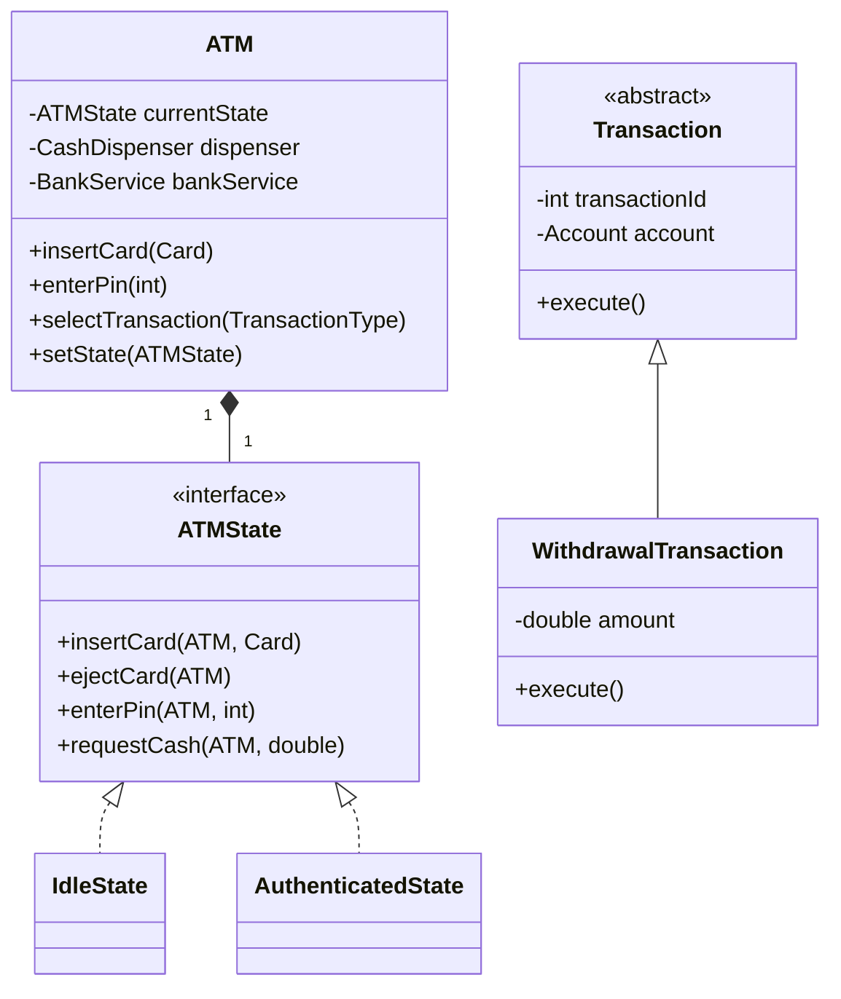

# 🛠️ Design an ATM (LLD)

The ATM (Automated Teller Machine) design is fundamentally a **State Machine** problem, similar to the Vending Machine. It tests your ability to model hardware interactions, user session states, and transaction management.

---

## 1. Requirements

### Functional Requirements
- **Hardware Integration:** Card reader, Keypad, Cash Dispenser, Screen, Printer.
- **Authentication:** User inserts card, enters PIN, system validates with Bank.
- **Transactions:** Support multiple transaction types (Withdraw Cash, Check Balance, Deposit Cash).
- **Cash Inventory:** ATM must track internal available cash denominations.
- **Transactions:** Operations must either succeed fully or fail safely (rollback).

### Non-Functional Requirements
- **Security:** Do not store plain-text PINs.
- **Extensibility:** Easy to add a new transaction type (e.g., Transfer Money).
- **State Management:** Handled cleanly so users can't withdraw money if they haven't entered a PIN.

---

## 2. Core Entities (Objects)

- `ATM` (Singleton, Context for the State Machine)
- `State` (Interface) -> `IdleState`, `HasCardState`, `AuthenticatedState`, `TransactionState`
- `CashDispenser`
- `BankService` (External Interface)
- `Card`
- `Transaction` (Abstract) -> `Withdrawal`, `Deposit`, `BalanceInquiry`

---

## 3. Class Diagram / Relationships



---

## 4. Key Algorithms / Design Patterns

### 1. State Pattern (Core Flow)

The ATM is strictly governed by its State. If you are in `IdleState` and press "Withdraw", it must throw an error or do nothing.

**The State Interface:**
```java
public interface ATMState {
    void insertCard(ATM atm, Card card);
    void enterPin(ATM atm, int pin);
    void selectTransaction(ATM atm, TransactionType type);
    void ejectCard(ATM atm);
}
```

**Concrete State: `IdleState`**
```java
public class IdleState implements ATMState {
    @Override
    public void insertCard(ATM atm, Card card) {
        System.out.println("Card read successfully.");
        atm.setInsertedCard(card);
        atm.changeState(new HasCardState());
    }

    @Override
    public void enterPin(ATM atm, int pin) { throw new IllegalStateException(); }
    // ...
}
```

**Concrete State: `HasCardState`**
```java
public class HasCardState implements ATMState {
    @Override
    public void enterPin(ATM atm, int pin) {
        boolean isValid = atm.getBankService().authenticate(atm.getInsertedCard(), pin);
        if (isValid) {
            System.out.println("Authenticated.");
            atm.changeState(new AuthenticatedState());
        } else {
            System.out.println("Invalid PIN.");
            ejectCard(atm);
        }
    }
    // ...
}
```

### 2. Command Pattern (Transactions)

When the user enters the `AuthenticatedState`, they can trigger different transactions. The Command pattern encapsulates a request as an object, allowing you to parameterize clients with queues, logs, and undoable operations.

```java
public abstract class Transaction {
    protected String transactionId;
    protected BankService bankService;
    protected Account account;

    public abstract void execute();
}

public class WithdrawalTransaction extends Transaction {
    private double amount;
    private CashDispenser dispenser;

    public WithdrawalTransaction(Account account, double amount, CashDispenser dispenser) {
        this.account = account;
        this.amount = amount;
        this.dispenser = dispenser;
    }

    @Override
    public void execute() {
        if (!dispenser.canDispense(amount)) {
            throw new InsufficientATMCashException();
        }
        
        // Network call to Bank
        boolean success = bankService.withdraw(account.getAccountNumber(), amount);
        if (success) {
            dispenser.dispenseCash(amount);
            System.out.println("Please collect your cash.");
        } else {
            System.out.println("Insufficient funds in Bank Account.");
        }
    }
}
```

### 3. The Cash Dispenser (Chain of Responsibility)

Like the Vending Machine, dispensing $130 with $100, $20, and $10 bills requires an algorithm. You can use the Greedy Algorithm, or a clean object-oriented approach using the **Chain of Responsibility Pattern**.

If the ATM needs to dispense $130:
1. `HundredDollarHandler` tries to dispense as many $100s as possible (1). Leaves $30.
2. Passes $30 to `FiftyDollarHandler`. It can dispense 0. Leaves $30.
3. Passes $30 to `TwentyDollarHandler`. Dispenses one $20. Leaves $10.
4. Passes $10 to `TenDollarHandler`. Dispenses one $10. Done.

```java
public abstract class CashDispenserHandler {
    protected CashDispenserHandler nextHandler;

    public void setNext(CashDispenserHandler handler) {
        this.nextHandler = handler;
    }

    public abstract void dispense(int requiredAmount);
}

// Example concrete handler
public class TwentyDollarHandler extends CashDispenserHandler {
    private int availableBanknotes = 500; // Track inventory

    @Override
    public void dispense(int amount) {
        int notesRequired = amount / 20;
        int remainder = amount % 20;

        if (notesRequired <= availableBanknotes) {
            System.out.println("Dispensing " + notesRequired + " $20 bills.");
            availableBanknotes -= notesRequired;
            if (remainder > 0 && nextHandler != null) {
                nextHandler.dispense(remainder);
            }
        } 
        // Logic for if ATM doesn't have enough 20s omitted for brevity
    }
}
```