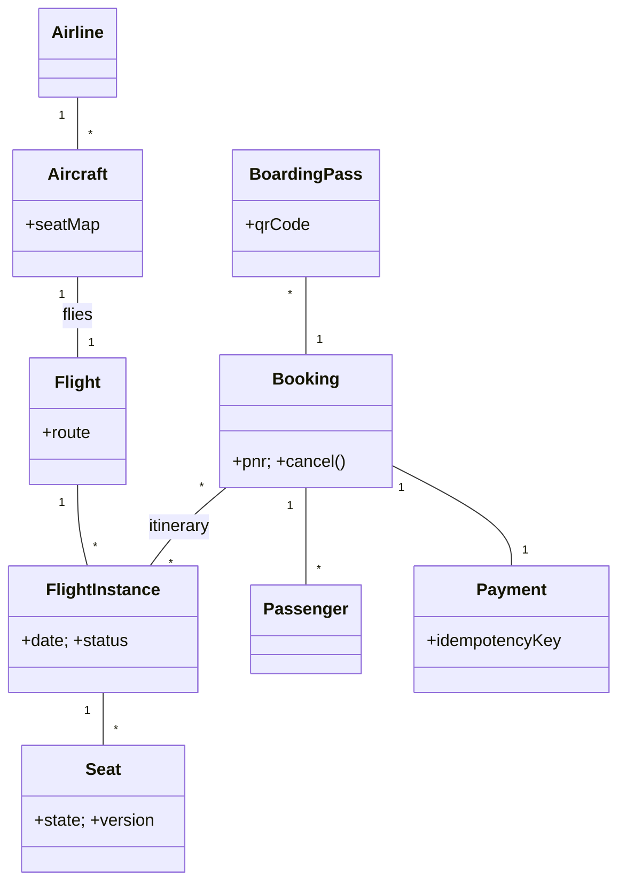

# 🛠️ Design Airline Management System (LLD)

> Object-oriented design for an airline reservation system — flight catalog, seat inventory, bookings (PNR), check-in, boarding pass, and frequent-flyer accounts. Focus is OOP class structure and concurrency on shared seat inventory.

## 📚 Table of Contents

1. [Requirements](#1-requirements)
2. [Core Entities](#2-core-entities-objects)
3. [Class Diagram](#3-class-diagram--relationships)
4. [Key APIs](#4-api--interfaces)
5. [Design Patterns](#5-key-algorithms--design-patterns)
6. [Concurrency](#6-concurrency--edge-cases)
7. [Sources](#7-sources)

---

## 1. Requirements

### Functional
- **Search flights** by route + date + class (Economy/Business/First)
- **Seat selection** on a visual seat map
- **Booking** — generates a PNR (Passenger Name Record) per booking
- **Check-in** with boarding-pass generation (QR/barcode)
- **Baggage** entries linked to passengers
- **Cancellation & refund** within fare-rule window
- **Frequent-flyer program** — earn/redeem miles, tier upgrades

### Non-Functional
- **No double-booking of seats** under contention
- **Real-time inventory** visible across channels (web, mobile, agents)
- **Fault-tolerant payment** (idempotent — retries don't double-charge)

---

## 2. Core Entities (Objects)

| Entity | Key Attributes |
|---|---|
| `Airline` | airlineId, name, frequentFlyerProgram |
| `Aircraft` | aircraftId, model, totalSeats, seatMap |
| `Flight` | flightId, route (origin → destination), basePrice — **template, not date-specific** |
| `FlightInstance` | instanceId, flightId, departureTime, arrivalTime, status (SCHEDULED/DELAYED/CANCELLED) |
| `Seat` | seatId, row, column, class, state (AVAILABLE/HELD/BOOKED), version |
| `Booking` (PNR) | pnr, passengers[], itinerary, seats, status, totalPrice |
| `Passenger` | passengerId, name, dob, contact, frequentFlyerId |
| `Itinerary` | segments[] — multi-leg trips |
| `Payment` | paymentId, bookingId, amount, method, status, idempotencyKey |
| `FrequentFlyerAccount` | accountId, points, tier (BRONZE/SILVER/GOLD/PLATINUM) |
| `BoardingPass` | bookingId, passengerId, seat, gate, boardingGroup, qrCode |

**Seat states:** `AVAILABLE → HELD → BOOKED`; `HELD` auto-expires.
**Booking states:** `PENDING → CONFIRMED → CHECKED_IN → BOARDED → COMPLETED` (or `CANCELLED`).

---

## 3. Class Diagram / Relationships



---

## 4. API / Interfaces

```java
List<FlightInstance> searchFlights(Airport from, Airport to, LocalDate date, SeatClass cls);

// Seat selection with TTL
HoldToken holdSeat(String instanceId, String seatId, long passengerId, Duration ttl);
void releaseSeat(HoldToken token);  // explicit release

// Booking
Booking bookSeats(List<HoldToken> holds, List<Passenger> passengers, PaymentRequest pay);
void   cancelBooking(String pnr);   // checks fare rules + refund

// Day-of-travel
BoardingPass checkIn(String pnr, long passengerId, String seatId);

// Loyalty
void earnMiles(long ffId, int miles);
boolean redeemMiles(long ffId, int miles);
```

---

## 5. Key Algorithms / Design Patterns

| Pattern | Where used | Why |
|---|---|---|
| **State** | `Seat` and `Booking` lifecycles | Encodes valid transitions; can't `book()` an `AVAILABLE` seat without `HOLD`; can't `checkIn()` a `PENDING` booking |
| **Strategy** | Pricing | Economy / Business / First; with `DynamicPricingStrategy` (demand-based) and `LoyaltyDiscountStrategy` |
| **Observer** | Flight status | `PassengerNotifier`, `RevenueManager`, `GateAgentDisplay` subscribe to `FlightInstance` changes (delay, gate change) |
| **Factory** | `Booking` / `BoardingPass` creation | Encapsulates validation + numbering rules |
| **Command** | Cancellation with refund window | `CancellationCommand.execute()`/`undo()` within 24-h cancellation grace |
| **Singleton** | `SeatInventoryService` | One coordinator owns the live HOLD/BOOKED state; backed by Redis for distributed mode |
| **Memento** | Booking history | Snapshots before each modification — supports audit + rollback |
| **Builder** | `Booking` construction | Many optional fields (insurance, meal, baggage, special-needs); builder produces immutable `Booking` |

---

## 6. Concurrency & Edge Cases

- **Seat hold (TTL)** — Redis `SET seat:<inst>:<seat> <passengerId> NX EX 900` (NX = "set if not exists", EX = 15-min TTL). The `NX` makes hold acquisition atomic; only the first request wins.
- **Optimistic lock on booking** — `UPDATE seats SET state='BOOKED', version=version+1 WHERE seat_id=? AND version=?`. If 0 rows affected → retry path with re-read. Avoids row locks.
- **Oversold protection** — counters per fare class per `FlightInstance`: `UPDATE inventory SET remaining = remaining - 1 WHERE flight_instance_id = ? AND fare_class = ? AND remaining > 0`. Hard guard in addition to seat-level state.
- **Idempotent payment** — every `Payment` carries an `idempotencyKey` (typically `pnr + attempt`). Provider replay of the same key returns the cached result; never double-charges. (Standard payment-gateway pattern, see `Solution-Stripe-Payment-Processor.md`.)
- **Distributed transaction** — booking spans seat-state update + payment + booking row + miles credit. Use a Saga pattern (compensating transactions) rather than 2PC: if payment fails, release the seat HOLD; if miles credit fails, log + reconcile async.
- **Cancellation race** — passenger cancels at the same moment a wait-list promotion fires. Whichever transitions the booking state first wins; the loser sees a "booking already in state X" error.
- **TTL expiry race** — Redis hold expires while user is paying. Re-check seat state at the start of the booking transaction; if no longer `HELD` by us, fail the booking and refund.

---

## 7. Sources

- IATA PNR standards (industry baseline for booking schemas)
- Workspace cross-reference: `Notes/LowLevelDesign/Solutions/Solution-Stripe-Payment-Processor.md` (idempotency, retries)
- Workspace cross-reference: `Notes/LowLevelDesign/LLD-08-Behavioral-Patterns.md` (State, Command, Observer, Memento)
- Workspace cross-reference: `Notes/SystemDesign/Topics/30-Distributed-Locking.md` (Redis SETNX with TTL)

📺 **Video walkthrough:** [Airline Management LLD](https://www.youtube.com/watch?v=5yEoh3toRyE)
