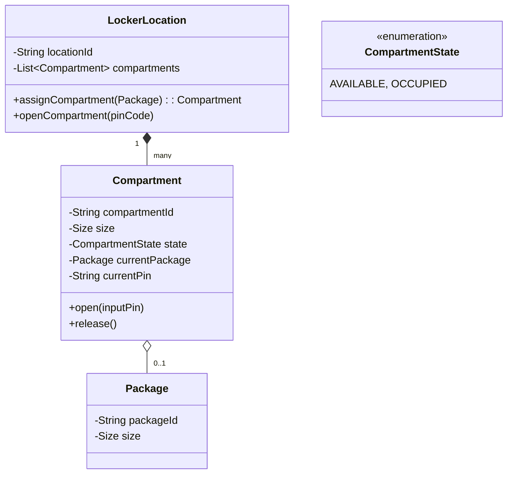

# 🛠️ Design Amazon Locker Service (LLD)

Amazon Lockers are self-service kiosks placed in convenience stores. Delivery drivers drop packages inside, and customers use a unique code/app to pop the door open and retrieve their package. This question tests matching algorithms (bin-packing) and expiration lifecycles.

---

## 1. Requirements

### Functional Requirements
- **Locker Inventory:** A locker bank has multiple compartments of different sizes (Small, Medium, Large).
- **Package Drop-off:** A delivery driver requests a compartment for a specific Package ID. The system assigns the smallest available compartment that fits the package.
- **Code Generation:** When dropped off, the system generates a secure PIN.
- **Package Pickup:** The customer enters the PIN at the kiosk. The correct compartment door opens.
- **Expiration:** If the package isn't picked up within 3 days, it expires, and the driver must pick it up to return it to the warehouse.

### Non-Functional Requirements
- **Concurrency:** Ensure a compartment isn't assigned to two different packages simultaneously.
- **Security:** PINs must be secure and one-time use.

---

## 2. Core Entities (Objects)

- `LockerLocation` (The physical bank of lockers at the 7-Eleven)
- `Compartment` (An individual door/box)
- `Size` (Enum: SMALL, MEDIUM, LARGE)
- `Package`
- `Order`
- `LockerCode` / `Notification`

---

## 3. Class Diagram / Relationships



---

## 4. Key Algorithms / Design Patterns

### 1. The Assignment Algorithm (Best-Fit)
When a package arrives, it needs the *smallest* compartment that is $\ge$ the package size. A small package can fit in a small, medium, or large box. But we should save the large boxes for large packages.

```java
public enum Size {
    SMALL(1), MEDIUM(2), LARGE(3);
    
    private int volume;
    Size(int v) { this.volume = v; }
    public boolean canFit(Size packageSize) {
        return this.volume >= packageSize.volume;
    }
}

public class LockerLocation {
    private List<Compartment> compartments;

    // We sort compartments by size to easily find the smallest fit
    public Compartment assignCompartment(Package pkg) {
        // Sort smallest to largest (can be pre-sorted or maintained as separate queues)
        compartments.sort(Comparator.comparingInt(c -> c.getSize().volume));

        for (Compartment c : compartments) {
            if (c.isAvailable() && c.getSize().canFit(pkg.getSize())) {
                c.assignPackage(pkg);
                return c;
            }
        }
        throw new NoLockerAvailableException();
    }
}
```

*Optimization:* Instead of iterating a list every time, maintain 3 separate Queues (`Queue<Compartment> smallLocs, mediumLocs, largeLocs`). If a small package arrives, try `smallLocs.poll()`. If empty, cascade to `mediumLocs.poll()`. This makes assignment $O(1)$.

### 2. State Management & Authentication
A Compartment holds the PIN temporarily.

```java
public class Compartment {
    private Size size;
    private boolean isAvailable = true;
    private String currentPin;
    private Package storedPackage;

    public void assignPackage(Package pkg) {
        this.isAvailable = false;
        this.storedPackage = pkg;
        this.currentPin = generateRandomPin(); // E.g., "482910"
        
        System.out.println("Assigned to " + size + " Locker. PIN: " + currentPin);
        // Fire NotificationService to email user...
    }

    public boolean open(String inputPin) {
        if (!isAvailable && this.currentPin.equals(inputPin)) {
            System.out.println("Door popped open. Please retrieve package " + storedPackage.getId());
            // Clear state
            this.isAvailable = true;
            this.currentPin = null;
            this.storedPackage = null;
            return true;
        }
        return false;
    }
}
```

### 3. Expiration Watcher (Observer / Timer)
If a package is abandoned, it blocks valuable locker space. We need a Background Timer or TTL (Time-To-Live) mechanism.

```java
public class ExpirationService {
    // Scheduled Executor runs every hour
    public void scanForExpiredPackages(LockerLocation location) {
        for (Compartment c : location.getCompartments()) {
            if (!c.isAvailable()) {
                long daysInLocker = checkDuration(c.getStoredPackage().getDropoffDate());
                if (daysInLocker >= 3) {
                    expirePackage(c);
                }
            }
        }
    }

    private void expirePackage(Compartment c) {
        // Change the PIN so the customer can no longer open it
        c.setPin(generateDriverReturnPin());
        // Notify the Amazon Driver to come pick it up
        DeliveryRoutingService.routeReturn(c.getStoredPackage());
    }
}
```

### 4. Handling Driver Drop-off (Multi-item)
A single driver often brings 20 packages to a 7-Eleven at once.
Instead of making the driver scan a package, wait for a door to pop, put it in, shut it, scan the next... the UI allows them to scan all 20 packages rapidly. The system runs the `assignCompartment` loop for all 20, and pops 20 doors open simultaneously, allowing the driver to rapid-fire load the wall. The state locks when the physical door hinge sensor reports "closed".