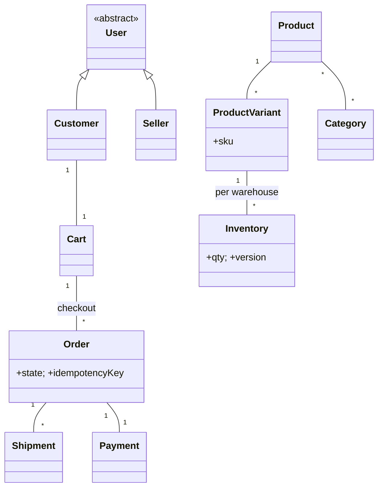

# 🛠️ Design Amazon E-Commerce (LLD)

> Object-oriented design for an Amazon-scale storefront — catalog, cart, checkout, multi-warehouse inventory, payment, and shipment. Focus is OOP structure and inventory consistency under contention.

## 📚 Table of Contents

1. [Requirements](#1-requirements)
2. [Core Entities](#2-core-entities-objects)
3. [Class Diagram](#3-class-diagram--relationships)
4. [Key APIs](#4-api--interfaces)
5. [Design Patterns](#5-key-algorithms--design-patterns)
6. [Concurrency](#6-concurrency--edge-cases)
7. [Sources](#7-sources)

---

## 1. Requirements

### Functional
- **Browse catalog** with categories, search, filters
- **Cart** — add/remove items, apply coupons, save for later
- **Checkout** with multiple payment methods (Card, UPI, Wallet, COD)
- **Order tracking**, multiple shipments per order
- **Reviews & ratings** (covered separately in `Solution-ECommerce-Review.md`)
- **Returns & refunds**

### Non-Functional
- **Inventory consistency** — never oversell
- **Idempotent checkout** — retries don't create duplicate orders
- **Scalable catalog** — millions of SKUs, billions of reads

---

## 2. Core Entities (Objects)

| Entity | Key Attributes |
|---|---|
| `User` (abstract) | userId, email, role |
| `Customer` extends User | shippingAddresses[], paymentMethods[], wishlist |
| `Seller` extends User | sellerId, fulfillmentType (FBA/FBM) |
| `Product` | productId, title, brand, basePrice, variants[] |
| `ProductVariant` | sku, size, color, attributes |
| `Category` | categoryId, name, parent |
| `Inventory` | sku, warehouseId, quantity, version |
| `Cart` | cartId, customerId, items[], couponCode |
| `CartItem` | sku, qty, priceSnapshot |
| `Order` | orderId, customerId, items[], state, total, idempotencyKey |
| `OrderItem` | sku, qty, unitPrice |
| `Shipment` | shipmentId, orderId, items[], carrier, tracking, status |
| `Payment` | paymentId, orderId, method, amount, status |
| `Address` | line1, city, state, country, pincode |

**Order states:** `PLACED → CONFIRMED → SHIPPED → OUT_FOR_DELIVERY → DELIVERED` (or `CANCELLED` / `RETURNED`).

---

## 3. Class Diagram / Relationships



---

## 4. API / Interfaces

```java
// Catalog
List<Product> searchProducts(SearchQuery q);
Product       getProduct(String productId);

// Cart
void addToCart(long customerId, String sku, int qty);
void removeFromCart(long customerId, String sku);
void applyCoupon(long customerId, String code);

// Checkout
Order checkout(long customerId, Address shipTo, PaymentMethod method, String idempotencyKey);
PaymentResult processPayment(String orderId);

// Shipment & tracking
Shipment createShipment(String orderId, List<OrderItem> items);
TrackingInfo trackOrder(String orderId);

// Returns
Return returnItem(String orderId, String sku, ReturnReason reason);
```

---

## 5. Key Algorithms / Design Patterns

| Pattern | Where used | Why |
|---|---|---|
| **State** | `Order` lifecycle | Each state defines valid actions (can't `cancel()` after `SHIPPED` without RMA) |
| **Strategy** | Payment methods | `CardStrategy`, `UpiStrategy`, `WalletStrategy`, `CodStrategy` — swappable per checkout |
| **Strategy** | Shipping cost | `Standard`, `Express`, `Prime` — different speed/price/eligibility |
| **Observer** | Order status & inventory alerts | Customer subscribes to status changes; "Notify me when in stock" listeners on `Inventory` |
| **Factory** | Payment processor creation | `PaymentProcessorFactory.create(method)` returns the right concrete processor |
| **Composite** | Product bundles | Treat individual SKUs and bundled SKUs uniformly; bundle price = sum or override |
| **Command** | Cart operations | `AddItemCommand`/`RemoveItemCommand` — supports undo last action |
| **Builder** | `Order` construction | Many optional fields (gift, instructions, multiple addresses); builder enforces invariants |

---

## 6. Concurrency & Edge Cases

- **Inventory decrement race** — two customers buy the last unit at the same instant. Use **atomic conditional update**:
  ```sql
  UPDATE inventory SET quantity = quantity - 1, version = version + 1
  WHERE sku = ? AND warehouse_id = ? AND quantity > 0 AND version = ?;
  ```
  If 0 rows affected → out of stock for this caller. No row locks needed.
- **Distributed reservation with TTL** — at checkout start, reserve units via Redis (`DECR inventory:<sku>` + TTL of 10 min). Reservations auto-expire if payment doesn't complete, releasing stock back. Used by Amazon for high-traffic sales.
- **Idempotent checkout** — every checkout request carries an `idempotencyKey` (typically `customerId + cartId + timestamp`). Server stores `(idempotencyKey → orderId)`; duplicate requests return the original order, never create a second.
- **Cart isolation** — one active cart per customer; cart writes go to a single shard keyed by `customerId`, so concurrent reads/writes serialize at the cart level.
- **Multi-warehouse fulfillment** — order may split: 2 items from Warehouse A, 1 from B. Each shipment has its own state machine; order is `DELIVERED` only when all shipments are.
- **DynamoDB-style optimistic locking** (AWS reference) — every item carries a `version` attribute; updates use `ConditionExpression: version = :expected`; on mismatch, client retries with the new version.
- **Coupon double-use** — `UNIQUE(customer_id, coupon_code)` index ensures one application even under retries.

---

## 7. Sources

- AWS DynamoDB docs — Optimistic Concurrency Control with `ConditionExpression`
- Workspace cross-reference: `Notes/LowLevelDesign/Solutions/Solution-Stripe-Payment-Processor.md` (idempotency)
- Workspace cross-reference: `Notes/LowLevelDesign/Solutions/Solution-ECommerce-Review.md` (review system)
- Workspace cross-reference: `Notes/LowLevelDesign/LLD-08-Behavioral-Patterns.md` (State, Strategy, Observer, Command)

📺 **Video walkthrough:** [Live Amazon / E-Commerce Low Level Design](https://www.youtube.com/watch?v=3_EdeBRjQ1w)
