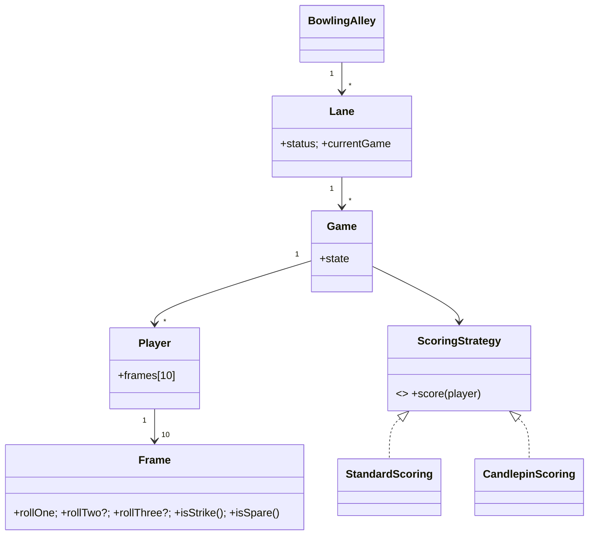

# 🛠️ Design a Bowling Alley System (LLD)

> **Sources**: [USBC — *Tenpin Bowling Rules*](https://bowl.com/Rulebook/) (frame structure, strike/spare bonuses, 10th-frame rules); Robert C. Martin — *Bowling Game Kata* (https://kata-log.rocks/bowling-kata-kata) — the canonical TDD exercise for bowling-score logic; Kent Beck — *TDD by Example*.

## 1. Requirements

### Functional
- Manage **multiple lanes** in a bowling alley.
- Each lane hosts **sequential games**; one active game per lane at a time.
- A game has 1–N **players**, each with **10 frames**.
- Track per-frame scoring with the bowling rules:
  - **Strike** (10 pins on roll 1): bonus = next 2 rolls.
  - **Spare** (10 pins after roll 2): bonus = next 1 roll.
  - **10th frame**: 3 rolls if strike or spare (so the bonus is well-defined).
- Game state lifecycle: `WAITING_FOR_PLAYERS → IN_PROGRESS → FINISHED`.
- Display a live scoreboard.
- Equipment **rental** (shoes, balls).

### Non-Functional
- **Bowling-rules correctness is the entire interview** — get it provably right.
- Multiple **concurrent games** on different lanes.
- Time-based pricing (rate per hour).

## 2. Core Entities

| Entity | Key Fields |
|---|---|
| `BowlingAlley` | `lanes[]`, `staff[]`, `pricePerHourMinor` |
| `Lane` | `id`, `status: AVAILABLE/IN_USE/MAINTENANCE`, `currentGame?` |
| `Game` | `lane`, `players[]`, `state`, `startedAt`, `finishedAt` |
| `Player` | `id`, `name`, `frames[10]` |
| `Frame` | `rollOne`, `rollTwo?`, `rollThree?` (10th only), derived `isStrike`, `isSpare`, `isComplete` |
| `Roll` | `pinsKnocked: 0..10` |
| `Equipment` (abstract) | shared base for rentals |
| `Ball` | `weightLbs`, `color` |
| `Shoes` | `size` |
| `RentalInventory` | thread-safe set of currently-available `Equipment` |

### Relationships
`BowlingAlley` 1—M `Lane` · `Lane` 1—M `Game` (sequential, one active) · `Game` 1—M `Player` · `Player` 1—10 `Frame` · `Frame` 1—3 `Roll`.

## 3. Class Diagram



## 4. Key Methods

```java
GameId BowlingAlley.bookLane(LaneId, List<Player>);
void   Game.startGame();
void   Game.recordRoll(PlayerId, int pinsKnocked);   // throws if invalid (e.g., 11 pins)
List<FrameScore> Game.getScoreboard();               // running totals per player
void   Game.finishGame();
```

## 5. The Scoring Algorithm (the crux)

```java
int calculateTotalScore(Player p) {
  int total = 0;
  Frame[] f = p.frames;          // 10 frames

  for (int i = 0; i < 10; i++) {
    if (f[i].isStrike()) {
      total += 10 + nextTwoRolls(p, i);          // cross-frame lookahead
    } else if (f[i].isSpare()) {
      total += 10 + nextOneRoll(p, i);
    } else if (f[i].isComplete()) {
      total += f[i].rollOne + f[i].rollTwo;
    } else {
      // game still in progress — leave running total partial
      break;
    }
  }
  // 10th-frame bonus rolls are stored INSIDE f[9] (rollTwo, rollThree)
  // and are not double-counted by nextTwoRolls(); see helpers below.
  return total;
}

int nextOneRoll(Player p, int idx) {
  if (idx == 9) return p.frames[9].rollTwo;     // already in 10th frame
  return p.frames[idx + 1].rollOne;
}

int nextTwoRolls(Player p, int idx) {
  if (idx == 9) return p.frames[9].rollTwo + safe(p.frames[9].rollThree);
  Frame next = p.frames[idx + 1];
  if (idx == 8) {                                // strike in 9th: 1st bonus from 10th's roll1, 2nd from 10th's roll2
    return next.rollOne + safe(next.rollTwo);
  }
  if (next.isStrike()) {                         // strike followed by strike: skip to frame after next
    return 10 + p.frames[idx + 2].rollOne;
  }
  return next.rollOne + safe(next.rollTwo);
}
```

**Why the 10th frame is special**: a strike in frame 10 needs 2 more rolls to compute its bonus; a spare needs 1. So frame 10 stores up to 3 rolls **internally** — keeping the bonus formula well-defined without needing an 11th frame.

**Sanity tests** (use these as fixtures — they exercise every edge case):
| Game | Score |
|---|---|
| All gutter balls (20 zeros) | 0 |
| All ones (20 ones) | 20 |
| One spare in frame 1, then 8 + 8s | 150 |
| **Perfect game** (12 strikes) | **300** |

## 6. Design Patterns

| Pattern | Where | Why |
|---|---|---|
| **State** | `Game.state` (`WAITING → IN_PROGRESS → FINISHED`) | Block illegal operations (e.g., recording a roll on a `FINISHED` game). |
| **Strategy** | `ScoringStrategy` (`Standard` / `Candlepin` / `Duckpin`) | Different bowling variants share the same `Game` shell. |
| **Observer** | `ScoreboardListener` notified after each `recordRoll` | Decouple game logic from display. |
| **Command** | `RecordRollCommand` (with `undo`) | Recover from operator typos at the kiosk. |
| **Factory** | `FrameFactory.create(frameNumber)` returns the special 10th-frame implementation | Avoid `if (frame == 10)` scattered everywhere. |
| **Composite** | `Game` aggregates `Player`s; `Player` aggregates `Frame`s; `Frame` aggregates `Roll`s | Uniform `getScore()` traversal. |

## 7. Concurrency
- Different lanes run **independent** `Game` instances — no cross-lane locking needed.
- **Within a lane**, `recordRoll` is single-threaded by definition (one user records).
- **Shared inventory**: `RentalInventory.checkout(Equipment)` and `return(Equipment)` synchronize on the inventory set; or use `ConcurrentHashMap<EquipmentId, Status>` with `replace(id, AVAILABLE, RENTED)`.

## 8. Edge Cases & Validation
- `pinsKnocked ∈ [0, 10]`; `rollOne + rollTwo ≤ 10` for frames 1–9.
- A double-throw on a strike frame is invalid (recordRoll should auto-advance after a strike, except in frame 10).
- A player joining mid-game ⇒ rejected; new player must wait for the next game.
- Lane in `MAINTENANCE` rejects `bookLane`.

## 9. Sources / Cross-Refs
- LLD-08 Behavioral Patterns (State, Strategy, Observer, Command)
- LLD-06 Creational Patterns (Factory)
- Robert C. Martin — Bowling Game Kata
- USBC Tenpin Bowling Rules
