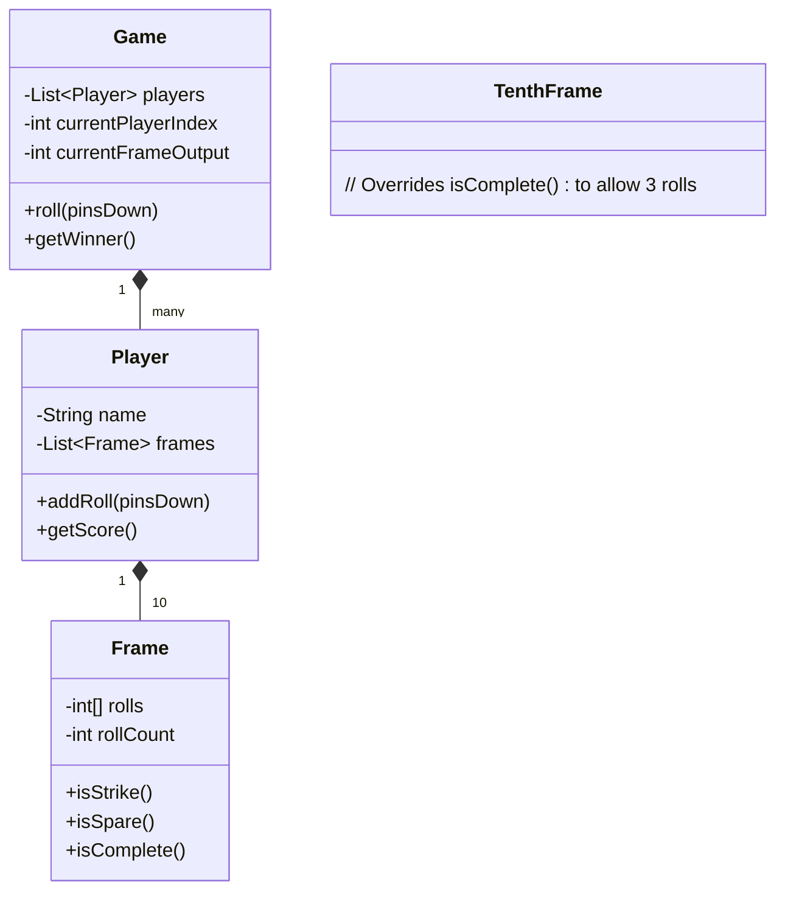

# 🛠️ Design Bowling Alley Scoring (LLD)

Designing a Bowling Alley scoring system looks simple on the surface but is notoriously tricky because of how "Strikes" and "Spares" retroactively affect the scoring of previous frames. It tests your ability to model sequential state arrays and look-ahead algorithms.

---

## 1. Requirements

### Functional Requirements
- **Match:** A bowling match consists of 1 to N players.
- **Frames:** Each player gets 10 frames per game.
- **Rolls:** In each frame, a player gets 2 rolls to knock down 10 pins. (Unless they get a strike on the first roll).
- **10th Frame Special Rule:** If a player bowls a Strike or Spare in the 10th frame, they get up to 3 rolls total in that frame.
- **Scoring:** The system must accurately calculate the score, factoring in bonus points for Spares and Strikes.

---

## 2. Core Entities (Objects)

- `Game` (Manages players and orchestrates the match)
- `Player`
- `Frame` (Base class) -> `TenthFrame` (Special subclass)
- `Roll` / `ScoreCard`

---

## 3. Class Diagram / Relationships



---

## 4. Key Algorithms / Design Patterns

### 1. Frame Representation

A standard frame holds up to 2 rolls. 

```java
public class Frame {
    protected int[] rolls = new int[2];
    protected int currentRoll = 0;

    public void addRoll(int pins) {
        rolls[currentRoll++] = pins;
    }

    public boolean isStrike() {
        return currentRoll > 0 && rolls[0] == 10;
    }

    public boolean isSpare() {
        return currentRoll == 2 && (rolls[0] + rolls[1] == 10) && !isStrike();
    }

    public boolean isComplete() {
        return isStrike() || currentRoll == 2;
    }
    
    public int getBaseScore() {
        return rolls[0] + rolls[1];
    }
}
```

**The 10th Frame:**
The 10th frame is special. If you get a Strike or a Spare, you get a 3rd roll. We use inheritance here to cleanly alter the `isComplete()` logic without cluttering the base class with `if (frameNumber == 10)` logic.

```java
public class TenthFrame extends Frame {
    public TenthFrame() {
        rolls = new int[3]; // The 10th frame can have 3 rolls
    }

    @Override
    public boolean isComplete() {
        if (isStrike() || isSpare()) {
            return currentRoll == 3; // Gets bonus roll
        }
        return currentRoll == 2; // Normal 2 rolls
    }
}
```

### 2. The Look-Ahead Scoring Algorithm

This is the hardest part of the interview. You cannot easily calculate the score of Frame 1 until Frame 2 (and sometimes Frame 3) happens.
The cleanest way to calculate the score is to iterate through the list of frames and use look-ahead logic by querying the *subsequent* frames.

```java
public class Player {
    private List<Frame> frames = new ArrayList<>();
    
    // ... setup 9 Frames and 1 TenthFrame ...

    public int getScore() {
        int totalScore = 0;

        for (int i = 0; i < 10; i++) {
            Frame current = frames.get(i);
            totalScore += current.getBaseScore();

            if (current.isStrike() && i < 9) {
                // Strike Bonus: Next two rolls
                Frame next = frames.get(i + 1);
                totalScore += next.roles[0];
                
                if (next.isStrike() && i < 8) {
                    // Two strikes in a row, need to look two frames ahead
                    totalScore += frames.get(i + 2).rolls[0];
                } else if (next.rolls.length > 1) {
                    totalScore += next.rolls[1];
                }
            } 
            else if (current.isSpare() && i < 9) {
                // Spare Bonus: Next one roll
                totalScore += frames.get(i + 1).rolls[0];
            }
        }
        return totalScore;
    }
}
```

### 3. Alternative Approach (Array of Rolls)

If modeling classes like `Frame` and `TenthFrame` seems too complex, a common alternative algorithmic approach is to completely discard the concept of a "Frame" object, and just maintain a flat `int[] rolls = new int[21]`. 

Scoring then becomes a simple array pointer traversal:

```java
public int scoreGame(int[] rolls) {
    int score = 0;
    int rollIndex = 0;
    
    for (int frame = 0; frame < 10; frame++) {
        if (rolls[rollIndex] == 10) { // Strike
            score += 10 + rolls[rollIndex + 1] + rolls[rollIndex + 2];
            rollIndex += 1;
        } else if (rolls[rollIndex] + rolls[rollIndex + 1] == 10) { // Spare
            score += 10 + rolls[rollIndex + 2];
            rollIndex += 2;
        } else { // Normal
            score += rolls[rollIndex] + rolls[rollIndex + 1];
            rollIndex += 2;
        }
    }
    return score;
}
```
*Note: In an Object-Oriented Design interview, the interviewer usually prefers the rich class-based approach (Frame objects), but this algorithmic array approach is faster to write if you're strapped for time or doing a pure algo interview.*