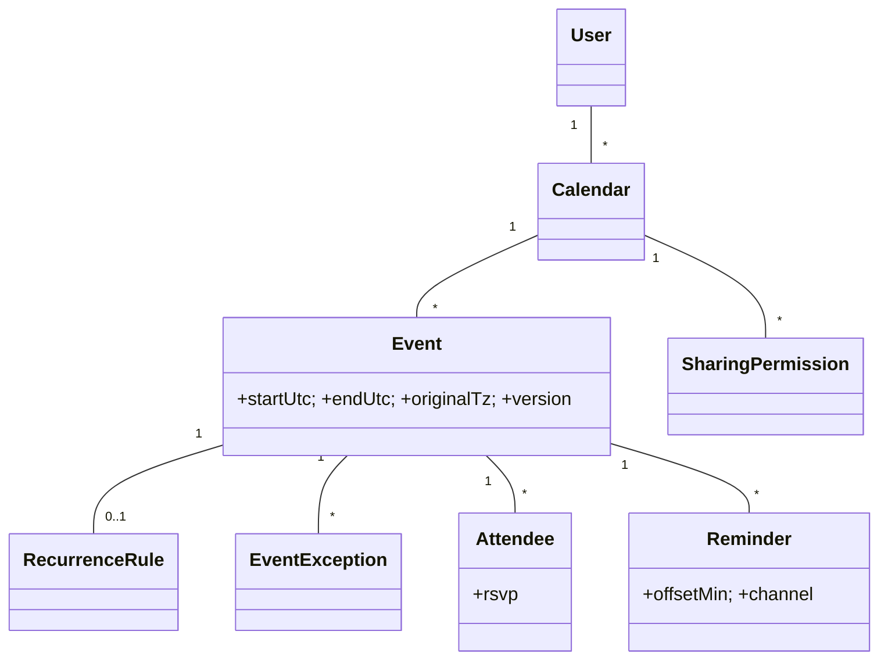

# 🛠️ Design Calendar Application (LLD)

> Object-oriented design for a Google Calendar-style app — events, recurrence (RFC 5545 RRULE), invitations, reminders, time-zone handling, and free/busy lookups.

## 📚 Table of Contents

1. [Requirements](#1-requirements)
2. [Core Entities](#2-core-entities-objects)
3. [Class Diagram](#3-class-diagram--relationships)
4. [Key APIs](#4-api--interfaces)
5. [Design Patterns](#5-key-algorithms--design-patterns)
6. [Concurrency](#6-concurrency--edge-cases)
7. [Sources](#7-sources)

---

## 1. Requirements

### Functional
- **Events** — single & recurring (DAILY/WEEKLY/MONTHLY/YEARLY) with `UNTIL` or `COUNT` termination
- **Attendees & RSVP** — `ACCEPTED / DECLINED / TENTATIVE / PENDING`
- **Reminders** — multiple per event, channels EMAIL / PUSH / POPUP, offset in minutes before event
- **Multiple calendars per user** (e.g., Work, Personal, Birthdays)
- **Free/busy lookup** — schedule meetings without conflicts
- **Time-zone aware** events with DST correctness
- **Sharing** with READ / EDIT / MANAGE permissions
- **CalDAV (RFC 5545)** sync with external clients (Outlook/Apple Mail)

### Non-Functional
- Sub-second conflict-detection queries
- Reminder delivery is **idempotent** (no duplicates)
- Time-zone arithmetic correct across DST jumps
- Optimistic concurrency on simultaneous edits (CalDAV ETag model)

---

## 2. Core Entities (Objects)

| Entity | Key Attributes |
|---|---|
| `User` | userId, name, email, defaultTimeZone |
| `Calendar` | calendarId, ownerId, name, color, timeZone |
| `Event` | eventId, calendarId, summary, startUtc, endUtc, originalTz, location, description, version |
| `RecurrenceRule` | freq, interval, byDay[], byMonth[], until, count, exDates[] |
| `EventException` | parentEventId, originalDate, overrideStartUtc, overrideEndUtc, isCancelled |
| `Attendee` | eventId, userId, rsvp, role |
| `Reminder` | reminderId, eventId, offsetMin, channel |
| `SharingPermission` | calendarId, granteeUserId, level (READ/EDIT/MANAGE) |
| `TimeSlot` | userId, startUtc, endUtc, status (BUSY/FREE) — denormalized |

---

## 3. Class Diagram / Relationships



---

## 4. API / Interfaces

```java
// Single events
Event createEvent(long calendarId, String summary, ZonedDateTime start, ZonedDateTime end);

// Recurring events (RFC 5545 RRULE)
Event createRecurringEvent(long calendarId, EventDetails details, RecurrenceRule rrule);

// Modification scope (Google Calendar UX)
enum ModifyScope { THIS_ONLY, THIS_AND_FUTURE, ALL }
void modifyEvent(String eventId, Modifications mods, ModifyScope scope);
void deleteEvent(String eventId, ModifyScope scope);

// Attendees / RSVP
void inviteAttendees(String eventId, List<Long> userIds);
void rsvp(String eventId, long userId, RsvpStatus status);

// Free/busy & scheduling
List<TimeSlot> freeBusy(long userId, ZonedDateTime from, ZonedDateTime to);
List<TimeSlot> findFreeSlots(List<Long> userIds, Duration duration, ZonedDateTime from, ZonedDateTime to);

// Recurrence expansion (Iterator, see below)
Iterator<EventOccurrence> expand(Event event, ZonedDateTime from, ZonedDateTime to);

// Sharing
void shareCalendar(long calendarId, long granteeUserId, PermissionLevel level);

// CalDAV
String exportToICalendar(long calendarId, LocalDate from, LocalDate to);
```

---

## 5. Key Algorithms / Design Patterns

| Pattern | Where used | Why |
|---|---|---|
| **Composite** | Event series + exceptions | The series is the "master"; each `EventException` is a leaf override (move/delete one occurrence) |
| **Iterator** | RRULE expansion (RFC 5545) | Lazily yields occurrences for a date range without materializing the full series |
| **Observer** | Invitations & changes | Attendees, Gmail, mobile push subscribe to `EventChangedEvent`; one event mutation → many fan-out notifications |
| **Strategy** | Reminder delivery | `EmailReminderStrategy`, `PushReminderStrategy`, `PopupReminderStrategy` — pluggable channels |
| **Visitor** | Cross-event queries | Compute "busy time this month" or "all overlapping conflicts" by visiting each occurrence |
| **Memento** | Edit history | Snapshot pre-edit state to support undo and audit trail |
| **Factory** | Event creation | `EventFactory` chooses single vs. recurring vs. all-day |
| **Template Method** | Modify dispatch | `modifyEvent()` skeleton: `lockSeries → branchByScope → applyDeltas → bumpVersion → notify`; concrete scope handlers fill in `branchByScope` |

**Time-zone storage rule of thumb:** **always store UTC + the original IANA zone** (e.g., `America/Los_Angeles`). Compute display time on the client. For recurring events, expand in the *original* zone so "every Monday 9 AM" stays anchored across DST.

---

## 6. Concurrency & Edge Cases

- **Simultaneous edits** — two devices edit the same event. Use the CalDAV pattern: every event has a **`version` (ETag)**; updates carry the expected version; mismatch → `409 Conflict`, client refetches and merges.
  ```sql
  UPDATE events SET ..., version = version + 1
  WHERE event_id = ? AND version = ?;
  ```
- **`THIS_AND_FUTURE` semantics** — splits the series at the modified instance: original series gets `UNTIL = (instanceDate - 1)`, new series starts from instanceDate with the new fields. Atomically inside a transaction.
- **Idempotent reminder dispatch** — worker job pulls due reminders; before sending, `INSERT INTO sent_reminders (reminderId, dueAtBucket) ON CONFLICT DO NOTHING`. If insert returned 0 rows, another worker already sent it — skip. Prevents duplicate emails on retry.
- **All-day vs timed events** — store all-day as `DATE` (no zone); timed as `DATE-TIME` + UTC + originalTz. Mixing causes the classic "your reminder fired at midnight UTC instead of midnight local" bug.
- **DST transition** — "every Sunday 7 AM PST" must remain 7 AM local even when DST shifts UTC offset by 1 hour. Resolve by storing the rule in original zone, only converting at expansion time.
- **Free/busy at scale** — denormalize into a `time_slots` table (`(userId, startUtc, endUtc, status)`) with a composite index on `(userId, startUtc)`. Range queries become O(log n).
- **Recurrence expansion cost** — never expand "every weekday until 2099" eagerly. Cap expansion to a window (e.g., 2 years forward), use the iterator on demand for further dates.

---

## 7. Sources

- **RFC 5545** — iCalendar object specification (RRULE, VEVENT, VALARM)
- **RFC 4791** — CalDAV protocol (ETag-based concurrency control)
- Workspace cross-reference: `Notes/LowLevelDesign/LLD-07-Structural-Patterns.md` (Composite)
- Workspace cross-reference: `Notes/LowLevelDesign/LLD-08-Behavioral-Patterns.md` (Iterator, Observer, Visitor, Strategy, Memento)

📺 **Video walkthrough:** [Calendar System Design Interview](https://www.youtube.com/watch?v=mUvyAMiMm-w)
