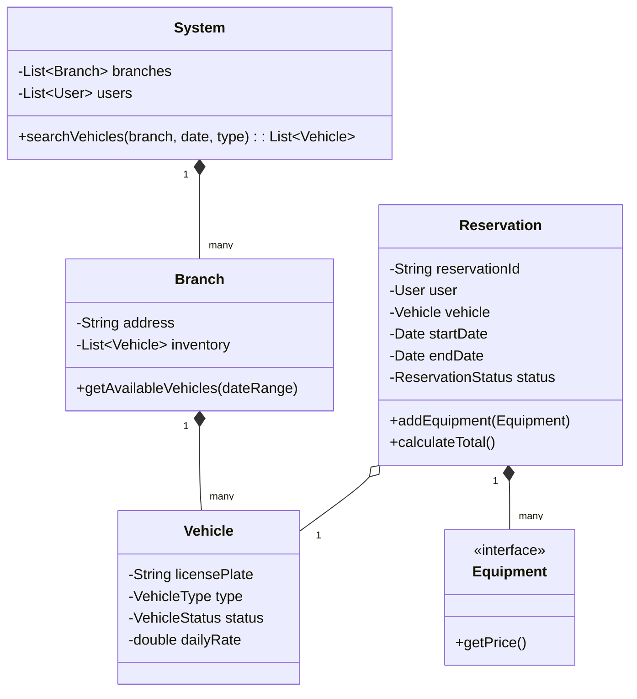

# 🛠️ Design Car Rental System (LLD)

Designing a Car Rental System (like Hertz or Enterprise) requires modeling inventory (cars), varying business logic for pricing algorithms, and handling reservations over time periods (preventing double-booking).

---

## 1. Requirements

### Functional Requirements
- **Search:** Users can search for available cars by location, date range, and car type.
- **Inventory:** System manages multiple rental branches/locations and different car types (Economy, SUV, Luxury).
- **Reservation:** Users can book an available car.
- **Pricing:** Dynamic pricing based on car type, duration, and optional add-ons (insurance, GPS).
- **Checkout/Return:** Employees scan the car out, and scan it back in (which makes it available again).

### Non-Functional Requirements
- **Concurrency:** Ensure two users cannot book the exact same car for overlapping dates.
- **Flexibility:** Easy to add new car types or pricing rules.

---

## 2. Core Entities (Objects)

- `System` (Orchestrator)
- `User` / `Member`
- `Branch` (Store Location)
- `Vehicle` (Abstract) -> `Car`, `Truck`, `Motorcycle`
- `VehicleStatus` (Enum: AVAILABLE, BOOKED, IN_MAINTENANCE)
- `Reservation`
- `Bill` / `Payment`
- `Equipment` (Add-ons)

---

## 3. Class Diagram / Relationships



---

## 4. Key Algorithms / Design Patterns

### 1. Decorator Pattern for Add-ons (Pricing)
A base car rental is $50/day. The user wants Child Seat (+$10), GPS (+$5), and Premium Insurance (+$20). Instead of creating a `CarWithSeatAndGps` subclass, or putting massive `if/else` statements in the `calculateTotal()` method, use the **Decorator Pattern**.

```java
// Base Component
public interface Rental {
    double calculatePrice();
}

public class BaseRental implements Rental {
    private Vehicle vehicle;
    private int days;

    public BaseRental(Vehicle v, int days) {
         this.vehicle = v; 
         this.days = days;
    }

    public double calculatePrice() {
        return vehicle.getDailyRate() * days;
    }
}

// Decorator
public abstract class RentalDecorator implements Rental {
    protected Rental decoratedRental;
    public RentalDecorator(Rental rental) {
        this.decoratedRental = rental;
    }
}

// Concrete Decorators
public class GPSDecorator extends RentalDecorator {
    public GPSDecorator(Rental rental) { super(rental); }
    
    public double calculatePrice() {
        return decoratedRental.calculatePrice() + 5.0; // Flat $5 fee
    }
}

public class InsuranceDecorator extends RentalDecorator {
    private int days;
    public InsuranceDecorator(Rental rental, int days) { 
        super(rental); 
        this.days = days; 
    }
    
    public double calculatePrice() {
        return decoratedRental.calculatePrice() + (20.0 * days); // $20/day
    }
}
```
**Usage:**
```java
Rental myRental = new BaseRental(hondaCivic, 3); // $150
myRental = new GPSDecorator(myRental);           // $155
myRental = new InsuranceDecorator(myRental, 3);  // $215
double finalPrice = myRental.calculatePrice();
```

### 2. Searching & Preventing Overbooking (The Inventory Logic)
How do we know if a specific car is available next week?
Rather than just checking `vehicle.getStatus() == AVAILABLE` (which only tells us if it's sitting in the lot *right now*), we must check the `Reservation` history for overlapping dates. 

*(In a real database, this is handled by a SQL overlapping date query).*

```java
public class Vehicle {
    private List<Reservation> schedule = new ArrayList<>();

    public boolean isAvailable(Date start, Date end) {
        for (Reservation r : schedule) {
            // Check for overlap
            if (start.before(r.getEndDate()) && end.after(r.getStartDate())) {
                return false; // Conflict found
            }
        }
        return true;
    }
    
    public synchronized void book(Reservation newRes) throws DoubleBookedException {
        if (isAvailable(newRes.getStartDate(), newRes.getEndDate())) {
            schedule.add(newRes);
        } else {
            throw new DoubleBookedException("Car is no longer available.");
        }
    }
}

public class Branch {
    private List<Vehicle> inventory;

    public List<Vehicle> searchAvailable(VehicleType type, Date start, Date end) {
        List<Vehicle> available = new ArrayList<>();
        for (Vehicle v : inventory) {
            if (v.getType() == type && v.isAvailable(start, end)) {
                available.add(v);
            }
        }
        return available;
    }
}
```

### 3. Factory Pattern (Vehicle Creation)
When a fleet manager buys 100 new cars, they input the specs into the system. Use a Factory to instantiate the correct Vehicle logic.

```java
public class VehicleFactory {
    public static Vehicle createVehicle(VehicleType type, String license) {
        switch(type) {
            case CAR:
                return new Car(license);
            case SUV:
                return new Suv(license);
            case TRUCK:
                return new Truck(license);
            default:
                throw new IllegalArgumentException();
        }
    }
}
```