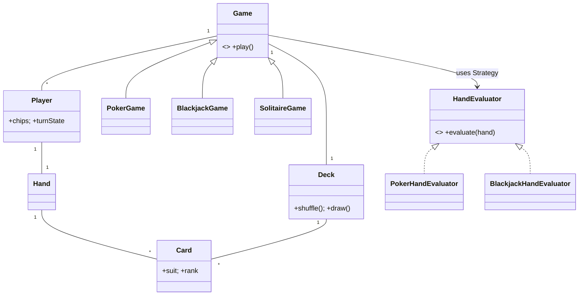

# 🛠️ Design a Card Game Framework (LLD)

> Object-oriented design for a generic card-game engine — extensible to Poker, Blackjack, Solitaire, Bridge. Focus on clean abstractions (Card / Deck / Hand / Player / Game) and the patterns that make new games drop-in.

## 📚 Table of Contents

1. [Requirements](#1-requirements)
2. [Core Entities](#2-core-entities-objects)
3. [Class Diagram](#3-class-diagram--relationships)
4. [Key APIs](#4-api--interfaces)
5. [Design Patterns](#5-key-algorithms--design-patterns)
6. [Concurrency & Shuffle](#6-concurrency--shuffle)
7. [Sources](#7-sources)

---

## 1. Requirements

### Functional
- Represent a **standard 52-card deck** (4 suits × 13 ranks)
- **Deal** cards to multiple players
- Support **multiple game variants** (Poker, Blackjack, Solitaire, Bridge) with their own:
  - Dealing pattern
  - Turn order & actions
  - Hand-evaluation rules
  - Win condition
- **Manage turns**, score, and end-of-round/game cleanup

### Non-Functional
- **Extensible** — adding a new game variant must not change core classes (Open/Closed)
- **Fair shuffle** — cryptographically random (SecureRandom), not `Math.random()`
- **Thread-safe** in multi-player setups (no two threads draw the same card)

---

## 2. Core Entities (Objects)

| Entity | Key Attributes |
|---|---|
| `Suit` (enum) | HEARTS, DIAMONDS, CLUBS, SPADES |
| `Rank` (enum) | TWO … TEN, JACK, QUEEN, KING, ACE |
| `Card` (immutable) | suit, rank, `value(GameContext ctx)` |
| `Deck` | cards[], `shuffle()`, `draw()` |
| `Hand` | cards held by a player; delegates evaluation to a strategy |
| `Player` | playerId, hand, chips, turnState |
| `Game` (abstract) | players[], deck, currentRound, `play()` template |
| `Round`, `Turn` | bookkeeping units |
| `GameAction` | abstract Command — Hit / Stand / Fold / Call / Raise / Move … |

**Player turn state:** `WAITING → ACTING → (FOLDED | CHECKED | ALL_IN | DONE)`

---

## 3. Class Diagram / Relationships



---

## 4. API / Interfaces

```java
public abstract class Game {
    protected final Deck deck;
    protected final List<Player> players;
    protected final HandEvaluator evaluator;

    // Template Method — fixed flow, customizable steps
    public final GameResult play() {
        setup();
        do {
            dealRound();
            playRound();
        } while (!isGameOver());
        GameResult r = evaluateWinner();
        cleanup();
        return r;
    }

    protected abstract void  setup();
    protected abstract void  dealRound();
    protected abstract void  playRound();
    protected abstract boolean isGameOver();
    protected abstract GameResult evaluateWinner();
    protected void cleanup() { /* default: reset state */ }
}

public interface HandEvaluator {
    Ranking evaluate(Hand hand);
}

public interface GameAction {
    void execute(Game g, Player p);
    void undo();           // for replay / casino audit
}
```

---

## 5. Key Algorithms / Design Patterns

| Pattern | Where used | Why |
|---|---|---|
| **Template Method** | `Game.play()` | Same flow (setup → deal → play → evaluate → cleanup) for every game; subclasses override only the bits they need |
| **Strategy** | `HandEvaluator` | Poker / Blackjack / Bridge plug different evaluation logic without touching `Game` or `Hand` |
| **Strategy** | `DealingStrategy` | Texas Hold'em (2 hole + 5 community) vs Blackjack (2 each, hit on demand) vs Solitaire (tableau) |
| **Factory** | `GameFactory.create(type, players)` | Single entry point for constructing concrete games |
| **State** | `Player.turnState` | Encapsulates valid actions per state; can't `fold()` after `CHECKED` |
| **Observer** | spectators & event log | `GameEventListener.onAction(...)` — async fan-out without blocking play |
| **Iterator** | turn order | `PlayerIterator` handles wrap-around; respects `FOLDED` players |
| **Command** | `GameAction` (Hit, Fold, …) | Replayable + undoable — required for casino audits and "spectator rewind" |
| **Singleton** | `GameRegistry` | Tracks active games per process; one source of truth |

---

## 6. Concurrency & Shuffle

### Fisher-Yates shuffle with `SecureRandom`

```java
public final class FisherYatesShuffle {
    private static final SecureRandom RNG = new SecureRandom();
    public static void shuffle(List<Card> cards) {
        for (int i = cards.size() - 1; i > 0; i--) {
            int j = RNG.nextInt(i + 1);
            Collections.swap(cards, i, j);
        }
    }
}
```
- O(n) time, every permutation has probability 1/n!
- **`SecureRandom`** (cryptographically strong) is required for any real-money/casino setting; `Math.random()` is predictable and unfit for gaming.

### Thread-safe deck

```java
public final class Deck {
    private final Deque<Card> cards;
    public synchronized Card draw() {
        if (cards.isEmpty()) throw new EmptyDeckException();
        return cards.pop();
    }
}
```
Synchronizing `draw()` is the cheapest way to guarantee no two threads draw the same card. For very high concurrency, use `ConcurrentLinkedDeque` with `pollFirst()` (atomic, lock-free).

### Turn-based locking

```java
public final class Game {
    private volatile Player currentPlayer;
    public void apply(Player p, GameAction a) {
        if (p != currentPlayer) throw new IllegalStateException("not your turn");
        a.execute(this, p);
        advanceTurn();
    }
}
```
`volatile` gives the visibility guarantee; turn check is the application-level lock. Spectators receive notifications via the Observer asynchronously, so broadcasting never stalls gameplay.

---

## 7. Sources

- **Knuth — Fisher-Yates shuffle** (TAOCP vol. 2, Algorithm P / 3.4.2)
- **`java.security.SecureRandom`** — JDK docs (cryptographic PRNG)
- Workspace cross-reference: `Notes/LowLevelDesign/LLD-08-Behavioral-Patterns.md` (Template Method, Strategy, State, Command, Iterator, Observer)
- Workspace cross-reference: `Notes/LowLevelDesign/Solutions/Solution-Deck-Of-Cards.md` and `Solution-OOD-Deck-Of-Cards.md`

📺 **Video walkthrough:** [Card Game OOP – LLD interview](https://www.youtube.com/watch?v=AGagsU2yzUo)
