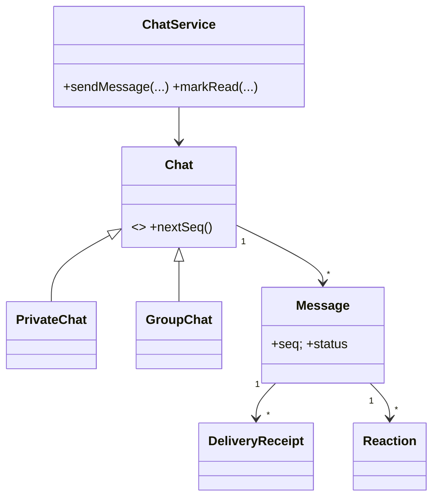

# 🛠️ Design a Chat Messaging App (WhatsApp / Slack-style) — LLD

> **Sources**: [WhatsApp Engineering Blog](https://blog.whatsapp.com/) (delivery acknowledgements, encryption); [Slack message API](https://api.slack.com/messaging) (threads, reactions, edits); [Signal Protocol whitepaper](https://signal.org/docs/) (Double Ratchet for E2EE); [AWS S3 presigned URLs](https://docs.aws.amazon.com/AmazonS3/latest/userguide/PresignedUrlUploadObject.html) (direct media upload).
>
> **Scope**: in-process LLD. The full **distributed** chat-system problem is in `SystemDesign/Solutions/Solution-Chat-System.md`.

## 1. Requirements

### Functional
- 1-on-1 and group chats; text / image / video / audio / file messages.
- Per-recipient message status: `SENT → DELIVERED → READ` (the three checkmarks).
- Typing indicators, online / last-seen status, read receipts.
- Message **reactions** (emoji), **reply-to-message**, **edit** (within 15 minutes), **soft-delete** ("this message was deleted" tombstone).
- **End-to-end encryption** (Signal Protocol).
- Media uploaded via **presigned S3 URLs** — server never proxies file bytes.

### Non-Functional
- **Per-chat ordering** is preserved.
- **Durability** — messages are never lost, including for offline recipients.
- Thread-safe with many concurrent users.

## 2. Core Entities

| Entity | Key Fields |
|---|---|
| `User` | `id`, `name`, `status`, `lastSeen` |
| `Chat` (abstract) | `id`, `participants[]`, `messages[]`, `nextSeq` (monotonic) |
| `PrivateChat` | exactly 2 participants |
| `GroupChat` | ≥ 2 participants, `admins[]`, `name`, `avatar` |
| `Message` | `id`, `chatId`, `senderId`, `seq`, `content`, `type: TEXT/IMAGE/VIDEO/AUDIO/FILE`, `timestamp`, `replyToId?`, `editedAt?`, `deletedAt?` |
| `DeliveryReceipt` | `(messageId, userId, status: DELIVERED/READ, at)` — one row per recipient (group chats need many) |
| `Reaction` | `(messageId, userId, emoji)` |
| `Attachment` | `s3Key`, `mimeType`, `sizeBytes` |

## 3. Class Diagram



## 4. Key Methods

```java
class ChatService {                                    // Singleton + Mediator
  Message sendMessage(ChatId c, UserId from, String content,
                      List<Attachment> media, MessageId? replyTo,
                      String clientToken);             // idempotent
  void markDelivered(MessageId, UserId);
  void markRead(MessageId, UserId);
  void addReaction(MessageId, UserId, String emoji);
  void editMessage(MessageId, String newContent);      // within 15 min
  void deleteMessage(MessageId);                       // tombstone
  GroupId createGroup(String name, List<UserId> members, UserId admin);
  void addMember(GroupId, UserId);
  void leaveGroup(GroupId, UserId);
}
```

## 5. The Three Critical Design Decisions

### 5.1 Per-chat monotonic sequence number
The server holds a counter per chat and assigns `seq = chat.nextSeq++` to every new message **inside the per-chat lock**. Clients reorder out-of-order arrivals by `seq`. This solves the "reply arrives before original" bug WhatsApp explicitly handles.

```java
synchronized Message sendMessage(...) {              // per-chat lock
  if (existsByClientToken(clientToken)) {            // idempotent retry
    return findByClientToken(clientToken);
  }
  long seq = chat.nextSeq++;
  Message m = new Message(id, chat.id, from, seq, content, ...);
  chat.messages.add(m);
  fanOutAsync(chat, m);                              // non-blocking
  return m;
}
```

### 5.2 Media flow — presigned URLs
1. Client → server: `requestUploadUrl(mimeType, sizeBytes)`.
2. Server returns a time-limited **presigned S3 URL**.
3. Client uploads bytes **directly to S3** (server never sees them).
4. Client → server: `sendMessage(..., attachments=[{s3Key, mimeType, sizeBytes}])`.
5. Recipients fetch from S3 directly via signed download URLs.

This removes the chat server from the bandwidth path — the same architecture Slack and WhatsApp use.

### 5.3 End-to-end encryption (Signal Protocol)
- Each user publishes a **prekey bundle** (long-term identity key + signed prekey + one-time prekeys).
- The first message between two users establishes a session via X3DH.
- Every subsequent message uses the **Double Ratchet** — a new symmetric key per message, with **forward secrecy** (compromising today's key doesn't decrypt yesterday's traffic).
- The chat server stores only **ciphertext**; it cannot read messages.
- Group chats: encrypt once per recipient with their pairwise session key (Signal's "Sender Keys" optimisation reduces this to one encryption + N envelopes).

## 6. Design Patterns

| Pattern | Where | Why |
|---|---|---|
| **Singleton** | `ChatService` | Single coordinator. |
| **Mediator** | `ChatService` routes between users (`User → ChatService → other Users`) | No N×N coupling. |
| **Observer** | New-message / typing / read-receipt events fan out to participants | Decoupled push notifications. |
| **State** | `Message` per-recipient status (`SENT → DELIVERED → READ`) | Block backwards transitions. |
| **Strategy** | `Chat` subtypes — `PrivateChat` rejects `addMember`; `GroupChat` enforces admin checks | Same API, different policies. |
| **Factory** | `MessageFactory.create(type, ...)` stamps id, seq, timestamp | Centralised invariant. |
| **Decorator** | `EncryptedMessage` wraps a `Message` with Signal envelope | Encryption added without modifying `Message`. |
| **Command** | `SendMessageCommand` queued for offline retry | Reliable delivery. |
| **Memento** | Edit history stores prior `(content, editedAt)` snapshots | "Show edit history" feature. |

## 7. Concurrency

- Per-chat lock around `sendMessage` ensures atomic seq allocation + insert + fan-out.
- `ConcurrentHashMap<UserId, Connection>` for online sessions.
- Async fan-out on a thread pool — sender does **not** block on slow recipients.
- For multi-device: each user has 1..N connections; each gets its own `DeliveryReceipt`.

## 8. Sources / Cross-Refs
- LLD-08 Behavioral Patterns (Mediator, Observer, State, Command, Memento, Strategy)
- LLD-06 Creational Patterns (Singleton, Factory)
- Solution-OOD-Chat-Server.md (CTCI 7.7 — simpler scope)
- SystemDesign/Solutions/Solution-Chat-System.md (the **distributed** version)
- WhatsApp Blog; Slack API; Signal docs
