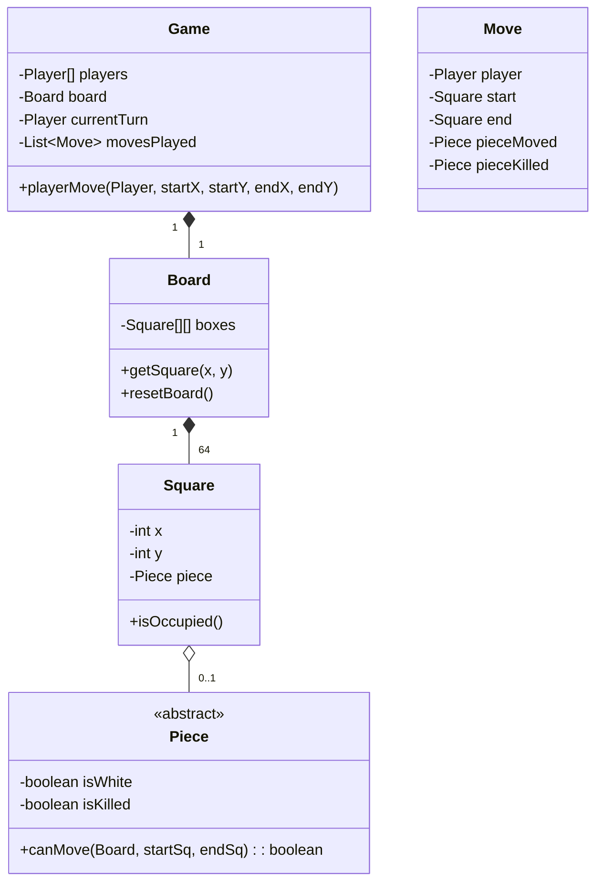

# 🛠️ Design Chess Game (LLD)

Chess is a massive state-machine problem. The interviewer is not expecting you to write an AI (like Stockfish). They want to see how elegantly you can model the board, encapsulate the movement rules for different pieces using polymorphism, and handle special edge cases like Castling.

---

## 1. Requirements

### Functional Requirements
- **Board:** 8x8 Grid.
- **Pieces:** 6 types of pieces (King, Queen, Rook, Bishop, Knight, Pawn) with different movement rules. colors: Black/White.
- **Moves:** Players can move pieces. If the move is invalid, reject it.
- **Capturing:** Moving a piece to a square occupied by an enemy captures it.
- **Special Moves (Optional/Bonus):** Castling, En Passant, Pawn Promotion.
- **Win Condition (Checkmate):** Game ends when a King is under attack and has no legal escape.

### Non-Functional Requirements
- **Extensibility:** The rules of movement should be encapsulated inside the pieces themselves, not crammed into a giant `if-else` block in the Board class.

---

## 2. Core Entities (Objects)

- `Game` (Controls the turn flow, tracks history, checks for Checkmate)
- `Player` (White/Black)
- `Board` (Holds the 8x8 grid of Squares)
- `Square` / `Cell` (Coordinates x, y, and holds a Piece)
- `Piece` (Abstract Base Class) -> `King`, `Queen`, `Rook`, `Knight`, `Bishop`, `Pawn`
- `Move` (DTO holding start, end, piece moved, piece killed).

---

## 3. Class Diagram / Relationships



---

## 4. Key Algorithms / Design Patterns

### 1. The Abstract Piece (Polymorphism)
The most important design decision: The Board should not know *how* a Knight moves. The `Board` simply asks the `Knight`, "Can you move to this square?"

```java
public abstract class Piece {
    private boolean killed = false;
    private boolean white = false;

    public Piece(boolean white) {
        this.white = white;
    }

    public boolean isWhite() { return this.white; }
    
    // Abstract method every piece MUST implement
    public abstract boolean canMove(Board board, Square start, Square end);
}
```

### 2. Concrete Piece Implementation (e.g., The Knight)
The Knight moves in an L-shape. It is the only piece that can jump over other pieces, so it doesn't need to trace its path.

```java
public class Knight extends Piece {
    public Knight(boolean white) { super(white); }

    @Override
    public boolean canMove(Board board, Square start, Square end) {
        // 1. You cannot kill your own piece
        if (end.getPiece() != null && end.getPiece().isWhite() == this.isWhite()) {
            return false;
        }

        int x = Math.abs(start.getX() - end.getX());
        int y = Math.abs(start.getY() - end.getY());
        
        // 2. L-Shape validation (2 horizontal 1 vertical OR 1 horizontal 2 vertical)
        return (x * y == 2);
    }
}
```

### 3. Concrete Piece Implementation (e.g., The Rook)
Unlike the Knight, the Rook moves in straight lines but *must not jump over pieces*. It must trace the path.

```java
public class Rook extends Piece {
    public Rook(boolean white) { super(white); }

    @Override
    public boolean canMove(Board board, Square start, Square end) {
        // Cannot kill own piece
        if (end.getPiece() != null && end.getPiece().isWhite() == this.isWhite()) {
            return false;
        }
        
        // Must move straight
        if (start.getX() != end.getX() && start.getY() != end.getY()) {
            return false;
        }
        
        // Path Tracing (Ensure no pieces are in the way)
        int xDirection = Integer.compare(end.getX(), start.getX());
        int yDirection = Integer.compare(end.getY(), start.getY());
        
        int currentX = start.getX() + xDirection;
        int currentY = start.getY() + yDirection;
        
        while (currentX != end.getX() || currentY != end.getY()) {
            if (board.getSquare(currentX, currentY).getPiece() != null) {
                return false; // Path is blocked by another piece
            }
            currentX += xDirection;
            currentY += yDirection;
        }

        return true;
    }
}
```

### 4. Making a Move (The Game Loop)

When a player attempts to move, the Game class orchestrates the logic:

```java
public boolean playerMove(Player player, int startX, int startY, int endX, int endY) {
    Square startBox = board.getSquare(startX, startY);
    Square endBox = board.getSquare(endX, endY);
    Piece sourcePiece = startBox.getPiece();

    // Validations
    if (sourcePiece == null) return false;
    if (player.isWhiteSide() != sourcePiece.isWhite()) return false; // Moving enemy piece
    if (!sourcePiece.canMove(board, startBox, endBox)) return false;

    // Execute Move
    Piece destPiece = endBox.getPiece();
    if (destPiece != null) {
        destPiece.setKilled(true);
    }

    // Transfer piece
    endBox.setPiece(sourcePiece);
    startBox.setPiece(null);

    // Record History
    Move move = new Move(player, startBox, endBox, sourcePiece, destPiece);
    movesPlayed.add(move);

    // Switch turns
    if (this.currentTurn == players[0]) {
        this.currentTurn = players[1];
    } else {
        this.currentTurn = players[0];
    }

    return true;
}
```

### 5. Check and Checkmate Logic
To verify if a move puts the opponent in "Check":
- After moving, loop through *all* of the current player's pieces.
- For each piece, call `canMove()` targeting the Square where the Opponent's King currently resides.
- If *any* piece returns true, the state is Check.
- *Checkmate* involves generating a hypothetical tree of all legal moves the opponent can make next, and verifying that *none* of them result in escaping the Check state. (This touches Minimax algorithms).