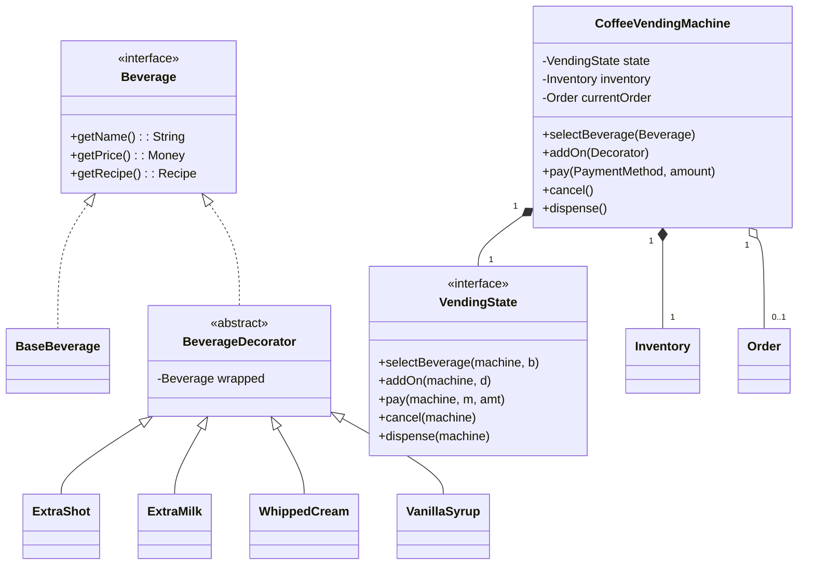

# 🛠️ Design Coffee Vending Machine (LLD)

> **Sources**: GoF — *Design Patterns: Elements of Reusable Object-Oriented Software* (1994), specifically the **State** chapter (p. 305) and **Decorator** chapter (p. 175). The Decorator-for-beverages example is the canonical motivation in *Head First Design Patterns* (Freeman & Robson, 2004), Ch. 3 ("Starbuzz Coffee"). Real-world references: Nespresso & Jura E8 product manuals (recipe-driven brewing & ingredient telemetry).

A coffee vending machine extends the classic vending-machine problem with **per-drink customization** and **recipe-based ingredient tracking**. It tests three things at once: a finite-state machine for the user-interaction flow (**State**), runtime composition of add-ons that mutate price/description (**Decorator**), and inventory management with a *pre-flight check* before brewing.

---

## 1. Requirements

### Functional
- **Beverage catalog**: Espresso, Latte, Cappuccino, Americano, Mocha, Hot Chocolate.
- **Customization (add-ons)**: extra shot, extra milk, extra sugar, whipped cream, syrups (vanilla / caramel / hazelnut). Each add-on has its own price *and* its own ingredient cost.
- **Payment**: coins, bills, contactless card, mobile wallet. Return change (cash) or void hold (card) on cancel.
- **Inventory**: track grams of beans, ml of milk, ml of water, sachets of sugar/chocolate, count of cups & lids. Refuse selection if any required ingredient is below the recipe requirement; surface "Out of stock" per beverage.
- **Brewing & dispense**: heat water, grind beans, brew, add milk/foam, dispense into cup, then return change.
- **Cancel & refund**: full refund any time before brewing starts; no refund once dispense begins.
- **Maintenance mode**: technician can refill ingredients, empty coin tray, view diagnostics; non-technician requests are rejected while in maintenance.

### Non-Functional
- **Single-user serialization**: only one transaction at a time (the physical machine has one spout); enforce via lock.
- **Recipe-driven extensibility**: adding a new drink should be data-only (a new `Recipe`), not a code change in the dispenser.
- **Crash safety**: a power loss mid-brew must not double-charge on restart — payment commit happens *after* dispense completes.

---

## 2. Core Entities

| Entity | Key Fields / Responsibility |
|---|---|
| `CoffeeVendingMachine` (Singleton) | Holds `currentState`, `inventory`, `currentOrder`, `paymentSession`. |
| `VendingState` (interface) | `IdleState`, `SelectingState`, `PaymentState`, `BrewingState`, `DispensingState`, `MaintenanceState`. |
| `Beverage` (interface) | `getName()`, `getPrice()`, `getRecipe()`. |
| `BaseBeverage` | `Espresso`, `Latte`, `Cappuccino`, `Americano`, `Mocha`. |
| `BeverageDecorator` (abstract) | wraps a `Beverage`; concrete: `ExtraShot`, `ExtraMilk`, `WhippedCream`, `VanillaSyrup`, `CaramelSyrup`, `Sugar`. |
| `Recipe` | `Map<Ingredient, int>` quantity required. |
| `Inventory` | `Map<Ingredient, int>` current levels; `hasFor(Recipe)`, `consume(Recipe)`, `refill(...)`. |
| `Ingredient` (enum) | `BEANS_G`, `WATER_ML`, `MILK_ML`, `CHOCOLATE_G`, `SUGAR_SACHET`, `VANILLA_ML`, `CARAMEL_ML`, `CUP`, `LID`. |
| `PaymentMethod` (Strategy) | `CashPayment`, `CardPayment`, `WalletPayment`. |
| `Order` | `Beverage drink`, `paid amount`, `transactionId`. |

---

## 3. Class Diagram



---

## 4. Key Methods

### 4.1 Decorator composition

The Decorator implementation is **transparent** — both the wrapped concrete drink and the decorator implement `Beverage`, so they compose recursively.

```java
public interface Beverage {
    String getName();
    Money getPrice();
    Recipe getRecipe();
}

public abstract class BeverageDecorator implements Beverage {
    protected final Beverage wrapped;
    protected BeverageDecorator(Beverage wrapped) { this.wrapped = wrapped; }
}

public class ExtraMilk extends BeverageDecorator {
    private static final Money COST = Money.of(0.50);
    private static final int MILK_ML = 50;

    public ExtraMilk(Beverage b) { super(b); }
    public String getName()     { return wrapped.getName() + " + Extra Milk"; }
    public Money  getPrice()    { return wrapped.getPrice().add(COST); }
    public Recipe getRecipe()   { return wrapped.getRecipe().plus(Ingredient.MILK_ML, MILK_ML); }
}
```

### 4.2 Pre-flight inventory check (before charging)

```java
public void selectBeverage(Beverage drink) {
    Recipe r = drink.getRecipe();
    if (!inventory.hasFor(r)) {
        throw new OutOfStockException(missingIngredients(r));
    }
    this.currentOrder = new Order(drink);
    setState(new PaymentState());
}
```

> The check happens **before** payment so we never charge a customer for a drink we can't make.

### 4.3 Two-phase commit on brew

```java
public void dispense() {
    Recipe r = currentOrder.getDrink().getRecipe();
    inventory.reserve(r);                 // 1. soft-deduct (rollback on failure)
    try {
        brewer.brew(currentOrder.getDrink());
        inventory.commit(r);              // 2. permanently consume
        payment.capture(currentOrder);    // 3. only NOW commit payment
    } catch (BrewFailure e) {
        inventory.rollback(r);
        payment.void(currentOrder);       // refund / release hold
        throw e;
    }
}
```

The order — *brew first, charge second* — means a power loss before `payment.capture` simply voids the transaction; the customer is never charged for a missing drink.

---

## 5. Design Patterns

| Pattern | Where Used | Why |
|---|---|---|
| **State** | `IdleState → SelectingState → PaymentState → BrewingState → DispensingState → IdleState` | Eliminates giant `if (state == X)` blocks; each state class enforces only the operations valid in that state. |
| **Decorator** | Drink customization (ExtraMilk, WhippedCream, Syrups) | Add-ons compose at runtime without an exponential class explosion (`LatteWithExtraMilkAndSugarAndVanilla` etc.). |
| **Strategy** | `PaymentMethod` (Cash / Card / Wallet) | Each payment family has different `authorize`/`capture`/`void` semantics. |
| **Singleton** | `CoffeeVendingMachine`, `Inventory` | One physical machine ⇒ one in-process instance. |
| **Builder** | `Recipe.builder().beans(18).waterMl(60).milkMl(120).cup().build()` | Recipes have many optional ingredients; Builder beats a 9-arg constructor. |
| **Observer** | Inventory level changes notify a `LowStockListener` (UI / refill alert). | Decouples inventory from the alerting subsystem. |

---

## 6. Concurrency & Edge Cases

### 6.1 Single-user serialization
Although the physical machine has one user, the controller may receive concurrent inputs (e.g. button + card-tap arriving in the same millisecond). Use a **single `ReentrantLock`** around all state transitions. State methods are called *under* the lock.

### 6.2 Inventory race during refill
A technician refilling milk while a customer is mid-brew must not corrupt counters. `Inventory.refill()` and `Inventory.consume()` use `AtomicInteger.addAndGet()` per ingredient — no cross-ingredient atomicity is needed because recipes are reserved as a *batch* under a per-machine lock.

### 6.3 Insufficient change
If the machine has $0.95 in coins and owes $1.00, **the transaction is aborted before brewing**. Either the user accepts a digital credit slip, or the order is voided and money refunded. Greedy change-making works for standard denominations (1¢, 5¢, 10¢, 25¢, $1, $5) but fails for irregular sets — an interview gotcha.

### 6.4 Cancel after payment, before brew
Refund full price; release ingredient *reservation* (no commit). The `Order` is marked `CANCELLED` and the state returns to `Idle`.

### 6.5 Mid-brew power loss
On restart, the machine reads its persisted journal:
- If the last entry is `BREW_STARTED` with no matching `PAYMENT_CAPTURED`, the payment is **voided** (or refund is queued for cash). Inventory rollback is best-effort.

### 6.6 Decorator ordering
`new WhippedCream(new ExtraMilk(new Latte()))` and `new ExtraMilk(new WhippedCream(new Latte()))` produce the same price and recipe (commutative addition), but the *description* differs. Tests should pin the canonical order if it matters for receipts.

---

## 7. Sources / Cross-Refs
- LLD-06 Creational Patterns (Builder for Recipe)
- LLD-07 Structural Patterns (Decorator chapter)
- LLD-08 Behavioral Patterns (State chapter)
- Solution-Vending-Machine.md (canonical State-pattern walkthrough)
- *Head First Design Patterns* — Ch. 3 "Decorating Objects" (Starbuzz example)
- GoF *Design Patterns* — State (p. 305), Decorator (p. 175)
