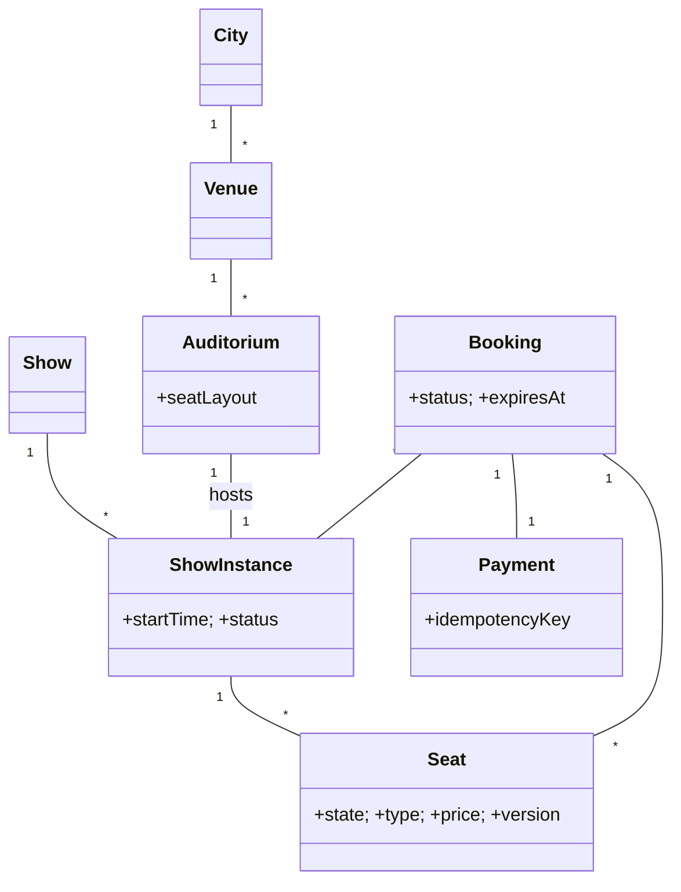

# 🛠️ Design Concert / Movie Ticket Booking (BookMyShow) (LLD)

> Object-oriented design for an event-ticketing system — venues, shows, seat layout, holds with TTL, payment, and cancellation. Focus is OOP class design and race-free seat reservation under sale-day contention.

## 📚 Table of Contents

1. [Requirements](#1-requirements)
2. [Core Entities](#2-core-entities-objects)
3. [Class Diagram](#3-class-diagram--relationships)
4. [Key APIs](#4-api--interfaces)
5. [Design Patterns](#5-key-algorithms--design-patterns)
6. [Concurrency](#6-concurrency--edge-cases)
7. [Sources](#7-sources)

---

## 1. Requirements

### Functional
- **Browse** events by city + date
- **View seat layout** with prices/types (VIP / Regular / Recliner)
- **Select & hold** seats for a 5-min window
- **Pay** to confirm; receive booking + e-ticket
- **Cancel** booking within fare-rule window

### Non-Functional
- **No double-booking** under sale-open contention (10K+ users hitting at second 0)
- **Accurate seat state** visible across all viewers within ≤1 second
- **Fast seat-map render** (cache-friendly, even on cold links)

---

## 2. Core Entities (Objects)

| Entity | Key Attributes |
|---|---|
| `City` | cityId, name |
| `Venue` | venueId, cityId, name, address, auditoriums[] |
| `Auditorium` | auditoriumId, venueId, name, seatLayout (rows × cols) |
| `Show` | showId, title, language, duration, genre |
| `ShowInstance` | instanceId, showId, auditoriumId, startTime, endTime, status |
| `Seat` | seatId, instanceId, row, column, type (VIP/REGULAR/RECLINER), price, state, version |
| `Booking` | bookingId, userId, instanceId, seats[], totalPrice, status, expiresAt |
| `User` | userId, name, phone, email |
| `Payment` | paymentId, bookingId, amount, method, status, idempotencyKey |

**Seat states:** `AVAILABLE → HELD → BOOKED` (or `BLOCKED` for maintenance)
**Booking states:** `PENDING → HELD → CONFIRMED` (or `CANCELLED` / `EXPIRED`)

---

## 3. Class Diagram / Relationships



---

## 4. API / Interfaces

```java
List<ShowInstance> searchShows(String cityId, LocalDate date, ShowFilter f);
SeatLayoutDto      getSeatLayout(String instanceId);

// Hold seats with 5-min TTL; idempotent on (userId, instanceId, seats)
HoldResult holdSeats(long userId, String instanceId, List<String> seatIds);

// After payment success → atomic transition to BOOKED
Booking confirmBooking(String bookingId, String paymentToken);

// Within cancellation window
RefundResult cancelBooking(String bookingId);
```

---

## 5. Key Algorithms / Design Patterns

| Pattern | Where used | Why |
|---|---|---|
| **State** | `Seat` and `Booking` lifecycles | Encodes valid transitions; can't `BOOK` an `AVAILABLE` seat without first `HOLD`-ing it |
| **Strategy** | Pricing | Early-bird, weekend surcharge, premium-seat multiplier — composable |
| **Observer** | Live seat-map updates | UI clients subscribe via WebSocket; on `HOLD`/`BOOK` events, broadcast to all viewers of that show |
| **Factory** | `Booking` creation | Encapsulates ID generation, TTL setup, and audit-trail creation |
| **Singleton** | `SeatInventoryService` | Single source of truth per process (backed by Redis cluster for distributed mode) |
| **Command** | Seat operations | `HoldCommand`/`BookCommand`/`ReleaseCommand` — supports auto-release on TTL via scheduled `ReleaseCommand` |

---

## 6. Concurrency & Edge Cases

- **Seat hold (Redis SETNX + TTL)** — atomic acquisition:
  ```
  SET seat:<inst>:<seatId> <userId> NX EX 300
  ```
  `NX` means "set if not exists", `EX 300` = 5-min TTL. Only the first concurrent caller wins; everyone else gets `nil` and must pick a different seat. Auto-released on TTL.
- **Atomic HELD → BOOKED transition** after payment success:
  ```sql
  UPDATE seats SET state = 'BOOKED', version = version + 1
  WHERE seat_id IN (?, ?, ?) AND state = 'HELD' AND version = ?;
  ```
  If row count ≠ requested → some hold expired or got stolen → fail booking, refund payment.
- **Race-free reservation (DB level)** — `UPDATE … WHERE state = 'AVAILABLE'` ensures only one transaction wins; the loser sees 0 rows affected and retries.
- **Distributed lock per show during sale-open** — for a flash-sale opening with millions of contending users, take a Redis lock keyed by `show:<id>:sale_open` for the first N seconds and **queue** requests to fairness-process them in arrival order. Trades latency for fairness.
- **Idempotent payment** — every payment carries an `idempotencyKey` (typically `bookingId`). Provider replay returns the cached result; never double-charges.
- **Hold-payment race** — user pays at the very last millisecond of TTL. Re-check seat state at the start of the booking transaction; if seats are no longer `HELD` by us, refund and inform user.
- **Cancellation race** — user clicks cancel just as scheduled cleanup releases seats. Both code paths transition `Booking.state` atomically; whichever wins decides the outcome.

---

## 7. Sources

- Workspace cross-reference: `Notes/LowLevelDesign/Solutions/Solution-Movie-Booking.md` (variant)
- Workspace cross-reference: `Notes/SystemDesign/Topics/30-Distributed-Locking.md` (Redis SETNX, Redlock)
- Workspace cross-reference: `Notes/LowLevelDesign/Solutions/Solution-Stripe-Payment-Processor.md` (idempotent payment)
- Workspace cross-reference: `Notes/LowLevelDesign/LLD-08-Behavioral-Patterns.md` (State, Command, Observer)
- Industry pattern: `SET key value NX EX seconds` is documented as the standard atomic distributed-lock primitive in Redis docs

📺 **Video walkthrough:** [BookMyShow / Movie Ticket Booking — LLD](https://www.youtube.com/watch?v=lh9dGGGfjSE)
