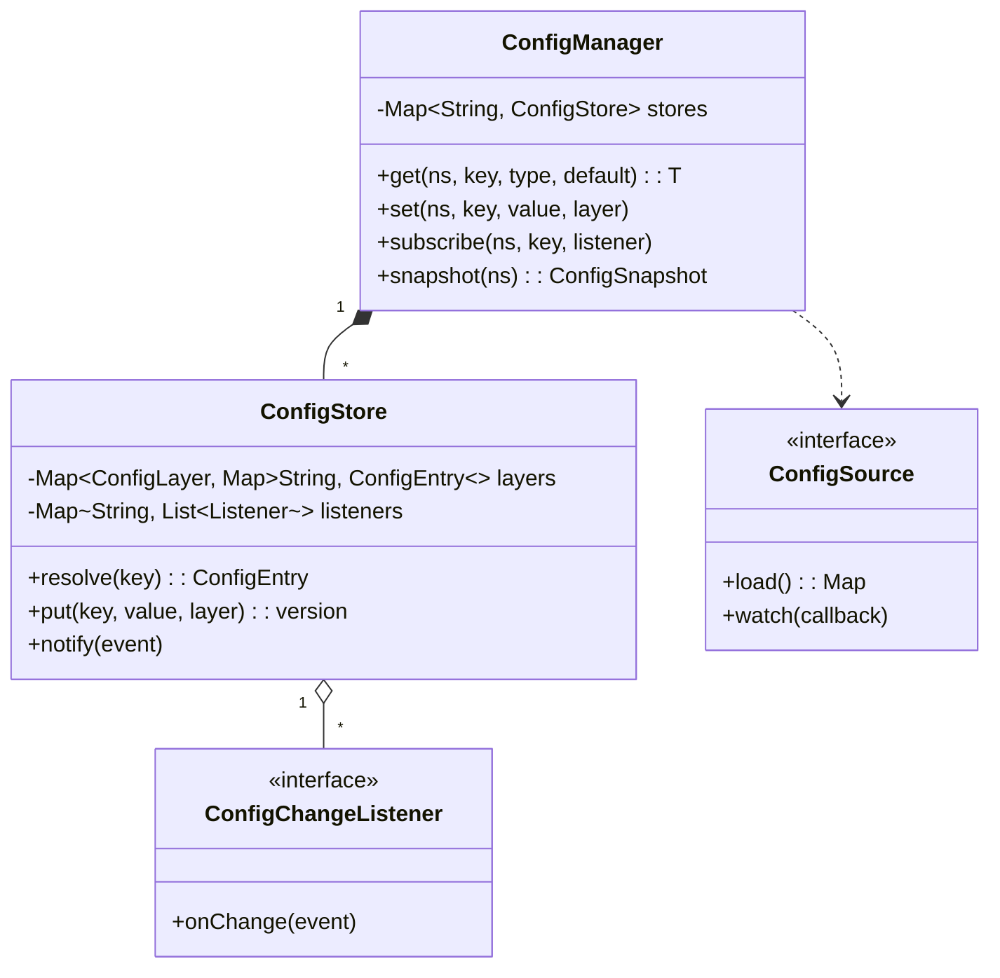

# 🛠️ Design a Configuration Management System (LLD)

> **Sources**: Netflix Archaius — [github.com/Netflix/archaius](https://github.com/Netflix/archaius) (the canonical "dynamic config + listener" library); Spring Cloud Config — [docs.spring.io/spring-cloud-config](https://docs.spring.io/spring-cloud-config/docs/current/reference/html/); etcd watch API — [etcd.io/docs/v3.5/learning/api](https://etcd.io/docs/v3.5/learning/api/#watch-api); Apache ZooKeeper — *ZooKeeper: Wait-free Coordination for Internet-scale Systems* (Hunt et al., USENIX ATC 2010); GoF — Observer (p. 293), Singleton (p. 127).

A configuration-management system stores key-value pairs that drive application behavior **without redeploying**. The hard parts are not CRUD — they are (1) **layered overrides** (a per-host override beats a per-environment override beats a default), (2) **typed values & versioning** (no silent string→int crashes), and (3) **push-style propagation to thousands of subscribers** in seconds.

---

## 1. Requirements

### Functional
- **Typed get/set**: `getString`, `getInt`, `getBool`, `getJson(Class<T>)` with default fallback.
- **Namespacing**: `payment-service.timeout-ms`, `feature.checkout.new-ui`. Keys are dot-segmented.
- **Layered overrides** (highest priority first): `RUNTIME_OVERRIDE → HOST → REGION → ENVIRONMENT (prod/stage/dev) → DEFAULT`.
- **Listeners**: `register(key, listener)` — listener fires on *every* change (old value, new value, version).
- **Versioning & rollback**: every write bumps a monotonic version; client can `rollback(key, version)`.
- **Atomic group writes**: change 5 keys as one logical txn (so a partial deploy doesn't leave the system in a mixed state).
- **Audit log**: who changed what, when, from where.

### Non-Functional
- **Read latency**: reads must be **lock-free O(1)** — config is read on every request path.
- **Push propagation**: a write must reach all 10 000 subscribers in **< 5 s** (long-poll / watch).
- **Strong consistency on writes**: two simultaneous writers must serialize (no lost update); use CAS on `version`.
- **Crash recovery**: if the config store crashes, clients keep serving from their *last cached* values rather than failing requests.

---

## 2. Core Entities

| Entity | Key Fields |
|---|---|
| `ConfigManager` (Singleton facade) | `Map<Namespace, ConfigStore>` — entry point. |
| `ConfigStore` | one per namespace; holds the layered map. |
| `ConfigEntry` | `key`, `typedValue`, `type`, `version`, `lastModified`, `modifiedBy`. |
| `ConfigLayer` (enum) | `DEFAULT < ENVIRONMENT < REGION < HOST < RUNTIME_OVERRIDE` (ordered by priority). |
| `ConfigChangeListener` (interface) | `onChange(ConfigChangeEvent event)`. |
| `ConfigChangeEvent` | `namespace`, `key`, `oldValue`, `newValue`, `oldVersion`, `newVersion`. |
| `ConfigSnapshot` | immutable point-in-time view returned to a client (so reads don't see a partial update mid-request). |
| `ConfigSource` (Strategy) | `FileConfigSource`, `JdbcConfigSource`, `EtcdConfigSource`, `HttpPollingSource`. |

---

## 3. Class Diagram



---

## 4. Key Methods

### 4.1 Layered resolution (priority order)

```java
public ConfigEntry resolve(String key) {
    // ConfigLayer.values() is ordered RUNTIME_OVERRIDE → HOST → REGION → ENVIRONMENT → DEFAULT
    for (ConfigLayer layer : ConfigLayer.byPriorityDesc()) {
        ConfigEntry e = layers.get(layer).get(key);
        if (e != null) return e;
    }
    throw new ConfigKeyNotFoundException(namespace + "." + key);
}
```

> Each layer is an *independent* map. `set(key, val, HOST)` does **not** overwrite the `DEFAULT` value — it inserts at the HOST layer; resolution picks whichever layer wins.

### 4.2 Snapshot read (lock-free, request-scoped)

```java
public ConfigSnapshot snapshot() {
    // resolved is a CopyOnWrite reference; reads need no lock
    return resolvedSnapshot.get();
}

// On every write we rebuild & publish a new immutable snapshot
private void rebuildSnapshot() {
    Map<String, ConfigEntry> merged = new HashMap<>();
    for (ConfigLayer layer : ConfigLayer.byPriorityAsc()) {
        merged.putAll(layers.get(layer));   // higher layers win because they overwrite
    }
    resolvedSnapshot.set(new ConfigSnapshot(Map.copyOf(merged)));
}
```

This is the **copy-on-write** pattern — readers grab one immutable snapshot, then any number of writes can happen concurrently without blocking the reader.

### 4.3 Versioned write with CAS

```java
public synchronized int put(String key, Object value, ConfigLayer layer) {
    ConfigEntry old = layers.get(layer).get(key);
    int newVersion = (old == null ? 0 : old.getVersion()) + 1;
    ConfigEntry next = new ConfigEntry(key, value, type(value), newVersion, now(), currentUser());
    layers.get(layer).put(key, next);
    rebuildSnapshot();
    fire(new ConfigChangeEvent(namespace, key, old, next));
    return newVersion;
}
```

### 4.4 Listener fan-out (Observer)

```java
private void fire(ConfigChangeEvent e) {
    List<Listener> ls = listeners.getOrDefault(e.getKey(), List.of());
    for (Listener l : ls) {
        notifyExecutor.submit(() -> {
            try { l.onChange(e); }
            catch (Exception ex) { log.error("listener {} threw", l, ex); }
        });
    }
}
```

> Listener invocation runs on a **separate executor** so that a slow/buggy listener doesn't stall other listeners or the writer thread.

---

## 5. Design Patterns

| Pattern | Where Used | Why |
|---|---|---|
| **Observer** | `ConfigChangeListener` fan-out | Decouples the config store from arbitrary downstream subscribers (cache invalidators, feature-flag refreshers, log-level switchers). |
| **Singleton** | `ConfigManager` | One global access point per process. |
| **Strategy** | `ConfigSource` (file / DB / etcd / HTTP poll) | The same client code runs against any backend. |
| **Composite** | Layered resolution chain | Layers behave like a search-list composite — query is delegated until satisfied. |
| **Memento** | `rollback(key, version)` reads the historical `ConfigEntry` from the audit log. | Snapshot rollback without changing client API. |
| **Facade** | `ConfigManager.get(...)` hides namespace lookup, layer resolution, type coercion. | Single ergonomic API. |

---

## 6. Concurrency & Edge Cases

### 6.1 Read-mostly workload
Configs are read on **every** request (e.g. checking a feature flag). The snapshot pattern means reads take an `AtomicReference.get()` — single volatile read, zero locks, zero allocations.

### 6.2 Lost-update race
Two admins race to set `payment.timeout`. Without serialization, one write disappears. We synchronize the *write path* (`synchronized` on the per-namespace `ConfigStore`) and use the version number as a CAS token: `set(key, value, expectedVersion)` returns 409 if the version moved.

### 6.3 Type coercion errors
`getInt("threadpool.size")` where the stored value is `"twelve"` must throw at *boot time* during validation, not on the first request. Provide a `validate(schema)` API that runs at startup.

### 6.4 Slow / buggy listener
A listener that blocks for 30 s would freeze every subsequent writer if listeners ran inline. Hence the dedicated `notifyExecutor` (bounded thread pool, timeout per task).

### 6.5 Push propagation
The classic mistake is poll-every-30s. Instead, the client opens a **long-poll / watch** request to the central store; the store responds the moment any subscribed key changes. This is exactly etcd's `Watch` API and ZooKeeper's ephemeral-watcher model — both deliver changes in **single-digit milliseconds** at internet scale.

### 6.6 Last-known-good cache
On client startup, configs are written to a local on-disk JSON file. If the central store is unreachable, the client keeps serving the last cached values rather than crashing — a critical resilience property used by Netflix Archaius and AWS Parameter Store SDK.

### 6.7 Atomic multi-key write
A user expects `feature.checkout.v2 = true` AND `feature.checkout.v1 = false` to flip together. Wrap them in a `ConfigTransaction` that buffers writes and publishes one `ConfigChangeEvent.batch(...)` — listeners react to the batch, never to half-updates.

### 6.8 Secret values
Do **not** store database passwords/API keys here in plaintext. Either (a) reference an external secret manager (HashiCorp Vault, AWS Secrets Manager) by `secret://` URI, or (b) encrypt at rest with a per-namespace KMS key.

---

## 7. Sources / Cross-Refs
- LLD-08 Behavioral Patterns (Observer)
- LLD-06 Creational Patterns (Singleton)
- 12-Caching.md (snapshot / copy-on-write reads)
- 18-Distributed-Systems.md (CAS, watch APIs)
- Netflix Archaius: https://github.com/Netflix/archaius
- etcd Watch API: https://etcd.io/docs/v3.5/learning/api/#watch-api
- Hunt et al., *ZooKeeper* (USENIX ATC 2010)
