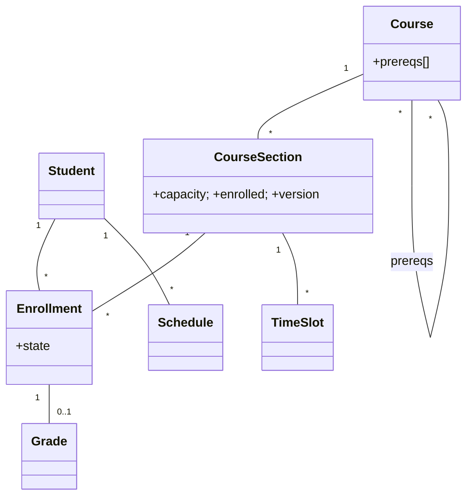

# 🛠️ Design Course Registration System (LLD)

> Object-oriented design for a university enrollment system — catalog, prerequisites, time conflicts, capacity limits, waitlists, and atomic registration under registration-day storm.

## 📚 Table of Contents

1. [Requirements](#1-requirements)
2. [Core Entities](#2-core-entities-objects)
3. [Class Diagram](#3-class-diagram--relationships)
4. [Key APIs](#4-api--interfaces)
5. [Design Patterns](#5-key-algorithms--design-patterns)
6. [Concurrency](#6-concurrency--edge-cases)
7. [Sources](#7-sources)

---

## 1. Requirements

### Functional
- Browse course **catalog** with prerequisites, credits, descriptions
- **Register** for course sections; **drop** before deadline
- **Time-conflict detection** across selected sections
- **Capacity limits** per section; **waitlist** if full
- **Auto-promote** waitlisted student when a seat opens
- View **schedule** + **grades** for past semesters

### Non-Functional
- **No over-enrollment** during the registration-day storm (thousands of students hitting at minute 0)
- **Correct prerequisite enforcement** (may not bypass)
- **Atomic schedule updates** — no half-registered states

---

## 2. Core Entities (Objects)

| Entity | Key Attributes |
|---|---|
| `Student` | studentId, name, email, major, completedCourses[] |
| `Professor` | professorId, name, department |
| `Course` | courseId, title, credits, prereqs[] (M-M self-ref), departmentId |
| `CourseSection` | sectionId, courseId, professorId, room, schedule (TimeSlots[]), capacity, enrolled, version |
| `Enrollment` | enrollmentId, studentId, sectionId, state (ENROLLED/WAITLISTED/DROPPED/COMPLETED), enrolledAt |
| `Schedule` | studentId, semester, sections[] |
| `TimeSlot` | dayOfWeek, startTime, endTime |
| `Department` | id, name |
| `Semester` | id, name (Fall 2026), startDate, endDate, registrationStart, registrationEnd |
| `Grade` | enrollmentId, letter, gpaPoints |

**Enrollment states:** `WAITLISTED → ENROLLED ⇆ DROPPED → COMPLETED` (terminal)

---

## 3. Class Diagram / Relationships



---

## 4. API / Interfaces

```java
List<Course>        searchCourses(SearchQuery q);
PrerequisiteResult  checkPrerequisites(long studentId, String courseId);

// Atomic: prereq + time-conflict + capacity + funds; either all pass or none
RegistrationResult register(long studentId, String sectionId);

void drop(long enrollmentId);
void joinWaitlist(long studentId, String sectionId);

// Background: when a seat opens
Enrollment autoPromoteFromWaitlist(String sectionId);

void submitGrade(long enrollmentId, GradeLetter letter);
```

---

## 5. Key Algorithms / Design Patterns

| Pattern | Where used | Why |
|---|---|---|
| **State** | `Enrollment` lifecycle | Each state defines valid transitions: can't `DROP` after `COMPLETED`; can't `WAITLIST` if already `ENROLLED` |
| **Strategy** | Waitlist policy | `FifoWaitlist`, `PriorityByCreditsWaitlist`, `LotteryWaitlist` — institution-specific |
| **Observer** | Waitlist promotion notifications | Promoted student is notified via Email + in-app push |
| **Chain of Responsibility** | Registration validation | `PrereqCheck → TimeConflictCheck → CapacityCheck → FundsCheck`; first failure short-circuits |
| **Command** | Registration | `RegisterCommand.execute()` runs the chain atomically; on any failure, rollback (no state change) |
| **Singleton** | `RegistrationService` | One coordinator owns capacity counters and waitlist state |
| **Visitor** | Schedule reporting | Compute "credits this semester", "free time slots" without polluting `Enrollment` |

**Time-conflict detection:** two `TimeSlot`s on the same `dayOfWeek` overlap iff `start1 < end2 AND start2 < end1`. O(n²) per registration is fine because n ≈ 5–7 sections.

---

## 6. Concurrency & Edge Cases

- **Over-enrollment race** — 50 students hit "register" for a 30-seat class at 09:00:00. Use **optimistic locking** with version + capacity guard:
  ```sql
  UPDATE course_sections
  SET enrolled = enrolled + 1, version = version + 1
  WHERE section_id = ? AND enrolled < capacity AND version = ?;
  ```
  If `enrolled < capacity` is false or version mismatched → 0 rows affected → put student on waitlist or return "section full".
- **Distributed lock alternative** — for very high contention, take a Redis lock keyed by `section:<id>:register` during the multi-step register transaction. Slower but simpler than optimistic-retry storm.
- **Waitlist promotion atomicity** — when a student drops, only **one** waitlisted student should be promoted. Wrap promotion in a transaction:
  ```sql
  BEGIN;
  UPDATE course_sections SET enrolled = enrolled - 1 WHERE section_id = ?;
  -- Pick top of waitlist (FOR UPDATE SKIP LOCKED so concurrent promoters don't pick same row)
  SELECT enrollment_id FROM enrollments
    WHERE section_id = ? AND state = 'WAITLISTED'
    ORDER BY enrolled_at LIMIT 1 FOR UPDATE SKIP LOCKED;
  UPDATE enrollments SET state = 'ENROLLED' WHERE enrollment_id = ?;
  UPDATE course_sections SET enrolled = enrolled + 1 WHERE section_id = ?;
  COMMIT;
  ```
- **Last-seat race** — covered by the same atomic capacity guard; the loser falls onto the waitlist branch.
- **Idempotent registration** — same student clicks "Register" twice. Enforce `UNIQUE(student_id, section_id, semester)`; second attempt gets a "already enrolled" 409.
- **Prerequisite drift** — student is registered for B, then drops A (its prereq). Re-validate prereqs at semester rollover, or block the drop transactionally.

---

## 7. Sources

- Workspace cross-reference: `Notes/LowLevelDesign/LLD-08-Behavioral-Patterns.md` (State, Strategy, Observer, Chain of Responsibility, Command, Visitor)
- PostgreSQL docs — `SELECT … FOR UPDATE SKIP LOCKED` for non-blocking row reservation
- Industry pattern: optimistic locking with version columns is the canonical approach for capacity-bounded resources
- Workspace cross-reference: `Notes/SystemDesign/Topics/30-Distributed-Locking.md`

📺 **Video walkthrough:** [University Course Registration System – LLD](https://www.youtube.com/watch?v=NtBmOA8uG2A)
