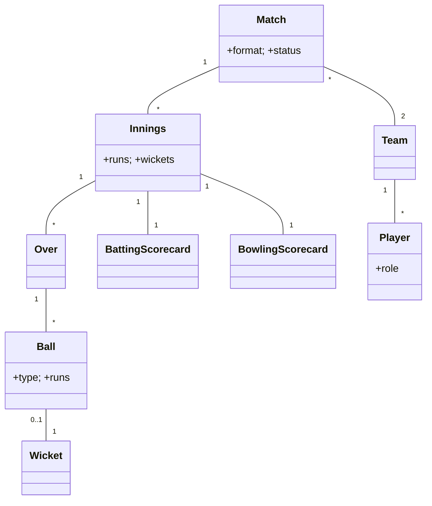

# 🛠️ Design Cricinfo / Cricbuzz (LLD)

> Object-oriented design for a live cricket scoring + stats system — ball-by-ball events, scorecard generation, format-specific rules (Test/ODI/T20), and real-time broadcast to many viewers.

## 📚 Table of Contents

1. [Requirements](#1-requirements)
2. [Core Entities](#2-core-entities-objects)
3. [Class Diagram](#3-class-diagram--relationships)
4. [Key APIs](#4-api--interfaces)
5. [Design Patterns](#5-key-algorithms--design-patterns)
6. [Concurrency & Broadcast](#6-concurrency--broadcast)
7. [Sources](#7-sources)

---

## 1. Requirements

### Functional
- Manage **teams** & **players** with roles (Batsman / Bowler / All-rounder / Wicketkeeper)
- Schedule **matches** in different formats: Test (5 days, 2 innings each), ODI (50 overs), T20 (20 overs)
- Record **ball-by-ball events** (run, wide, no-ball, boundary, wicket)
- **Live score** updated real-time
- Compute **statistics** — batting avg, strike rate, bowling economy
- **Commentary** + **fall-of-wickets** timeline

### Non-Functional
- **Real-time updates** to many viewers (WebSocket / pub-sub)
- **Accurate stats** under high read concurrency
- **Format flexibility** — Test/ODI/T20 share core but differ in rules

---

## 2. Core Entities (Objects)

| Entity | Key Attributes |
|---|---|
| `Team` | teamId, name, players[] |
| `Player` | playerId, name, role |
| `Match` | matchId, format, teams[2], venue, date, status |
| `Innings` | inningsId, battingTeamId, bowlingTeamId, runs, wickets, overs |
| `Over` | overId, inningsId, bowlerId, balls[] |
| `Ball` | ballId, overId, type (NORMAL/WIDE/NOBALL/WICKET), runs, batsmanId, bowlerId, wicketType? |
| `Wicket` | type (BOWLED/CAUGHT/LBW/RUN_OUT/STUMPED), batsman, bowler, fielder? |
| `BattingScorecard` | playerId, runs, balls, fours, sixes, dismissal |
| `BowlingScorecard` | playerId, balls, runs, wickets, economy |
| `Commentary` | ballId, text, timestamp |

**Match states:** `SCHEDULED → LIVE → COMPLETED`
**Innings states:** `IN_PROGRESS → COMPLETED`

---

## 3. Class Diagram / Relationships



---

## 4. API / Interfaces

```java
Match startMatch(String matchId);

// Core operation: every ball is one event
void addBall(String inningsId, BallEvent event);

void endOver(String overId);
void endInnings(String inningsId);

BattingStats computeBattingStats(long playerId);
BowlingStats computeBowlingStats(long playerId);

Scorecard generateScorecard(String matchId);
```

---

## 5. Key Algorithms / Design Patterns

| Pattern | Where used | Why |
|---|---|---|
| **State** | `Match` and `Innings` lifecycle | Encodes valid transitions; can't `addBall` to a `COMPLETED` innings |
| **Strategy** | Format-specific rules | `TestRules` / `OdiRules` / `T20Rules` — different over caps, super-over logic, follow-on rules |
| **Observer** | Real-time score push | Every viewer subscribes via WebSocket; one ball event → broadcast to all |
| **Visitor** | Stats computation | Walks `Ball → Over → Innings → Match` to compute averages, strike rates, economies without polluting domain classes |
| **Composite** | Hierarchical aggregation | `Match.runs() = Σ Innings.runs() = Σ Over.runs() = Σ Ball.runs()` — uniform interface |
| **Factory** | `Match` / `Ball` creation | Format-specific factories produce the right rule-bound objects |
| **Command** | Ball events | `AddBallCommand.execute()/undo()` — supports umpire-review/DRS reversal |
| **Memento** | Innings snapshots | Capture state before crucial moments (last over, super-over) for restore on review |

---

## 6. Concurrency & Broadcast

- **Single-threaded scorer per match** — exactly one process is the source of truth for `addBall()` events. Eliminates race conditions on innings/over/ball state. The scorer typically lives in a stateful service (e.g., Akka actor, Erlang-style process, or a Redis-backed lock-holder).
- **Many readers** — viewers subscribe via WebSocket; the scorer publishes each ball event to a Redis pub/sub channel (or Kafka topic) keyed by `match:<id>`. Web servers fan out to connected sockets without blocking the scorer.
- **Stat aggregation thread-safety** — scorecards live in a `ConcurrentHashMap<playerId, ScorecardSnapshot>`. Reads are wait-free; writes are CAS-guarded.
- **Buffer between scorer and slow clients** — pub/sub absorbs back-pressure; if a viewer is slow, only that connection's queue grows, never the scorer's.
- **Idempotent ball events** — every `addBall` carries a monotonically-increasing `ballId` per innings. Replays of the same `ballId` are no-ops (essential for resuming scorer after a crash).
- **DRS / review** — implemented as `UndoLastBallCommand`; the scorer rolls innings stats back deterministically, then accepts the corrected ball.
- **Crash recovery** — the scorer rebuilds state by replaying the ordered ball event log from durable storage (event sourcing).

---

## 7. Sources

- ICC Playing Conditions (publicly published) — formal rules per format
- Industry pattern: Event-sourcing for live-event domains (live sports, trading, telemetry)
- Workspace cross-reference: `Notes/LowLevelDesign/LLD-08-Behavioral-Patterns.md` (State, Strategy, Observer, Visitor, Command, Memento)
- Workspace cross-reference: `Notes/SystemDesign/Topics/13-Asynchronism.md` (pub/sub fan-out)

📺 **Video walkthrough:** [Cricinfo / Cricbuzz – LLD](https://www.youtube.com/watch?v=VDqwCo6lhkY)
