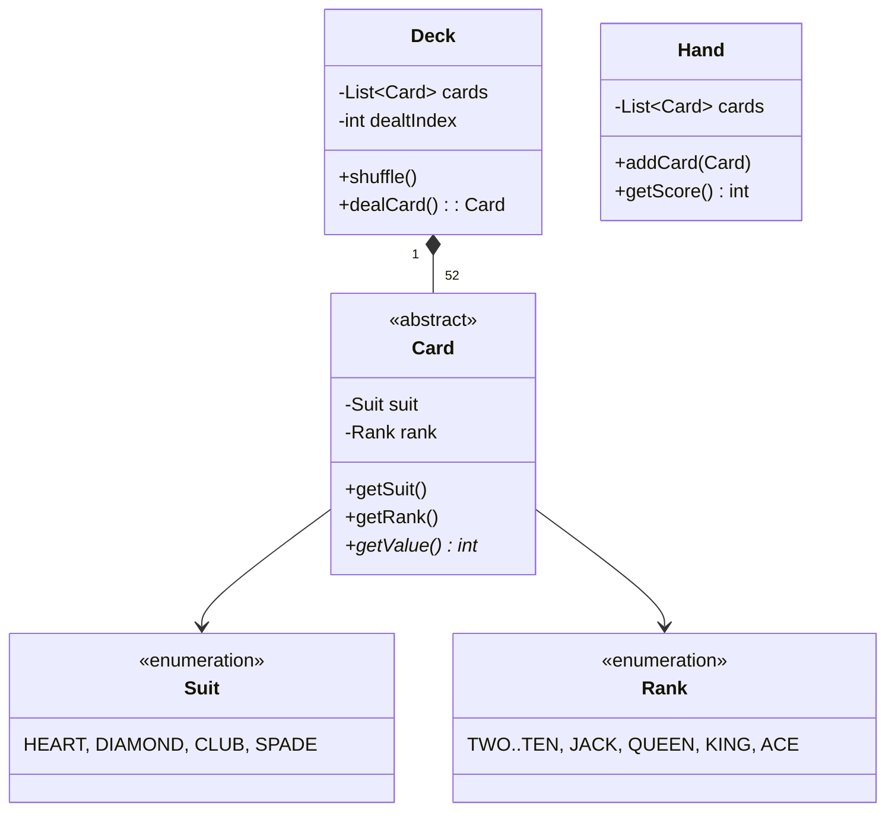

# 🛠️ Design a Deck of Cards (LLD)

This is a foundational Object-Oriented Design question. It tests basic class relationships, use of Enums, and algorithm implementation (shuffling). Once the basic deck is modeled, interviewers usually ask you to model a specific game on top of it, like Blackjack or Poker.

---

## 1. Requirements

### Functional Requirements
- **Standard Deck:** A 52-card standard deck (4 suits, 13 values).
- **Actions:** Ability to shuffle the deck and draw/deal a card.
- **Extensibility:** The design should allow building various games (Blackjack) utilizing the same core Deck classes.

### Non-Functional Requirements
- Avoid "Magic Strings" for suits and card values. Use strongly typed Enums.

---

## 2. Core Entities (Objects)

- `Suit` (Enum: Hearts, Diamonds, Clubs, Spades)
- `Rank` (Enum: Two, Three ... King, Ace)
- `Card` (Base class) -> `StandardCard`
- `Deck` (Collection of Cards)
- `Hand` (A player's collection of cards)

If extending to Blackjack:
- `BlackjackCard` (Extends Card to provide Blackjack point values)
- `BlackjackHand` (Extends Hand to calculate scores, handling the Ace 1/11 logic).

---

## 3. Class Diagram / Relationships



---

## 4. Key Design Patterns & Logic

### 1. Strongly Typed Enums
By putting values in Enums, we prevent typos and centralize logic.

```java
public enum Suit {
    HEART, DIAMOND, CLUB, SPADE
}

public enum Rank {
    TWO(2), THREE(3), FOUR(4), FIVE(5), SIX(6), SEVEN(7), 
    EIGHT(8), NINE(9), TEN(10), JACK(10), QUEEN(10), KING(10), ACE(1); // Default values

    private int value;
    Rank(int value) { this.value = value; }
    public int getValue() { return value; }
}
```

### 2. The Abstract Card Class
We make `Card` abstract because the "value" of a card depends heavily on the game. In Poker, suits might not matter for points, but Ranks determine the winner. In Blackjack, a King is 10, but in other games, it might be 13.

```java
public abstract class Card {
    private final Suit suit;
    private final Rank rank;

    public Card(Suit suit, Rank rank) {
        this.suit = suit;
        this.rank = rank;
    }
    
    public abstract int getValue();
}

public class StandardCard extends Card {
    public StandardCard(Suit suit, Rank rank) { super(suit, rank); }
    
    @Override
    public int getValue() {
        return this.getRank().getValue();
    }
}
```

### 3. The Deck & Shuffling Algorithm
How do you shuffle a list of objects algorithmically? You should use the **Fisher-Yates (Knuth) Shuffle Algorithm**, which guarantees a perfectly unbiased permutation in `O(N)` time. Do not just `Collections.shuffle()` without knowing how it works.

```java
public class Deck {
    private List<Card> cards = new ArrayList<>();
    private int dealIndex = 0; // Pointer to top of deck
    
    public Deck() {
        // Initialize deck
        for (Suit suit : Suit.values()) {
            for (Rank rank : Rank.values()) {
                cards.add(new StandardCard(suit, rank));
            }
        }
    }
    
    public void shuffle() {
        Random rand = new Random();
        for (int i = cards.size() - 1; i > 0; i--) {
            int j = rand.nextInt(i + 1); // Random index from 0 to i
            // Swap cards[i] and cards[j]
            Card temp = cards.get(i);
            cards.set(i, cards.get(j));
            cards.set(j, temp);
        }
        dealIndex = 0; // Reset
    }
    
    public Card dealCard() {
        if (dealIndex < cards.size()) {
            return cards.get(dealIndex++); 
        }
        return null; // Deck is empty
    }
}
```

### 4. Extending for Blackjack (Handling the Ace)
If asked to solve Blackjack, the complexity is calculating the Hand score, because an Ace can be 1 or 11.

```java
public class BlackjackHand {
    private List<Card> cards = new ArrayList<>();

    public int getScore() {
        int score = 0;
        int aceCount = 0;

        for (Card card : cards) {
            int val = card.getValue();
            if (card.getRank() == Rank.ACE) {
                aceCount++;
                score += 11; // Assume 11 initially
            } else {
                score += val;
            }
        }

        // Adjust if we bust
        while (score > 21 && aceCount > 0) {
            score -= 10; // Convert an Ace from 11 down to 1
            aceCount--;
        }

        return score;
    }
}
```