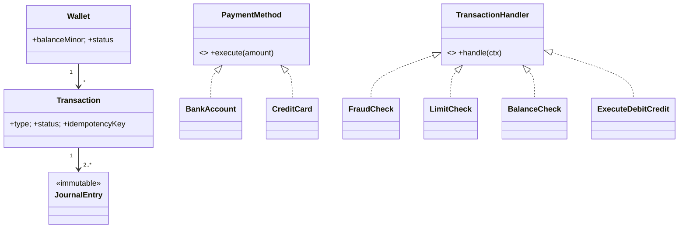

# 🛠️ Design a Digital Wallet (PayPal / Venmo / Apple-Pay-style) — LLD

> **Sources**: [Stripe blog — *Online migrations at scale*](https://stripe.com/blog/online-migrations) and [Stripe API — Idempotent requests](https://docs.stripe.com/api/idempotent_requests); [Square Engineering — *Distributed transactions in Cash App*](https://developer.squareup.com/blog/); standard double-entry bookkeeping (Pacioli, 1494, *Summa de Arithmetica*); PCI-DSS, SOX, and GDPR regulatory frameworks.

## 1. Requirements

### Functional
- Each user has one or more **Wallets** (one per currency); each tracks balance.
- **Deposit** money (linked bank or card), **withdraw** to bank.
- **P2P transfer** between users (instant); **pay merchants**.
- **Transaction history** with running balance.
- **Refund** an existing transaction.
- **Multi-currency** wallets; FX conversion.
- **Daily / monthly spending limits** per user.
- **Lock / freeze** wallet on suspicious activity.

### Non-Functional
- **Never lose money** — perfect debit/credit symmetry.
- **Idempotent transfers** — network retries do not double-charge.
- **Read-your-writes** consistency for balance.
- **Audit log** for every state change (SOX compliance).
- Low latency for balance reads.

## 2. The Critical Idea: Double-Entry Bookkeeping

> "Every transaction is two journal entries: one debit + one credit, summing to zero."  — Pacioli, 1494.

The **journal of entries is the source of truth**; the wallet's `balance` column is a **derived/cached value** computed (or maintained transactionally) from the journal. This makes audits and reconciliation trivial: at all times, `Σ debits == Σ credits` for the entire system.

This is the same architecture Stripe Ledger uses internally — every money movement on Stripe generates symmetric ledger entries, and discrepancies are caught by automated reconciliation against the source-of-truth journal.

## 3. Core Entities

| Entity | Key Fields |
|---|---|
| `User` | `id`, `kycStatus` |
| `Wallet` | `id`, `userId`, `currency`, `balanceMinor` (cached), `status: ACTIVE/FROZEN/CLOSED` |
| `Account` | linked external `BankAccount` / `Card` (provider, externalId, masked PAN, lastFour) |
| `Transaction` | `id`, `type: DEPOSIT/WITHDRAW/TRANSFER/REFUND/FEE`, `fromWalletId?`, `toWalletId?`, `amountMinor`, `currency`, `status: PENDING/COMPLETED/FAILED/REVERSED`, `idempotencyKey UNIQUE`, `createdAt`, `completedAt` |
| `JournalEntry` *(immutable)* | `id`, `transactionId`, `walletId`, `amountMinor` (signed), `direction: DEBIT/CREDIT` |
| `Limit` | `userId`, `currency`, `dailyMaxMinor`, `monthlyMaxMinor` |
| `AuditLog` *(immutable)* | `entityId`, `before`, `after`, `actor`, `at` |

## 4. Class Diagram



## 5. Key Methods

```java
TransactionId  transfer(WalletId from, WalletId to, long amountMinor,
                        Currency c, String idempotencyKey);
TransactionId  deposit(WalletId to, AccountId source, long amountMinor);
TransactionId  withdraw(WalletId from, AccountId dest, long amountMinor);
long           getBalance(WalletId);
Page<Transaction> getHistory(WalletId, Page);
TransactionId  refund(TransactionId originalTx);
```

## 6. The Transfer Algorithm — atomic, idempotent, deadlock-free

```sql
BEGIN;

-- 6.1 IDEMPOTENCY: insert reserves the key. Retried request collides and we
--     return the existing transaction (Stripe's playbook).
INSERT INTO transactions (id, type, from_wallet, to_wallet, amount_minor,
                          currency, status, idempotency_key)
  VALUES (...,'TRANSFER', :from, :to, :amt, :cur, 'PENDING', :key)
  ON CONFLICT (idempotency_key) DO NOTHING;

-- 6.2 LOCK ORDERING: always lock by ascending wallet_id.
--     Same trick used in Solution-Splitwise.md to avoid the classic
--     "A locks 1 then 2; B locks 2 then 1" deadlock.
SELECT * FROM wallets
  WHERE id IN (LEAST(:from,:to), GREATEST(:from,:to))
  ORDER BY id
  FOR UPDATE;

-- 6.3 GUARDS
--     status checks; balance check on `from`; daily/monthly limits.

-- 6.4 DOUBLE-ENTRY: one debit + one credit, summing to zero
INSERT INTO journal_entries(transaction_id, wallet_id, amount_minor, direction)
  VALUES (:tx, :from, -:amt, 'DEBIT'),
         (:tx, :to,    :amt, 'CREDIT');

-- 6.5 Update cached balances (still inside the same TX)
UPDATE wallets SET balance_minor = balance_minor - :amt WHERE id = :from;
UPDATE wallets SET balance_minor = balance_minor + :amt WHERE id = :to;

UPDATE transactions SET status='COMPLETED', completed_at=now() WHERE id=:tx;
COMMIT;
```

After commit, fire `TransactionCompletedEvent` (outside the transaction) for notifications, fraud-monitoring, and downstream ledgers.

## 7. Design Patterns

| Pattern | Where | Why |
|---|---|---|
| **Command** | Every state change is a `Transaction` (queryable, replayable, never deleted) | Audit-grade history. |
| **Strategy** | `PaymentMethod` (`BankAccount` / `CreditCard` / `ACH` / `InstantPush`) | Same `execute` API, provider-specific behavior. |
| **State** | `Wallet.status` (`ACTIVE → FROZEN → ACTIVE` or `→ CLOSED`) | Block illegal operations. |
| **Observer** | `TransactionEventListener` (notify user, fraud-detection, downstream ledger) | Decoupled fan-out. |
| **Chain of Responsibility** | `FraudCheck → LimitCheck → BalanceCheck → ExecuteDebit → ExecuteCredit` | Each handler can short-circuit. |
| **Factory** | `TransactionFactory.create(type, ...)` | Single creation point with invariants. |

## 8. Concurrency, Idempotency, Refunds

- **Deadlock avoidance**: lock wallets in canonical (`min, max`) order — same trick as Splitwise.
- **Idempotency**: `UNIQUE(idempotency_key)` constraint; the second arrival sees a key collision, looks up the existing transaction, and returns the **same** result. Matches Stripe's `Idempotency-Key` semantics.
- **Refunds**: never delete or amend a journal entry. Issue a **new reversing transaction** with `type=REFUND, parentTransactionId=originalTx`. Audit log shows both rows.
- **Consistency**: per-wallet balance is **strongly consistent** (read-your-writes from primary). System-wide aggregates are eventually consistent.

## 9. Regulatory Layer

| Concern | Mitigation |
|---|---|
| **PCI-DSS** | Never store full PAN; store provider tokens only; TLS in transit. |
| **KYC** | Enforced above thresholds (e.g., $1000 / day); blocks transfers until verified. |
| **AML** | Transaction monitoring with rule + ML scoring; SAR filing workflow. |
| **SOX** | Append-only `JournalEntry` and `AuditLog`; 7-year retention. |
| **GDPR** | Right to erasure → anonymise PII (replace name/email with hash) but **retain transactions** (legal hold). |

## 10. Sources / Cross-Refs
- LLD-08 Behavioral Patterns (Command, Strategy, State, Observer, Chain of Responsibility)
- LLD-09 Concurrency.md (`SELECT FOR UPDATE`, lock ordering)
- Solution-Splitwise.md (sister problem — same lock-ordering recipe)
- Solution-Stripe-Payment-Processor.md (idempotency contract in detail)
- Stripe & Square engineering blogs; PCI-DSS / SOX / GDPR docs
