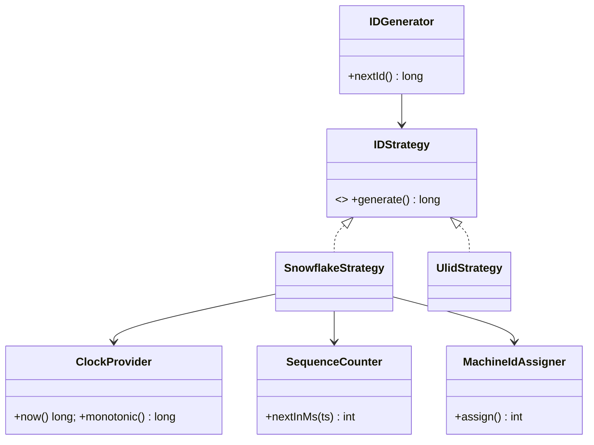

# 🛠️ Design Distributed Unique ID Generator (LLD)

> Object-oriented design for a Twitter Snowflake-style 64-bit ID generator — focus on bit layout, machine-ID assignment, and concurrency under clock skew. Distributed coordination details (ZooKeeper) are referenced but not the focus.

## 📚 Table of Contents

1. [Requirements](#1-requirements)
2. [Snowflake Bit Layout](#2-snowflake-bit-layout)
3. [Core Entities](#3-core-entities-objects)
4. [Class Diagram](#4-class-diagram--relationships)
5. [Key APIs](#5-api--interfaces)
6. [Design Patterns](#6-key-algorithms--design-patterns)
7. [Concurrency](#7-concurrency--edge-cases)
8. [Sources](#8-sources)

---

## 1. Requirements

### Functional
- Generate **64-bit unique IDs** across many machines without coordination per call
- IDs must be **roughly time-ordered** (k-sortable) so they sort meaningfully in DB indexes
- Support **millions of IDs per second per node**
- Sub-millisecond latency

### Non-Functional
- No single point of failure during ID generation (only at startup, for machine-ID assignment)
- Robust to NTP clock adjustments (slewing, step-back)
- Stateless after machine ID is assigned

---

## 2. Snowflake Bit Layout

Twitter's original Snowflake (2010) packs a 64-bit ID like this:

```
┌─┬─────────────────────────────────────────┬──────────┬──────────────┐
│0│ timestamp (41 bits, ms since epoch)     │ machineId│ sequence     │
│ │                                         │ (10 bits)│ (12 bits)    │
└─┴─────────────────────────────────────────┴──────────┴──────────────┘
 1                  41                          10           12  =  64
```

| Field | Bits | Range | Notes |
|---|---|---|---|
| Sign | 1 | always 0 | so ID fits in a signed `long` |
| Timestamp | 41 | ≈ 69 years | ms since custom epoch (e.g., service launch date) |
| Machine ID | 10 | 1024 nodes | sometimes split into 5 datacenter + 5 worker bits |
| Sequence | 12 | 0–4095 per ms | resets every ms |

**Throughput per node:** 4096 × 1000 = **~4M IDs/sec** theoretical. Practical microbenchmarks land near the theoretical max; on a 3-node cluster ~31k TPS at 500 concurrent threads has been measured before infra (LB, servlet pool) saturates.

---

## 3. Core Entities (Objects)

| Entity | Purpose |
|---|---|
| `IDGenerator` | Singleton facade exposing `nextId()` |
| `IDStrategy` (interface) | Abstract "how to make an ID" — Snowflake, ULID, UUIDv7 |
| `SnowflakeStrategy` | 64-bit time + machine + sequence |
| `UlidStrategy`, `UuidV7Strategy` | 128-bit alternatives |
| `MachineIdAssigner` | Resolves the worker ID at startup (config / ZooKeeper / IP-derived) |
| `ClockProvider` | Wraps system + monotonic clock; detects regressions |
| `SequenceCounter` | `AtomicLong` per generator; resets per ms |

---

## 4. Class Diagram / Relationships



---

## 5. API / Interfaces

```java
public interface IDStrategy {
    long generate();
}

public final class SnowflakeStrategy implements IDStrategy {
    private static final long EPOCH = 1420070400000L; // custom epoch
    private final int machineId;       // 0..1023
    private final ClockProvider clock;
    private final AtomicLong lastTimestamp = new AtomicLong(-1);
    private final AtomicInteger sequence  = new AtomicInteger(0);

    public synchronized long generate() {
        long ts = clock.now();
        if (ts < lastTimestamp.get()) {
            throw new ClockMovedBackwardException(lastTimestamp.get() - ts);
        }
        if (ts == lastTimestamp.get()) {
            int seq = (sequence.incrementAndGet()) & 0xFFF; // 12-bit mask
            if (seq == 0) {
                ts = waitNextMs(lastTimestamp.get()); // sequence overflow: spin to next ms
            }
        } else {
            sequence.set(0);
        }
        lastTimestamp.set(ts);
        return ((ts - EPOCH) << 22) | ((long) machineId << 12) | sequence.get();
    }

    private long waitNextMs(long lastTs) {
        long ts;
        do { ts = clock.now(); } while (ts <= lastTs);
        return ts;
    }
}
```

---

## 6. Key Algorithms / Design Patterns

| Pattern | Where used | Why |
|---|---|---|
| **Singleton** | `IDGenerator` per process | All threads share the same sequence + last-ts state |
| **Strategy** | `IDStrategy` interface | Snowflake / ULID / UUIDv7 swappable via DI; A/B test |
| **Factory** | `IDStrategyFactory` | Picks strategy from config at boot |
| **Template Method** | bit-packed strategies | Common skeleton: `getTime → getSequence → packBits` |

**Alternatives to know for the interview:**
- **ULID** (128-bit, lexicographically sortable, more entropy)
- **UUID v7** (128-bit timestamp-prefixed; emerging standard, RFC 9562)
- **MongoDB ObjectID** (96-bit: timestamp + machine + pid + counter)
- **Sonyflake** (16-bit machine ID from private IPv4, but 10 ms time unit lowers throughput)
- **Instagram's approach** — sharded PostgreSQL sequences in `PL/pgSQL`, embedding shard ID in upper bits

---

## 7. Concurrency & Edge Cases

- **Clock skew (NTP step)** — if NTP detects > 128 ms drift it can step the clock backward. Snowflake **must refuse** to emit an ID with `ts < lastTimestamp` — otherwise duplicates are possible. Use a monotonic clock for elapsed-time reasoning and reject (or wait) on backward jumps.
- **Sequence overflow within same ms** — when 4096 IDs are exhausted in one ms, spin-wait in `waitNextMs()` until the clock advances. This caps per-node throughput at 4 M/s but never produces duplicates.
- **Thread safety** — the simplest correct version is a `synchronized` `generate()`. Lock-free designs use `AtomicLong` packing both timestamp and sequence into a single 64-bit word and CAS-update them atomically.
- **Machine ID assignment** — three options:
  - *Static config* — simplest, but operator error = duplicate IDs
  - *ZooKeeper ephemeral nodes* — generator creates `/snowflake/workers/<id>`; if node dies, the ephemeral node + its worker ID are released
  - *IP-derived* — Sonyflake-style, take last 10/16 bits of private IPv4; works in Kubernetes/ECS where IPs are unique and ephemeral
- **Across regions** — embed datacenter bits in machine ID; ensures no global coordination needed even across regions.

---

## 8. Sources

- Twitter Engineering Blog — original Snowflake announcement (2010)
- Discord Engineering — uses Snowflake (Discord IDs are 64-bit Snowflakes)
- Instagram Engineering — sharded ID generation with PL/pgSQL (Sept 2012)
- RFC 9562 — UUID v7 specification (timestamp-prefixed UUIDs)
- Workspace cross-reference: `Notes/SystemDesign/Topics/26-Unique-ID-Generation.md` (high-level)

📺 **Video walkthrough:** [Design a Unique ID Generator – Snowflake Algorithm](https://www.youtube.com/watch?v=g3BV_holJK4)
