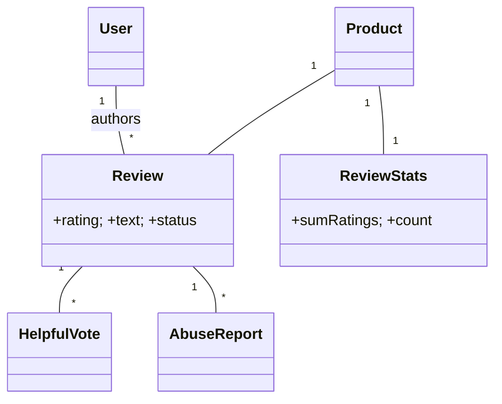

# 🛠️ Design E-Commerce Review/Rating System (LLD)

> Object-oriented design for an Amazon/Yelp reviews subsystem — review posting, helpful votes, abuse reports, sort orders, and incremental stats aggregation.

## 📚 Table of Contents

1. [Requirements](#1-requirements)
2. [Core Entities](#2-core-entities-objects)
3. [Class Diagram](#3-class-diagram--relationships)
4. [Key APIs](#4-api--interfaces)
5. [Design Patterns](#5-key-algorithms--design-patterns)
6. [Concurrency](#6-concurrency--edge-cases)
7. [Sources](#7-sources)

---

## 1. Requirements

### Functional
- Post **review** with rating (1–5), text, optional photos
- **Edit/Delete** own review
- **Vote helpful** on others' reviews
- **Report abuse** with reason
- **Sort** by helpful / recent / highest / lowest
- **Verified-purchase** filter / requirement (some products)
- **Average rating** per product computed in real time

### Non-Functional
- **One review per user per product** (idempotent)
- **Spam/abuse detection** before publish
- **Stats consistency** without rescanning all reviews
- **High read concurrency** (reviews are read 1000× more than written)

---

## 2. Core Entities (Objects)

| Entity | Key Attributes |
|---|---|
| `User` | userId, name |
| `Product` | productId, title |
| `Review` | reviewId, userId, productId, rating, text, photos[], status, createdAt, updatedAt |
| `HelpfulVote` | voteId, reviewId, voterId, createdAt |
| `AbuseReport` | reportId, reviewId, reporterId, reason, status |
| `ReviewStats` | productId, sumRatings, count, distribution[1..5] |
| `VerifiedPurchase` | userId, productId, orderId — proven via Order Service |

**Review states:** `PENDING → PUBLISHED → (REJECTED | REMOVED)`

---

## 3. Class Diagram / Relationships



---

## 4. API / Interfaces

```java
Review postReview(long userId, String productId, int rating, String text, List<String> photoUrls);
Review editReview(String reviewId, long userId, ReviewEdits edits);
void   deleteReview(String reviewId, long userId);     // soft-delete

int    voteHelpful(String reviewId, long voterId);     // returns new count
void   reportAbuse(String reviewId, long reporterId, AbuseReason reason);

List<Review> getReviewsByProduct(String productId, SortOrder order, int page, int size);
ReviewStats  getStats(String productId);
```

---

## 5. Key Algorithms / Design Patterns

| Pattern | Where used | Why |
|---|---|---|
| **State** | `Review` lifecycle | `PENDING → PUBLISHED → REJECTED/REMOVED`; clean transitions, audit-friendly |
| **Strategy** | Sort order | `MostHelpful`, `MostRecent`, `HighestRated`, `LowestRated` — pluggable |
| **Strategy** | Abuse detection | `KeywordFilter`, `MlClassifier`, `RateLimitDetector` — composable |
| **Observer** | Stats recomputation | On `publish` / `edit` / `delete` → `StatsService` updates `ReviewStats` incrementally |
| **Decorator** | Photo attachment | `PhotoReview = PhotoDecorator(plainReview)` — adds photos without subclass explosion |
| **Chain of Responsibility** | Review pipeline | `Validate → VerifiedPurchaseCheck → SpamCheck → Publish`; any step can short-circuit |
| **Factory** | Review variants | `ReviewFactory.createWithPhotos()` vs `.createTextOnly()` |
| **Singleton** | `StatsService` | Single coordinator for incremental stats updates per process |

---

## 6. Concurrency & Edge Cases

- **One review per user per product** — `UNIQUE(user_id, product_id)` index. Duplicate `INSERT` returns a constraint violation; map to a 409 in the API.
- **Helpful-vote idempotency** — `UNIQUE(review_id, voter_id)` and use `UPSERT`:
  ```sql
  INSERT INTO helpful_votes (review_id, voter_id) VALUES (?, ?)
  ON CONFLICT (review_id, voter_id) DO NOTHING;
  ```
  Safe under retries; never double-counts.
- **Atomic helpful counter** — keep a denormalized counter on `Review.helpful_count` and increment **conditionally inside the same transaction** as the vote insert; or use Redis `INCR` and reconcile periodically.
- **Incremental stats** — never recompute average from all reviews on every change. Maintain `(sum_ratings, count)` per product and apply deltas:
  ```sql
  -- on new review
  UPDATE review_stats SET sum_ratings = sum_ratings + :r, count = count + 1, distribution[:r] = distribution[:r] + 1
  WHERE product_id = ?;
  ```
  `avg = sum / count` computed at read time. O(1) update regardless of review count.
- **Edit changes rating from 5 → 3** — apply `Δ = -2` on `sum_ratings`, decrement `distribution[5]`, increment `distribution[3]`. Same transaction as the review update.
- **Spam detection async** — pipeline runs in a worker; `Review.status` starts `PENDING`; only flips to `PUBLISHED` on `pass`. Reads default to `PUBLISHED` only.
- **Abuse threshold auto-reject** — when N reports collected (e.g., 10), worker flips `status → REJECTED` and decrements stats.
- **Read scaling** — cache product reviews + stats in Redis; invalidate (or update via Observer) on any change. Most product pages serve from cache exclusively.

---

## 7. Sources

- Amazon "Verified Purchase" public documentation (anti-fraud rationale)
- Yelp Engineering Blog — review trust mechanisms (publicly available)
- Workspace cross-reference: `Notes/LowLevelDesign/LLD-08-Behavioral-Patterns.md` (State, Strategy, Chain of Responsibility, Observer)
- Workspace cross-reference: `Notes/LowLevelDesign/LLD-07-Structural-Patterns.md` (Decorator)
- PostgreSQL docs — `INSERT … ON CONFLICT DO NOTHING/UPDATE` for atomic UPSERT

📺 **Video walkthrough:** [Design Amazon Review System](https://www.youtube.com/watch?v=gwsK2N71-go)
