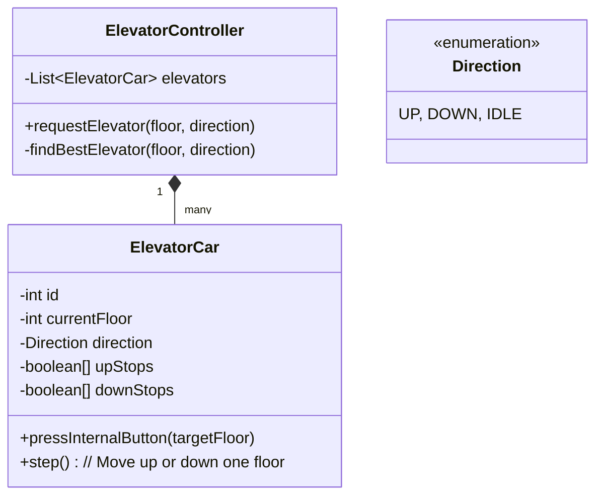

# 🛠️ Design an Elevator System (LLD)

The Elevator System is a highly common LLD and Concurrency problem. It tests your ability to manage state, create efficient routing algorithms (like the SCAN algorithm), and handle multi-threaded asynchronous events (users pressing buttons on floors while the elevator is moving).

---

## 1. Requirements

### Functional Requirements
- **Multiple Elevators:** The system must manage $N$ elevators in a building with $M$ floors.
- **Internal/External Buttons:** Users can press Up/Down buttons in the lobby of a floor (External), and target floor buttons inside the car (Internal).
- **Dispatching Algorithm:** Minimize wait time. Elevators shouldn't blindly go up and down to service a single user if it's currently on the way.
- **Capacity:** Elevators have a max weight/passenger limit.

### Non-Functional Requirements
- **Concurrency:** Button presses happen asynchronously in different threads. Dispatch logic must be thread-safe.

---

## 2. Core Entities (Objects)

- `ElevatorController` / `Dispatcher` (Singleton Orchestrator)
- `ElevatorCar` (Represents the physical moving car)
- `State` (Enum: IDLE, UP, DOWN)
- `Door` (Enum: OPEN, CLOSED)
- `Button` (Abstract) -> `InternalButton`, `ExternalButton`
- `Request` (DTO representing an intent to go to a floor)

---

## 3. Class Diagram / Relationships



---

## 4. Key Algorithms / Design Patterns

### 1. The Dispatching Algorithm (Which elevator takes the call?)
When a user on Floor 5 presses "UP", which of the 3 elevators should go get them?
A standard heuristic:
1. Find an elevator currently `IDLE` at Floor 5.
2. If none, find an elevator moving `UP` that is currently *below* Floor 5.
3. If none, find an `IDLE` elevator closest to Floor 5.
4. If none, queue the request until an elevator becomes available.

### 2. The Internal Routing Algorithm (The SCAN / LOOK Algorithm)
Once an elevator is assigned calls, how does it physically move? 
We DO NOT use a First-In-First-Out (FIFO) queue for an elevator. If people press 9, then 2, then 8, the elevator shouldn't bounce 1 -> 9 -> 2 -> 8. It should sweep up: 1 -> 2 -> 8 -> 9.
This is exactly how a hard drive read-head works, known as the **SCAN** (or LOOK) algorithm.

**Data Structure:**
Use a boolean array (or `BitSet`) or two Priority Queues per elevator to track where it needs to stop.
- `boolean[] upStops`: True if it needs to stop on the way UP.
- `boolean[] downStops`: True if it needs to stop on the way DOWN.

```java
public class ElevatorCar implements Runnable {
    private int currentFloor = 0;
    private Direction direction = Direction.IDLE;
    private boolean[] upStops = new boolean[100];
    private boolean[] downStops = new boolean[100];

    // Called asynchronously by users inside the car or by the Controller
    public synchronized void addStop(int targetFloor, Direction dir) {
        if (dir == Direction.UP || (dir == Direction.IDLE && targetFloor > currentFloor)) {
            upStops[targetFloor] = true;
        } else {
            downStops[targetFloor] = true;
        }
        
        if (direction == Direction.IDLE) {
            direction = (targetFloor > currentFloor) ? Direction.UP : Direction.DOWN;
        }
    }

    // The physical movement loop
    @Override
    public void run() {
        while (true) {
            try {
                if (direction == Direction.UP) {
                    moveUp();
                } else if (direction == Direction.DOWN) {
                    moveDown();
                } else {
                    // IDLE: wait for notify() from addStop
                    Thread.sleep(100); 
                }
            } catch (InterruptedException e) { }
        }
    }

    private void moveUp() throws InterruptedException {
        // Did we hit a stop?
        if (upStops[currentFloor]) {
            upStops[currentFloor] = false;
            openDoors();
        }
        
        // Is there another stop above us?
        if (hasMoreStopsAbove()) {
            currentFloor++;
            Thread.sleep(1000); // 1 second to move a floor
        } else {
            // Turn around or go IDLE
            direction = hasMoreStopsBelow() ? Direction.DOWN : Direction.IDLE;
        }
    }
    
    // ... moveDown() implementation ...
}
```

### 3. Concurrency
Because buttons are pressed via Web APIs or physical hardware asynchronously to the `run()` loop moving the car, all state modifications (`upStops`, `direction`) must be protected.
- Using `synchronized` methods.
- Using `ConcurrentSkipListSet` instead of boolean arrays if floor counts are massive or dynamic.

### 4. The Observer Pattern
The elevator car's physical display showing "Floor 4... Floor 5..." needs to update in real-time.
The `ElevatorCar` acts as the Subject.
The `FloorDisplay` objects on every single floor act as Observers.
When `currentFloor` changes, the Car triggers `notifyObservers(currentFloor)`, updating the LCD screens instantly.