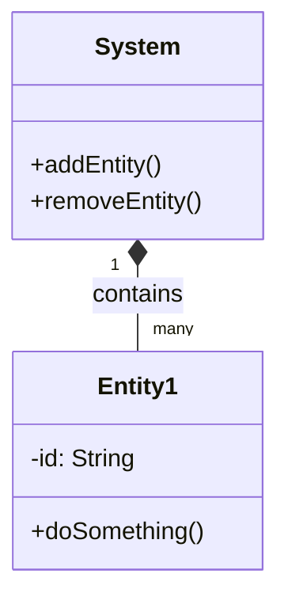

# 🛠️ Implement a Finite State Machine

## 1. Requirements

### Functional Requirements
- **Core Feature 1:** 
- **Core Feature 2:** 

### Non-Functional Requirements
- **Scalability:** 
- **Concurrency:** (if applicable)

---

## 2. Core Entities (Objects)
Identify the primary objects/models involved.

- `Entity1`: Description
- `Entity2`: Description

---

## 3. Class Diagram / Relationships



---

## 4. API / Interfaces
Define the primary interfaces or abstract classes.

```java
public interface ISystem {
    void process();
}
```

---

## 5. Key Algorithms / Design Patterns
- **Pattern 1:** (e.g., Strategy Pattern for pricing)
- **Concurrency Strategy:** (e.g., ReadWriteLock)
