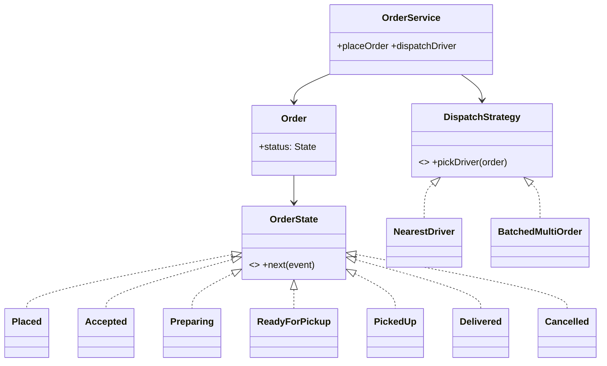

# 🛠️ Design a Food Delivery System (DoorDash / Uber Eats / Swiggy) — LLD

> **Sources**: [DoorDash Engineering — *DeepRed: Inside DoorDash's Dispatch Engine*](https://doordash.engineering/2024/04/02/inside-doordash-deepred/); DoorDash — *Building geo-distance services with isochrones* (uses `geohash` + OSRM); [Redis GEO commands](https://redis.io/docs/data-types/geospatial/); [Uber H3 hexagonal grid](https://h3geo.org/).
>
> **Scope**: in-process LLD focusing on the order state machine, dispatch, and entity model. The **distributed** ride-/delivery-system problem (real-time location pipeline, Kafka topics, ETA prediction at scale) is in `SystemDesign/Solutions/Solution-Uber.md`.

## 1. Requirements

### Functional
- Browse restaurants by location; view menu (categorised items with options).
- Add to cart (single restaurant per cart); checkout with address + payment.
- Order lifecycle: `PLACED → ACCEPTED → PREPARING → READY_FOR_PICKUP → PICKED_UP → DELIVERED` (or `CANCELLED`).
- **Restaurant** accepts/rejects, marks "ready"; **driver** is dispatched, accepts, picks up, delivers.
- Customer rates restaurant + driver; **promo codes**.

### Non-Functional
- **Low-latency restaurant search** by geo (sub-100 ms p95).
- **Real-time order tracking** (push / WebSocket).
- Driver **dispatch in seconds**.
- Order state machine **reliable across distributed components** (customer app, restaurant tablet, driver app).

## 2. Core Entities

| Entity | Notes |
|---|---|
| `User` (abstract) → `Customer`, `RestaurantOwner`, `Driver`, `Admin` | Factory by role. |
| `Restaurant` | `id`, `name`, `location: (lat,lng,geohash)`, `cuisine`, `rating`, `openHours`, `menuItems[]`, `status` |
| `MenuItem` + `MenuItemOption` (Decorator) | Base burger + cheese + bacon — composable pricing. |
| `Cart` | `userId`, `restaurantId` (one restaurant per cart), `items[]` |
| `Order` | `id`, `customerId`, `restaurantId`, `items[]`, `totalAmountMinor`, `status` (state machine), `address`, `paymentId`, `driverId?`, timestamps |
| `Driver` | `id`, `currentLocation` (geohash), `status: OFFLINE/AVAILABLE/EN_ROUTE_TO_RESTAURANT/EN_ROUTE_TO_CUSTOMER` |
| `Address` | `street`, `lat`, `lng`, `instructions` |
| `Payment` | linked to `Order`; `idempotencyKey` |
| `Rating` | `(orderId, type, score)` |

## 3. Class Diagram



## 4. Key Methods

```java
List<Restaurant> searchRestaurants(LatLng loc, Cuisine? c, int radiusKm);
void   addToCart(UserId u, RestaurantId r, MenuItem i, List<Option> opts);
OrderId placeOrder(UserId, Address, PaymentMethod, String idempotencyKey);
void   restaurantAccept(OrderId);  void restaurantReject(OrderId, Reason);
DriverId dispatchDriver(OrderId);  // geohash GEORADIUS query
void   driverAcceptOrder(DriverId, OrderId);  // first-wins atomic UPDATE
void   markPickedUp(OrderId);  void markDelivered(OrderId, GeoPoint);
void   cancelOrder(OrderId, Reason);
```

## 5. The Order State Machine (the crux)

```text
PLACED ──restaurantAccept──> ACCEPTED ──prepStart──> PREPARING ──prepDone──>
   │                                                                       │
   │                                                                       ▼
   ▼                                                              READY_FOR_PICKUP
CANCELLED  <──cancel(<=ACCEPTED, full refund)──┐                           │
                                                │                          │
                                                │                          ▼
                                                ├──cancel(>ACCEPTED, partial refund manager-approval)──── PICKED_UP
                                                │                          │
                                                │                          ▼
                                                └──── (terminal)        DELIVERED
```

The State pattern enforces these transitions. **Cancelling at `ACCEPTED`** triggers a full refund automatically; cancelling **after** `ACCEPTED` requires manager approval (the kitchen has incurred cost).

## 6. The Dispatch Algorithm (DoorDash-style)

```text
1. After PREPARING, query Driver index:
     candidates = redis.GEORADIUS("drivers:" + city, restaurant.lat, restaurant.lng, 5km)
     filter: status = AVAILABLE
2. Score each candidate:
     score = w1*distanceKm + w2*(1 - rating/5) + w3*currentLoad - w4*acceptanceHistory
3. Send offer to top-N drivers in priority order, with a 15-second timeout each.
4. First driver to call driverAcceptOrder(orderId) wins:
     UPDATE orders SET driver_id = ?, status = 'DRIVER_ASSIGNED'
       WHERE id = ? AND driver_id IS NULL;     -- atomic CAS
5. If no acceptance after K rounds, escalate (raise fee / widen radius).
```

DoorDash's production system ("DeepRed") layers ML on top of this — predicting per-driver acceptance probability and ETA, then solving a **mixed-integer optimisation** that maximises city-wide throughput rather than per-order locality. Mention this once if asked about scale.

## 7. Design Patterns

| Pattern | Where | Why |
|---|---|---|
| **State** | `Order.status` is a State object; transitions are method calls on the state | Illegal transitions throw, not silent. |
| **Strategy** | `DispatchStrategy` (`NearestDriver`, `BatchedMultiOrder`, `MLBased`) | A/B test new dispatch algorithms without touching `OrderService`. |
| **Observer** | `OrderStatusListener` notifies customer push, restaurant tablet, driver app on every state change | Decoupled real-time tracking. |
| **Chain of Responsibility** | `placeOrder` validation: `CartNotEmpty → RestaurantOpen → ItemsAvailable → AddressInRange → PaymentValid` | Add new guards (e.g., age-restricted alcohol) without surgery. |
| **Decorator** | `MenuItem` options ("Burger" + "ExtraCheese" + "Bacon") compose price + name | No subclass explosion. |
| **Composite** | Menu hierarchy: `Category → SubCategory → MenuItem` | Uniform rendering. |
| **Mediator** | `OrderService` coordinates Customer, Restaurant, Driver state machines | Avoids three-way coupling. |
| **Command** | `CancelOrderCommand` with audit trail | Replayable + auditable. |
| **Factory** | `User` subtype creation by role | Clean polymorphism. |

## 8. Concurrency

- **Driver dispatch race**: many drivers may receive the same offer; the **atomic CAS** (`UPDATE … WHERE driver_id IS NULL`) ensures exactly one wins.
- **Order state**: optimistic locking — `UPDATE orders SET status=?, version=version+1 WHERE id=? AND version=?`. Zero rows updated ⇒ retry or surface the conflict.
- **Idempotent payment**: same `idempotencyKey` retried by the client returns the existing payment id (Stripe-style; see Solution-Stripe-Payment-Processor.md).
- **Location streaming**: drivers push location at 1 Hz to a per-region Kafka topic / Redis Stream; consumers (customer apps watching this order, dispatcher) subscribe.

## 9. Geo Indexing

- Restaurant + driver locations are indexed by **geohash** (or H3 / S2). Redis `GEOADD` / `GEORADIUS` is the canonical interview answer; H3's hexagonal cells avoid the geohash discontinuity at cell boundaries.
- The full distributed geo index design is in **27-Proximity-Location-Services.md** and **Solution-Uber.md** — reference, don't duplicate.

## 10. Sources / Cross-Refs
- LLD-08 Behavioral Patterns (State, Strategy, Observer, Mediator, Chain of Responsibility, Command)
- LLD-07 Structural Patterns (Decorator, Composite)
- 27-Proximity-Location-Services.md (geohash / H3 deep dive)
- Solution-Uber.md (the **distributed** ride-/delivery-system version)
- Solution-Restaurant.md (sister LLD focused on the in-restaurant POS side)
- Solution-Stripe-Payment-Processor.md (payment idempotency)
- DoorDash engineering blog
