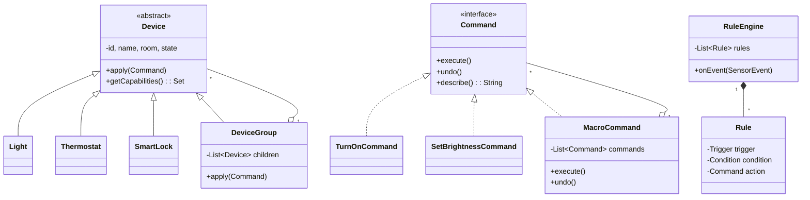

# 🛠️ Design a Home Automation System (LLD)

> **Sources**: GoF — *Design Patterns* (1994): **Command** chapter (p. 233 — explicitly motivated by "remote control to operate home appliances"), **Composite** (p. 163), **Observer** (p. 293); *Head First Design Patterns* (Freeman & Robson, 2004) — Ch. 6 ("Remote Control" example, the canonical Command-pattern walkthrough); Apple HomeKit Accessory Protocol — [developer.apple.com/homekit](https://developer.apple.com/homekit/); Home Assistant architecture — [developers.home-assistant.io/docs/architecture_index](https://developers.home-assistant.io/docs/architecture_index/); Matter (CSA) protocol spec — [csa-iot.org/matter](https://csa-iot.org/all-solutions/matter/).

A home-automation hub controls dozens of heterogeneous devices (lights, thermostats, locks, speakers, sensors) through a single API. The interesting design pressure isn't *one* device — it's (1) **uniform abstraction over wildly different devices**, (2) **scenes & groups** ("Goodnight" turns off 8 lights and arms the alarm in one tap), (3) **rule automation** ("when motion sensor fires after sunset, turn on hallway light"), and (4) **undo**.

---

## 1. Requirements

### Functional
- **Device control**: turn on/off, dim brightness, set thermostat temperature, lock/unlock door, adjust volume — across many device types.
- **Scenes**: a named bundle of device commands ("Movie Night" = lights to 20%, TV on, blinds down).
- **Groups**: control a logical set as one (e.g. "All Living Room Lights" → 5 bulbs).
- **Rules / triggers**: `WHEN <event> AND <condition> THEN <action>`.
  - Event sources: time-of-day (cron), sensor events (motion, door, temperature), voice command, geofence.
- **Undo / redo** the last command (or last N commands).
- **Voice integration**: parse "turn off the kitchen lights" → resolve to a group → fire the command.
- **History**: append-only log of every executed command (for audit + debugging).

### Non-Functional
- **Pluggable device protocols**: Zigbee, Z-Wave, Wi-Fi, Matter — adding a new device type should not touch the rule engine.
- **Asynchronous**: commands return immediately; status updates arrive later via callback (devices can be slow or temporarily offline).
- **Resilient**: if one device in a scene fails, the others still execute.
- **Single-house scale**: ~100 devices, 5 users, ~1000 events/day — concurrency matters but throughput doesn't.

---

## 2. Core Entities

| Entity | Key Fields / Responsibility |
|---|---|
| `HomeAutomationSystem` (Singleton facade) | `DeviceRegistry`, `RuleEngine`, `CommandHistory`, `EventBus`. |
| `Device` (abstract) | `id`, `name`, `room`, `state`; methods `getCapabilities()`, `apply(Command)`. |
| Concrete devices | `Light`, `DimmableLight`, `ColorBulb`, `Thermostat`, `SmartLock`, `Speaker`, `Blinds`, `Camera`. |
| `DeviceGroup` (Composite) | implements `Device` itself; holds a list of `Device` children — calls fan out. |
| `Command` (interface) | `execute()`, `undo()`, `describe()`. |
| Concrete commands | `TurnOnCommand`, `SetBrightnessCommand`, `SetTemperatureCommand`, `LockCommand`, `MacroCommand` (a list of commands). |
| `Scene` | named `MacroCommand` (e.g. "Goodnight"). |
| `Sensor` (publishes `SensorEvent`) | `MotionSensor`, `DoorSensor`, `TemperatureSensor`. |
| `Rule` | `Trigger` + optional `Condition` + `Action` (a `Command`). |
| `RuleEngine` | subscribes to events; matches against rules; fires actions. |
| `CommandHistory` | `Deque<Command>` for undo, capped at N. |
| `EventBus` | in-process pub-sub between sensors and the rule engine. |

---

## 3. Class Diagram



---

## 4. Key Methods

### 4.1 Command pattern with undo

```java
public interface Command {
    void execute();
    void undo();
    String describe();
}

public class SetBrightnessCommand implements Command {
    private final DimmableLight light;
    private final int newBrightness;
    private int previousBrightness;     // captured at execute time

    public SetBrightnessCommand(DimmableLight l, int b) {
        this.light = l; this.newBrightness = b;
    }

    public void execute() {
        previousBrightness = light.getBrightness();   // snapshot for undo
        light.setBrightness(newBrightness);
    }
    public void undo() { light.setBrightness(previousBrightness); }
    public String describe() {
        return "Set " + light.name() + " brightness " + previousBrightness + " → " + newBrightness;
    }
}
```

> **Key insight**: `undo()` requires capturing the *previous* state at `execute()` time. A naive implementation that hard-codes `setBrightness(0)` is not undoable — the undo would forget the original value.

### 4.2 Composite — group control

```java
public class DeviceGroup extends Device {
    private final List<Device> children = new ArrayList<>();

    public void apply(Command c) {
        for (Device d : children) {
            try { d.apply(c); }
            catch (DeviceOfflineException e) { log.warn("{} offline; skipping", d, e); }
        }
    }
}
```

> The `apply` call shape on a `DeviceGroup` is **identical** to a single device — that's the Composite-pattern superpower. The rule engine doesn't need to know whether it's controlling one bulb or 50.

### 4.3 Macro / Scene execution

```java
public class MacroCommand implements Command {
    private final List<Command> commands;
    private final List<Command> executed = new ArrayList<>();

    public void execute() {
        for (Command c : commands) {
            try { c.execute(); executed.add(c); }
            catch (Exception e) { log.error("scene step failed; continuing", e); }
        }
    }
    public void undo() {
        // Undo in reverse order — only what actually executed
        for (int i = executed.size() - 1; i >= 0; i--) executed.get(i).undo();
    }
}
```

### 4.4 Observer — sensor → rule engine

```java
public class MotionSensor extends Sensor {
    private final List<SensorEventListener> listeners = new CopyOnWriteArrayList<>();

    public void onMotionDetected() {
        SensorEvent e = new SensorEvent(EventType.MOTION, this, Instant.now());
        listeners.forEach(l -> l.onEvent(e));
    }
}

public class RuleEngine implements SensorEventListener {
    public void onEvent(SensorEvent e) {
        for (Rule r : rules) {
            if (r.trigger().matches(e) && r.condition().evaluate()) {
                history.record(r.action());
                r.action().execute();
            }
        }
    }
}
```

### 4.5 Rule example — "Hallway light at night"

```java
Rule nightHallway = Rule.builder()
    .trigger(EventTrigger.on(EventType.MOTION, hallwaySensor))
    .condition(TimeCondition.between(SUNSET, SUNRISE))
    .action(new TurnOnCommand(hallwayLight))
    .build();
```

---

## 5. Design Patterns

| Pattern | Where Used | Why |
|---|---|---|
| **Command** | Every device action wrapped as a `Command` | Enables undo, logging/audit, queuing, scheduling, and macro composition. (GoF's *original* motivating example was home-appliance control — pp. 233-235.) |
| **Composite** | `DeviceGroup` implements `Device` and contains `Device`s | Treat groups identically to single devices; recursion ⇒ groups can contain other groups. |
| **Observer** | Sensors → `RuleEngine`, Devices → status-listener UI | Decouple the producer of an event from any number of subscribers. |
| **Strategy** | `Trigger` (time-of-day vs sensor-event vs voice), `Condition` (time-window vs presence-detection) | Each rule combines pluggable trigger + condition + action without growing a `RuleType` enum. |
| **Singleton** | `HomeAutomationSystem` facade | One process per home hub. |
| **Memento** | `CommandHistory` stores executed commands (which themselves carry their pre-state) | Foundation of undo/redo. |
| **Adapter** | Per-protocol device adapters (`ZigbeeLightAdapter`, `WifiBulbAdapter`) | Wrap protocol-specific SDKs behind the uniform `Device` interface. |
| **Facade** | `HomeAutomationSystem` exposes `arm("Goodnight")` etc. | Hides registry / engine / history wiring from the API surface. |

---

## 6. Concurrency & Edge Cases

### 6.1 Concurrent writes to the same device
Two rules fire simultaneously, both setting the thermostat. Without serialization the device sees an interleaved write or a "last write wins" surprise. Each device has a single-threaded `executor` so commands queued to it run sequentially — preserving causality per device while still allowing parallelism *across* devices.

### 6.2 Slow / offline devices
A Wi-Fi bulb on a flaky router can take 10 s to respond. The `apply` call is async with a per-device timeout; the scene continues to other devices and reports the failed one. Crucial for usability — a single offline bulb shouldn't break "Goodnight."

### 6.3 Rule loops
Rule A "if light A on, turn on light B"; Rule B "if light B on, turn on light A" → infinite event storm. Mitigations: per-rule debounce (don't re-fire within N seconds), and a per-event-chain depth limit (drop after 5 cascading triggers).

### 6.4 Sensor flapping (debounce)
A motion sensor can fire 50 times in 5 seconds for one walk-by. Rules wrap their trigger in a debouncer (`fire only if no event in the last 3 s`) — a standard signal-processing technique borrowed by IoT.

### 6.5 Undo of a destructive action
Some commands aren't undoable in a meaningful sense (e.g. `SpeakCommand("Door alarm!")`). Mark commands `isReversible()` so the UI grays out "Undo" for those.

### 6.6 Authorization
Voice command from a guest's phone shouldn't unlock the front door. Wrap commands in an `AuthorizedCommand` decorator that checks `user.canExecute(command)` before delegating — the **Decorator** pattern composes cleanly with **Command**.

### 6.7 Persistence & restart
Scenes, rules, and device-pairing data must survive a hub restart. Persist to a small embedded DB (SQLite). Sensor *events* are ephemeral — rebuilding the in-memory event bus on restart is fine.

### 6.8 Network partition (the cloud is down)
Most user-facing actions should still work locally. The hub keeps a local rule engine and only syncs to the cloud opportunistically. Apple HomeKit and Home Assistant both follow this "local-first" architecture.

---

## 7. Sources / Cross-Refs
- LLD-07 Structural Patterns (Composite, Adapter, Decorator, Facade)
- LLD-08 Behavioral Patterns (Command — *the* canonical home-automation example, Observer, Strategy, Memento)
- Solution-Notification.md (related observer / fan-out)
- Solution-Task-Scheduler.md (cron-style triggers)
- *Head First Design Patterns* — Ch. 6 "Encapsulating Invocation" (Remote Control example)
- GoF *Design Patterns* — Command (p. 233), Composite (p. 163), Observer (p. 293)
- Home Assistant architecture: https://developers.home-assistant.io/docs/architecture_index/
- Matter (CSA): https://csa-iot.org/all-solutions/matter/
