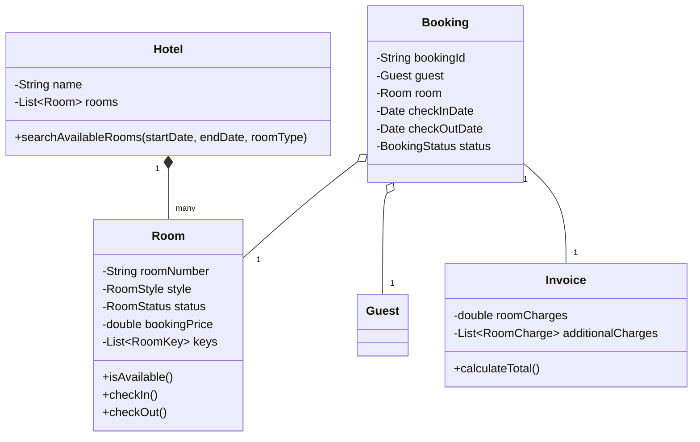

# 🛠️ Design Hotel Management System (LLD)

Designing a Hotel Management System involves modeling physical inventory (rooms), actors (guests, receptionists), and transactions (bookings, payments). It shares similarities with a Car Rental or Library system but introduces room-specific metadata.

---

## 1. Requirements

### Functional Requirements
- **Search:** Users can search for rooms by type (Single, Double, Suite) and date range.
- **Booking:** Users can book an available room.
- **Check-in/Check-out:** Receptionists can check guests in and out.
- **Room Status:** Track room statuses (Available, Occupied, Reserved, Maintenance, Cleaning).
- **Billing:** Calculate the total bill including room charges and additional services (Room Service, Spa).

### Non-Functional Requirements
- **Concurrency:** Ensure two users cannot book the exact same room for overlapping dates.
- **Extensibility:** Easily add new room types or amenities.

---

## 2. Core Entities (Objects)

- `Hotel` (Central orchestrator)
- `User` (Abstract) -> `Guest`, `Receptionist`, `Admin`
- `Room` (Abstract) -> `StandardRoom`, `DeluxeRoom`, `SuiteRoom`
- `RoomKey` / `KeyCard`
- `Booking` / `Reservation`
- `Invoice` / `Payment`
- `RoomCharge` (Additional charges)

---

## 3. Class Diagram / Relationships



---

## 4. Key Algorithms / Design Patterns

### 1. The Strategy / Decorator Pattern (Pricing & Billing)

A room has a base price. However, prices might fluctuate based on seasons, or a user might add amenities. Use the **Decorator Pattern** to calculate the bill dynamically, or a simple List of `Charge` objects.

```java
public class Invoice {
    private double baseRoomCharge;
    private List<Charge> additionalCharges = new ArrayList<>();

    public Invoice(double baseRoomCharge) {
        this.baseRoomCharge = baseRoomCharge;
    }

    public void addCharge(Charge charge) {
        this.additionalCharges.add(charge);
    }

    public double calculateTotal() {
        double total = baseRoomCharge;
        for (Charge c : additionalCharges) {
            total += c.getAmount();
        }
        return total; // Plus calculate taxes
    }
}

public class Charge {
    private String description;
    private double amount;
    // Constructor, getters
}
```

### 2. Overlapping Dates Algorithm (The Core Logic)

Just like Car Rentals, a room is not simply "Available" or "Unavailable" in a boolean sense. It is available *for a specific date range*. To search for rooms, the system must cross-reference all existing bookings.

```java
public class Room {
    private String roomNumber;
    private RoomStyle style;
    private List<Booking> schedule = new ArrayList<>();

    // O(N) where N is number of future bookings for this room
    public boolean isAvailable(Date startDate, Date endDate) {
        for (Booking b : schedule) {
            // Check if requested dates overlap with an existing booking
            // Overlap logic: StartA < EndB AND EndA > StartB
            if (startDate.before(b.getCheckOutDate()) && endDate.after(b.getCheckInDate())) {
                return false; // Conflict found
            }
        }
        return true;
    }

    public synchronized void addBooking(Booking booking) throws RoomUnavailableException {
        if (isAvailable(booking.getCheckInDate(), booking.getCheckOutDate())) {
            schedule.add(booking);
        } else {
            throw new RoomUnavailableException("Room is already booked for these dates.");
        }
    }
}

public class Hotel {
    private List<Room> rooms;

    public List<Room> searchAvailableRooms(RoomStyle style, Date start, Date end) {
        List<Room> available = new ArrayList<>();
        for (Room room : rooms) {
            if (room.getStyle() == style && room.isAvailable(start, end)) {
                available.add(room);
            }
        }
        return available;
    }
}
```

### 3. State Pattern (Room Status)

A room's physical state changes. It needs cleaning after checkout before it can be occupied again.

```java
public enum RoomStatus {
    AVAILABLE, 
    OCCUPIED, 
    BEING_CLEANED, 
    MAINTENANCE
}

public class Room {
    private RoomStatus currentStatus = RoomStatus.AVAILABLE;

    public void checkOut() {
        if (this.currentStatus == RoomStatus.OCCUPIED) {
            this.currentStatus = RoomStatus.BEING_CLEANED;
            // Notify Housekeeping system
        }
    }

    public void finishCleaning() {
        if (this.currentStatus == RoomStatus.BEING_CLEANED) {
            this.currentStatus = RoomStatus.AVAILABLE;
        }
    }
}
```