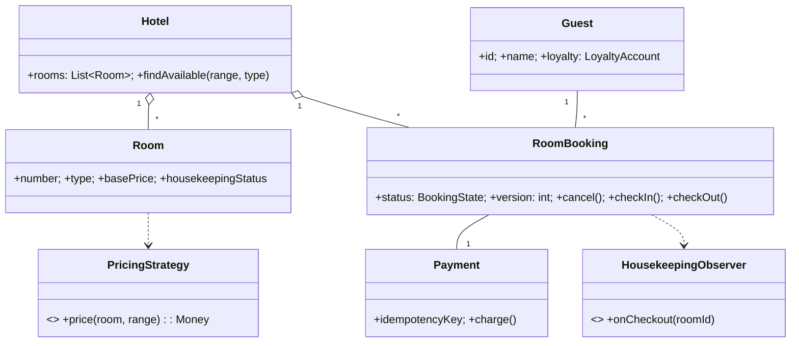

# 🛠️ Design Hotel Management System (LLD)

> **Sources**: This solution synthesizes interview-style references including [Hotel Management System OOP design walkthrough](https://www.youtube.com/watch?v=5VWycK8KmW0), Booking.com engineering blog on availability calendars, plus standard textbook patterns (GoF). Concurrency techniques follow MySQL/Postgres documentation for `SELECT ... FOR UPDATE` and optimistic locking.

## 1. Requirements

### Functional
- **Search & inventory**: Find rooms in a hotel by city, date range, room type (`STANDARD`/`DELUXE`/`SUITE`), and guest count.
- **Booking flow**: Hold → pay → confirm. A booking covers a date range `[checkIn, checkOut)`.
- **Lifecycle**: `cancelBooking`, `checkIn`, `checkOut`, `noShow`.
- **Housekeeping**: Track room status (`CLEAN`/`DIRTY`/`OCCUPIED`/`MAINTENANCE`); notify staff on checkout.
- **Pricing**: Base + season + weekday/weekend + length-of-stay discount + dynamic occupancy surge.
- **Add-on services**: Extra bed, breakfast, late checkout, room service, laundry; show on final bill.
- **Loyalty**: Points per night/spend; tiered redemption.

### Non-Functional
- **No double booking** under contention (the headline correctness property).
- **Atomic check-in** transitions (`BOOKED → CHECKED_IN`).
- **Idempotent payments** so retries don't double-charge.
- **Read-heavy availability search** (cache + read replicas).

## 2. Core Entities

| Entity | Key Fields |
|---|---|
| `Hotel` | `id`, `name`, `address`, `rooms[]` |
| `Room` | `roomNumber`, `type`, `basePrice`, `housekeepingStatus` |
| `RoomBooking` | `id`, `guestId`, `roomId`, `checkInDate`, `checkOutDate`, `status`, `version` |
| `Guest` | `id`, `name`, `email`, `loyaltyAccount` |
| `Payment` | `id`, `bookingId`, `amount`, `idempotencyKey`, `status` |
| `Service` | `id`, `bookingId`, `type`, `cost`, `timestamp` |
| `HousekeepingTask` | `id`, `roomId`, `assignedTo`, `status`, `createdAt` |

## 3. Class Diagram



## 4. Key Methods

```java
List<Room> Hotel.searchAvailableRooms(LocalDate inDate, LocalDate outDate, RoomType type);

// Atomic; throws RoomUnavailableException if a conflicting booking exists
Booking BookingService.bookRoom(guestId, roomId, inDate, outDate, idempotencyKey);

void  BookingService.cancelBooking(bookingId);
void  BookingService.checkIn(bookingId);    // version-checked
void  BookingService.checkOut(bookingId);   // notifies housekeeping observers
Money Billing.computeBill(bookingId);       // room + services + tax
```

## 5. Design Patterns

| Pattern | Where | Why |
|---|---|---|
| **State** | `RoomBooking.status` (`HELD`/`BOOKED`/`CHECKED_IN`/`CHECKED_OUT`/`CANCELLED`); `Room.housekeepingStatus` | Each state owns its allowed transitions. |
| **Strategy** | `PricingStrategy` (seasonal, weekday, length-of-stay, dynamic) | Pricing rules vary independently of `Booking`. |
| **Observer** | `HousekeepingObserver`, `LoyaltyObserver` on checkout | Decouple side-effects from booking domain. |
| **Factory** | `BookingFactory.create(...)` validates overlap + composes price | Centralize creation rules. |
| **Decorator** | Room price decorated with `BreakfastDecorator`, `ExtraBedDecorator`, `LateCheckoutDecorator` | Compose add-ons without subclass explosion. |
| **Singleton** | `RoomInventoryService` | Single coordinator for availability cache. |

## 6. Concurrency & Edge Cases

### 6.1 Preventing double booking (the core problem)

Two well-known approaches; pick by contention:

**(A) Optimistic — atomic conditional INSERT**
```sql
INSERT INTO bookings (room_id, check_in, check_out, status)
SELECT :roomId, :in, :out, 'BOOKED'
WHERE NOT EXISTS (
  SELECT 1 FROM bookings
  WHERE room_id = :roomId
    AND status IN ('HELD','BOOKED','CHECKED_IN')
    AND check_in < :out AND check_out > :in   -- overlap predicate
);
-- 0 rows inserted ⇒ conflict; retry or surface to user
```

**(B) Pessimistic — `SELECT … FOR UPDATE` on the room row**
Best for high-contention release windows (concert weekends, big-game travel). Source rows for the date range are locked until commit.

### 6.2 Atomic check-in (no double check-in)
Optimistic-lock the booking with a `version` column:
```sql
UPDATE bookings SET status='CHECKED_IN', version=version+1
 WHERE id=:id AND status='BOOKED' AND version=:expectedVersion;
```
0 rows ⇒ already checked in or cancelled.

### 6.3 Idempotent payment
Client supplies `Idempotency-Key`. Server stores the first response keyed on it; replays return the cached response (Stripe-style).

### 6.4 Cancellation cascade
Cancellation: refund payment (idempotent), restore inventory (no-op since row condition releases it), notify observers.

### 6.5 Housekeeping notification
On `checkOut`, the booking publishes a `RoomCheckedOut` event; `HousekeepingObserver` flips `Room.housekeepingStatus` to `DIRTY` and creates a `HousekeepingTask`.

## 7. Sources / Cross-Refs
- LLD-08 Behavioral Patterns (State, Strategy, Observer, Command)
- LLD-07 Structural Patterns (Decorator)
- Solution-Concert-Booking.md (atomic seat hold pattern reused here for rooms)
- Solution-Stripe-Payment-Processor.md (idempotency-key contract)
- Video walkthrough: https://www.youtube.com/watch?v=5VWycK8KmW0
