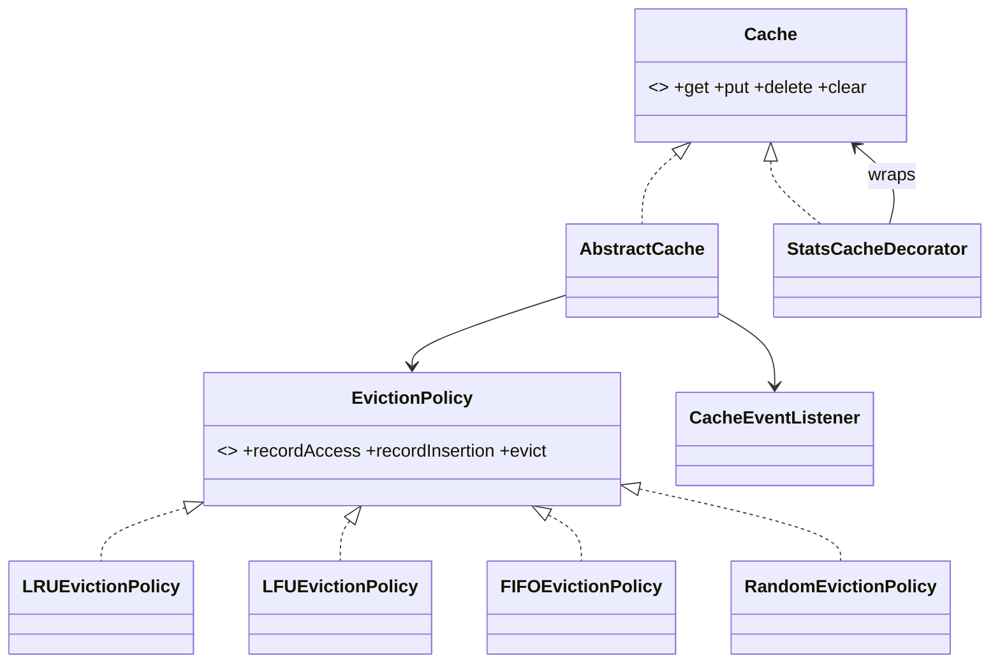

# 🛠️ Design an In-Memory Cache with Pluggable Eviction Policies — LLD

> **Sources**: [LeetCode #146 — LRU Cache](https://leetcode.com/problems/lru-cache/) and [#460 — LFU Cache](https://leetcode.com/problems/lfu-cache/) (the canonical interview problems); [Caffeine cache](https://github.com/ben-manes/caffeine) (production JVM cache used by Cassandra, Spring, and Dgraph; implements **Window TinyLFU**); Einziger, Friedman, Manes — *TinyLFU: A Highly Efficient Cache Admission Policy* (ACM TOS 2017); Guava `Cache` design docs; Java `ConcurrentHashMap` source.

## 1. Requirements

### Functional
- `get(K) → V?`, `put(K, V)`, `delete(K)`, `clear()`, `size()`, bounded `maxCapacity`.
- Optional **TTL** per entry.
- **Pluggable eviction policy**: LRU, LFU, FIFO, Random, MRU.

### Non-Functional
- **O(1)** average for `get` / `put` / `evict` — *the entire point of the LLD*.
- Thread-safe; scale to millions of entries; low GC pressure.

## 2. The Two Canonical Algorithms

### 2.1 LRU — HashMap + Doubly Linked List
- `HashMap<K, Node>` for O(1) lookup.
- Doubly-linked list ordered by recency (head = MRU, tail = LRU).
- **Why doubly linked**: O(1) removal of an arbitrary node *given* its reference (we have it from the map). A singly linked list would force an O(N) walk to find the predecessor.
- **Dummy head and tail sentinels** eliminate null-checks during splice operations — the standard interview trick.

```text
get(k):  node = map[k]; move node to head; return node.value
put(k,v):if k in map: update value, move to head
         else:        create node, add at head, map[k]=node
                      if size > capacity: tail.prev evicted (remove from list + map)
```

### 2.2 LFU — frequency-stratified linked lists
- `HashMap<K, Node>`: O(1) lookup.
- `HashMap<int, DoublyLinkedList<Node>>`: a list of nodes **at each frequency level**.
- `int minFreq`: tracks the smallest active frequency (so eviction is O(1)).
- On `get`: `node.freq++`; move node from `lists[freq]` to `lists[freq+1]`. If `lists[freq]` becomes empty *and* `freq == minFreq`, increment `minFreq`.
- On evict: remove the **tail** of `lists[minFreq]` (LRU tiebreaker within a frequency).

This gives **O(1) amortised** for both `get` and `put` — the same complexity as LRU, at the cost of ~2× memory per node.

## 3. Core Entities

| Entity | Role |
|---|---|
| `Cache<K, V>` *(interface)* | Public API. |
| `AbstractCache<K, V>` *(template)* | Ties the map + policy together. |
| `Node<K, V>` | `key`, `value`, `prev`, `next`, optional `freq`, optional `expiresAt`. |
| `EvictionPolicy<K, V>` *(strategy)* | `recordAccess(K)`, `recordInsertion(K)`, `evict() → K`. |
| `LRUEvictionPolicy`, `LFUEvictionPolicy`, `FIFOEvictionPolicy`, `RandomEvictionPolicy` | Concrete strategies. |
| `CacheEventListener` *(observer)* | `onHit`, `onMiss`, `onEvict`, `onExpire`. |

## 4. Class Diagram



## 5. TTL — two strategies

| Approach | When entry is removed | Memory profile |
|---|---|---|
| **Lazy** | On the next `get`, check `expiresAt`; if past, evict and return miss | Expired entries linger until accessed; same model Redis defaults to |
| **Active** | A background `ScheduledExecutorService` periodically scans (or samples) for expired entries | Tighter memory bound; scan cost amortised |

Both are commonly accepted answers. Production systems combine both — Caffeine and Redis both default to a **hybrid**: lazy on access + a low-rate background sweep.

## 6. Design Patterns

| Pattern | Where | Why |
|---|---|---|
| **Strategy** | `EvictionPolicy` | The whole point — swap LRU/LFU/FIFO without touching cache code. |
| **Template Method** | `AbstractCache.get/put` | Common skeleton; policy hooks for the variable parts. |
| **Decorator** | `StatsCacheDecorator`, `LoggingCacheDecorator`, `TtlCacheDecorator` | Compose cross-cutting concerns onto any `Cache`. |
| **Observer** | `CacheEventListener` (`onHit`/`onMiss`/`onEvict`) | Stats, metrics, eviction-driven external invalidations. |
| **Builder** | `CacheBuilder.maxSize(...).policy(LRU).ttl(...).build()` | Fluent, validated construction (Caffeine-style). |
| **Factory** | `CacheBuilder.build()` returns the right `AbstractCache` subtype | Hides selection logic. |
| **Singleton** | A process-wide default cache (use sparingly) | Convenience for global lookup. |

## 7. Concurrency

| Approach | Pros | Cons |
|---|---|---|
| `synchronized` on every method | Simplest; correct | All operations serialise — terrible scalability. |
| `ReadWriteLock` | Multiple concurrent readers | Most cache operations *write* (LRU access mutates the linked list), so readers rarely run lock-free. |
| **Lock striping** (segment the keyspace into N shards, each with its own lock + map + list) | Near-linear scaling with cores; the `ConcurrentHashMap` design | Eviction is per-shard, not global LRU — usually an acceptable trade. |
| **Caffeine** | Wait-free reads via Count-Min Sketch + buffered writes; near-optimal hit rate via Window TinyLFU | More complex than you would implement in an interview. |

For the interview: lead with **lock striping** as the right answer; mention Caffeine as the production-grade implementation that outperforms hand-rolled LRU/LFU significantly in real workloads.

## 8. Sample API

```java
Cache<String, User> users = CacheBuilder.<String, User>newBuilder()
    .maxSize(100_000)
    .evictionPolicy(EvictionPolicy.LRU)
    .ttl(Duration.ofMinutes(10))
    .listener(new MetricsListener())
    .build();

User u = users.get("alice");        // O(1); on miss, returns null
users.put("bob", new User(...));    // O(1); may evict an LRU entry
```

## 9. Edge Cases

- **`maxCapacity == 0`** → cache is a sink; `put` immediately evicts. Reject in the builder.
- **Negative TTL or zero TTL** → entry never enters the cache (or expires instantly). Validate at the boundary.
- **Concurrent `put` + `evict` of the same key** — make `delete` idempotent; use the segment lock to serialise.
- **Hot key** — under lock striping, all traffic for one key hits one shard. Solution: per-key versioning, or a higher-fan-out hash.

## 10. Sources / Cross-Refs
- LLD-08 Behavioral Patterns (Strategy, Template Method, Observer)
- LLD-07 Structural Patterns (Decorator)
- Solution-OOD-LRU-Cache.md (the bare LRU-only LeetCode #146 framing)
- Solution-LRU-Cache.md (sibling solution, LRU emphasis)
- Solution-TTL-Cache.md (TTL-emphasis variant)
- Solution-Concurrent-HashMap.md (the lock-striping primitive)
- Caffeine project; LeetCode #146 / #460; *TinyLFU* paper
