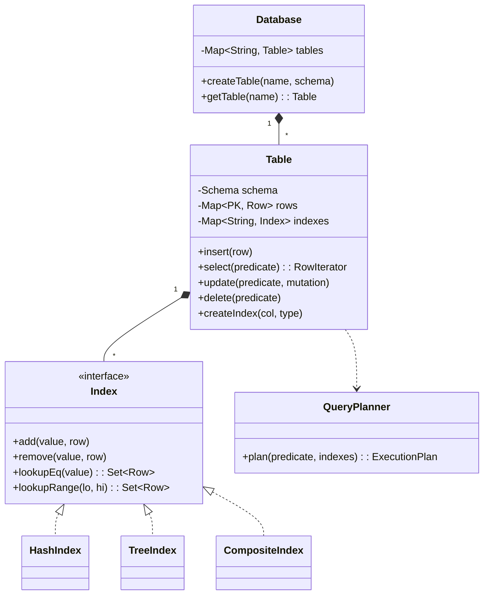

# 🛠️ Design an In-Memory Database with Indexing (LLD)

> **Sources**: Redis source — [github.com/redis/redis](https://github.com/redis/redis) (the canonical in-memory store; uses dict + skiplist for hash/sorted indexes); H2 in-memory mode — [h2database.com docs](https://h2database.com/html/features.html#in_memory_databases); SQLite `:memory:` mode — [sqlite.org/inmemorydb.html](https://www.sqlite.org/inmemorydb.html); *Database System Concepts* (Silberschatz, 7e) — Ch. 14 (Indexing); *The Art of Multiprocessor Programming* (Herlihy & Shavit) — Ch. 13 (concurrent hash maps).

An in-memory database keeps the entire dataset in RAM for microsecond-level reads and writes. Unlike a generic `HashMap`, a real DB must support **schemas with typed columns**, **secondary indexes** beyond the primary key, **range queries**, and **MVCC-style concurrency** — all without paying disk I/O cost.

---

## 1. Requirements

### Functional
- **DDL**: `createTable(name, schema)`, `dropTable`, `createIndex(table, column, type)`.
- **DML**: `insert(row)`, `update(filter, mutation)`, `delete(filter)`, `select(filter, projection)`.
- **Schema**: column name, type (`INT`, `LONG`, `STRING`, `DOUBLE`, `TIMESTAMP`, `BOOL`), nullability, primary-key flag.
- **Indexes**:
  - **Hash index** on `=` lookups → O(1) per equality predicate.
  - **Tree (sorted) index** on `BETWEEN`, `<`, `>`, `ORDER BY` → O(log n) seek + O(k) scan.
- **Composite indexes** on `(col_a, col_b)` for queries that filter on both columns.
- **Constraints**: primary-key uniqueness, NOT NULL, foreign-key (optional).
- **Iterators**: `select(...)` returns a lazy `RowIterator` so callers can stream large result sets.

### Non-Functional
- **Read latency**: < 10 µs for indexed point lookup.
- **Concurrent readers + writers**: many readers must not block each other; writers serialized per-table or via MVCC.
- **Bounded memory**: drop-table fully reclaims memory; updates do not leak old index entries.
- **Snapshot-isolation reads** (stretch goal): a long `SELECT` sees a consistent view even if another thread is mid-update.

---

## 2. Core Entities

| Entity | Key Fields / Responsibility |
|---|---|
| `Database` (Singleton) | `Map<String, Table>`; `createTable`, `getTable`. |
| `Table` | `name`, `Schema schema`, `Map<PrimaryKey, Row> rows`, `Map<String, Index> indexes`, `ReadWriteLock lock`. |
| `Schema` | `List<Column> columns`; `validate(row)`. |
| `Column` | `name`, `type`, `nullable`, `isPrimaryKey`. |
| `Row` | `Map<String, Object> values`; immutable to support snapshot reads. |
| `Index` (interface) | `add(value, row)`, `remove(value, row)`, `lookupEq(value)`, `lookupRange(lo, hi)`. |
| `HashIndex` | `ConcurrentHashMap<Object, Set<Row>>`. |
| `TreeIndex` | `ConcurrentSkipListMap<Comparable, Set<Row>>`. |
| `CompositeIndex` | wraps a tuple-keyed `TreeIndex`. |
| `Predicate` | filter expression: `eq("age", 30)`, `between("ts", lo, hi)`, `and(...)`, `or(...)`. |
| `QueryPlanner` | given a `Predicate`, picks the best index (or falls back to full scan). |

---

## 3. Class Diagram



---

## 4. Key Methods

### 4.1 Hash index — equality lookup in O(1)

```java
public class HashIndex implements Index {
    private final ConcurrentHashMap<Object, Set<Row>> idx = new ConcurrentHashMap<>();

    public void add(Object key, Row row) {
        idx.computeIfAbsent(key, k -> ConcurrentHashMap.newKeySet()).add(row);
    }
    public void remove(Object key, Row row) {
        Set<Row> bucket = idx.get(key);
        if (bucket != null) bucket.remove(row);
    }
    public Set<Row> lookupEq(Object key) {
        return idx.getOrDefault(key, Set.of());           // O(1) average
    }
    public Set<Row> lookupRange(Object lo, Object hi) {
        throw new UnsupportedOperationException("hash index has no order");
    }
}
```

### 4.2 Tree index — range scans in O(log n + k)

```java
public class TreeIndex implements Index {
    private final ConcurrentSkipListMap<Comparable, Set<Row>> idx = new ConcurrentSkipListMap<>();

    public Set<Row> lookupRange(Comparable lo, Comparable hi) {
        // ConcurrentSkipListMap.subMap — O(log n) seek, then linear scan of k matching keys
        return idx.subMap(lo, true, hi, true).values().stream()
                  .flatMap(Set::stream)
                  .collect(Collectors.toSet());
    }
}
```

> **Why `ConcurrentSkipListMap` and not `TreeMap`?** Skiplists are lock-free for reads and use fine-grained CAS for writes. A `TreeMap` would need an external `RWLock`, blocking all readers during any write — unacceptable for an in-memory DB.

### 4.3 Insert with index maintenance

```java
public void insert(Map<String, Object> data) {
    schema.validate(data);                       // type + nullability + PK uniqueness
    Row row = Row.of(data);                      // immutable
    PrimaryKey pk = schema.extractPK(row);

    lock.writeLock().lock();
    try {
        if (rows.putIfAbsent(pk, row) != null)
            throw new DuplicatePrimaryKeyException(pk);

        for (Index idx : indexes.values()) {
            idx.add(row.get(idx.column()), row);
        }
    } finally { lock.writeLock().unlock(); }
}
```

### 4.4 Update — *remove from indexes, then re-insert*

The classic bug here is updating a column without updating its index. Always:

```java
public void update(Predicate p, Map<String, Object> mutation) {
    for (Row old : select(p)) {
        Row next = old.with(mutation);
        // 1. remove old index entries
        for (Index idx : indexes.values())
            idx.remove(old.get(idx.column()), old);
        // 2. swap row
        rows.put(old.pk(), next);
        // 3. add new index entries
        for (Index idx : indexes.values())
            idx.add(next.get(idx.column()), next);
    }
}
```

### 4.5 Query planning — pick the best index

```java
public ExecutionPlan plan(Predicate p, Map<String, Index> indexes) {
    if (p instanceof EqPredicate eq && indexes.containsKey(eq.column())) {
        Index idx = indexes.get(eq.column());
        return new IndexScan(idx, eq);                 // O(1) or O(log n)
    }
    if (p instanceof RangePredicate r && indexes.get(r.column()) instanceof TreeIndex t) {
        return new RangeScan(t, r);                    // O(log n + k)
    }
    return new FullTableScan(p);                       // O(n) — last resort
}
```

---

## 5. Design Patterns

| Pattern | Where Used | Why |
|---|---|---|
| **Strategy** | `Index` (`HashIndex` vs `TreeIndex` vs `CompositeIndex`) | Each index type has different lookup semantics; the planner picks at runtime. |
| **Singleton** | `Database` | Single in-process namespace. |
| **Factory** | `Index.create(type)` | Construct the right index given a column type & query workload hint. |
| **Iterator** | `RowIterator` returned by `select` | Stream large result sets without materializing the whole list. |
| **Visitor** | `Predicate.accept(QueryPlanner)` | The planner walks the predicate tree to choose indexes. |
| **Command** | `INSERT/UPDATE/DELETE` as command objects → enables undo, transaction logging. | Foundation for adding write-ahead-log persistence later. |

---

## 6. Concurrency & Edge Cases

### 6.1 Read-heavy: ReadWriteLock per table
Many concurrent `select`s should not block each other. A `ReentrantReadWriteLock` per table allows N readers OR 1 writer. For higher write concurrency, replace with **MVCC**: each row carries a version, writers create a new immutable row, readers see the version pinned at the start of their query (snapshot isolation).

### 6.2 Index consistency under concurrent writes
The classic race: Thread A removes the old index entry, Thread B reads via the index and sees a stale row. We close this gap by performing **remove-old → swap-row → add-new** *under the table's write lock*, so any reader either sees the full old state or the full new state.

### 6.3 Composite indexes vs covering indexes
For `WHERE last_name = 'Smith' AND first_name = 'John'`, a composite `(last_name, first_name)` is **strictly faster** than two separate single-column indexes — one lookup vs two intersected sets. Order matters: the composite supports `last_name=...` queries too, but not `first_name=...` alone.

### 6.4 NULL handling
By SQL standard `NULL = NULL` is *unknown*. Hash indexes typically *exclude* NULL values from the index entirely; queries asking `WHERE col IS NULL` fall back to a full scan unless you build a separate "null bitmap" index.

### 6.5 Primary-key uniqueness under concurrency
`putIfAbsent` on the row map is the atomic guard. Without it, two simultaneous `insert(pk=42)` calls could both pass the `if (!contains)` check.

### 6.6 Delete leaves index entries pointing nowhere
On every delete, walk every index for the deleted row's columns and remove the entry. Forgetting this leaks memory and produces phantom results.

### 6.7 Memory bounds
An in-memory DB with no eviction grows until it OOM-kills the JVM. Production stores (Redis) add **TTL per key** and an **eviction policy** (`allkeys-lru`, `volatile-ttl`). A toy LLD can document the policy as a future extension without implementing it.

### 6.8 No persistence
By definition, process crash = total data loss. Real systems (Redis) add **RDB snapshots** and **AOF (append-only file)** logs. Mention this as the natural extension.

---

## 7. Sources / Cross-Refs
- LLD-12 Concurrency Deep Dive (`ConcurrentHashMap`, `ConcurrentSkipListMap`, RWLock)
- 11-Databases.md (indexing fundamentals, B-tree vs hash)
- 12-Caching.md (TTL, eviction policies)
- Solution-Hashmap.md, Solution-Concurrent-HashMap.md (foundational structures)
- Redis source: https://github.com/redis/redis
- *Database System Concepts*, Silberschatz et al., 7e — Ch. 14 (Indexing)
