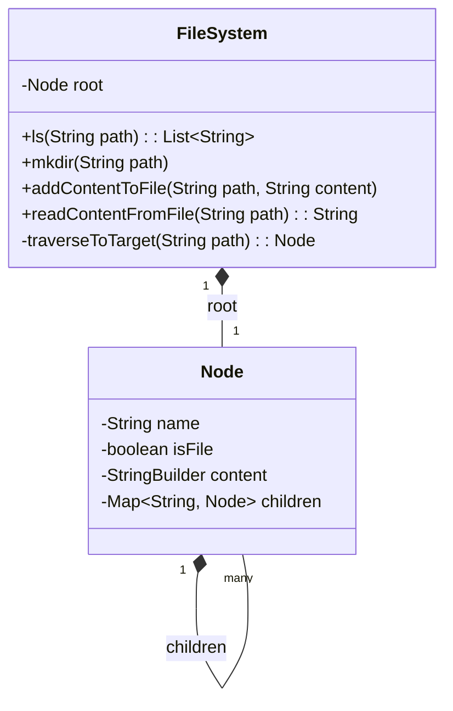

# 🛠️ Design In-Memory File System (LLD)

This is a classic algorithmic/System Design hybrid question (often asked by Amazon as a machine coding round). You are asked to simulate a standard UNIX file system entirely in memory.

---

## 1. Requirements

### Functional Requirements
- `ls(path)`: List files and directories in a given path.
- `mkdir(path)`: Create a new directory according to the path.
- `addContentToFile(path, content)`: Append content to a file. If the file doesn't exist, create it.
- `readContentFromFile(path)`: Return the string content of a file.

### Non-Functional Requirements
- **Performance:** `ls` and `read` should be fast. Path parsing should be efficient.
- **Structured Data:** You must use trees (specifically an N-ary Tree or Trie structure) to model the hierarchy.

---

## 2. Core Entities (Objects)

A file system is a composite structure. A directory contains files and other directories. We can use the **Composite Pattern**, or create a unified `Node` (or `File`) class that acts as both.

- `FileSystem` (The orchestrator, holding the root)
- `Node` (Represents either a Directory or a File)
  - `isFile` (boolean)
  - `name` (String)
  - `content` (StringBuilder)
  - `children` (HashMap mapping names to generic Nodes)

---

## 3. Class Diagram / Relationships



---

## 4. Key Algorithms / Design Patterns

### 1. The Directory/File Node (The N-ary Tree)

We use a unified node. If `isFile` is true, the `content` is populated and `children` is ignored. If false, `children` is populated.

```java
import java.util.*;

class Node {
    String name;
    boolean isFile;
    StringBuilder content;
    
    // We use a TreeMap so that the keys (file/folder names) 
    // are automatically sorted alphabetically for the "ls" command.
    NavigableMap<String, Node> children;

    public Node(String name) {
        this.name = name;
        this.isFile = false;
        this.content = new StringBuilder();
        this.children = new TreeMap<>();
    }
}
```

### 2. Path Traversal Algorithm (The Router)

Every function in the file system requires traversing down the path from the root. E.g., `/a/b/c`.
We create a helper function that breaks the path by `/` and walks the tree.

```java
public class FileSystem {
    private Node root;

    public FileSystem() {
        this.root = new Node(""); // Root directory
    }

    private Node traverse(String path) {
        Node current = root;
        // Split path ("/", or empty string)
        String[] parts = path.split("/");
        
        for (String part : parts) {
            if (part.isEmpty()) continue; // Handles the leading slash (e.g. split("/a") -> ["", "a"])
            
            // If it doesn't exist, create it (acts like mkdir -p)
            current.children.putIfAbsent(part, new Node(part));
            current = current.children.get(part);
        }
        return current;
    }
}
```

*Note: In some strict variations of the problem, `traverse` shouldn't auto-create folders unless explicitly told to. But standard Leetcode 588 allows auto-creation.*

### 3. Implementing the Commands

**1. `mkdir(String path)`**
Because our `traverse` helper auto-creates nodes that don't exist in the tree map, `mkdir` is trivial.
```java
    public void mkdir(String path) {
        traverse(path);
    }
```

**2. `addContentToFile(String path, String content)`**
We traverse to the target node, flag it as a file, and append the text.
```java
    public void addContentToFile(String filePath, String content) {
        Node node = traverse(filePath);
        node.isFile = true;
        node.content.append(content);
    }
```

**3. `readContentFromFile(String path)`**
```java
    public String readContentFromFile(String filePath) {
        Node node = traverse(filePath);
        return node.content.toString();
    }
```

**4. `ls(String path)`**
This is the trickiest. If the path points to a file, it should just return a list containing that file's name. If it points to a directory, it should return a sorted list of its children.

```java
    public List<String> ls(String path) {
        List<String> result = new ArrayList<>();
        
        // Handle root edge case manually
        if (path.equals("/")) {
            result.addAll(root.children.keySet());
            return result;
        }

        Node node = traverse(path);

        if (node.isFile) {
            // It's a file, return just the file name
            result.add(node.name);
        } else {
            // It's a directory, return its contents. 
            // Since we used a TreeMap, keySet() is already alphabetically sorted!
            result.addAll(node.children.keySet());
        }

        return result;
    }
```

---

## 5. Alternative Approach (Composite Pattern)

If an interviewer demands strict Object-Oriented principles, you should not put `content` and `children` in the exact same `Node` class. You represent it via the Composite Pattern.

```java
public abstract class FileSystemElement {
    protected String name;
    public abstract int getSize();
    public abstract List<FileSystemElement> ls();
}

public class File extends FileSystemElement {
    private String content;
    @Override
    public int getSize() { return content.length(); }
    @Override
    public List<FileSystemElement> ls() { return Arrays.asList(this); }
}

public class Directory extends FileSystemElement {
    private Map<String, FileSystemElement> children = new HashMap<>();
    @Override
    public int getSize() { 
        // sum children sizes
    }
    @Override
    public List<FileSystemElement> ls() { 
        // return sorted list of children
    }
}
```
*Verdict:* The Composite Pattern is better for theoretical OOD interviews. The unified `Node` approach is far superior for algorithmic/LeetCode-style interviews where speed of implementation matters most.