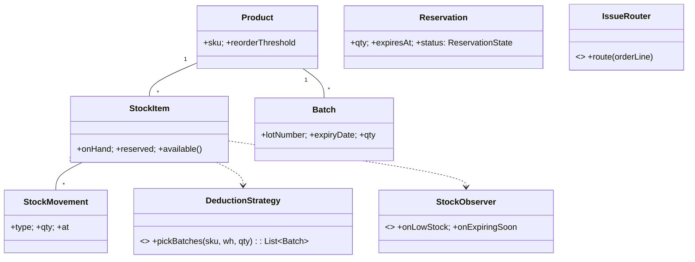

# 🛠️ Design Inventory Management System (LLD)

> **Sources**: [Postgres explicit row-level locks](https://www.postgresql.org/docs/current/explicit-locking.html#LOCKING-ROWS); [AWS — Saga pattern for distributed transactions](https://docs.aws.amazon.com/prescriptive-guidance/latest/cloud-design-patterns/saga.html); [Martin Fowler — Event Sourcing](https://martinfowler.com/eaaDev/EventSourcing.html); standard FIFO/FEFO inventory rotation rules from supply-chain texts.

## 1. Requirements

### Functional
- **Catalog**: products keyed by `SKU`.
- **Multi-warehouse**: a product has one `StockItem` per warehouse, each with its own counts.
- **Stock movements**: `RECEIVE` (PO arrival), `ISSUE` (sales), `TRANSFER` (between warehouses), `ADJUST` (corrections).
- **Reservations**: cart holds with TTL; `commit` on order, `expire` after timeout.
- **Lots**: track `expiryDate` per batch; deduct via FEFO (first-expiring-first-out) for perishables, FIFO otherwise.
- **Reorder**: when `quantityOnHand` falls below `reorderThreshold`, suggest a PO of `reorderQty`.
- **Alerts**: low-stock and expiring-soon.

### Non-Functional
- **No over-selling** under high concurrency (Black Friday).
- **Atomic** stock-adjustment transactions.
- **Audit trail**: every change is an entry in an append-only `StockMovement` log.
- **Multi-warehouse transfers** must be atomic across warehouses.

## 2. Core Entities

| Entity | Key Fields |
|---|---|
| `Product` | `sku`, `name`, `category`, `reorderThreshold`, `reorderQty` |
| `Warehouse` | `id`, `location` |
| `StockItem` | `(sku, warehouseId)`, `quantityOnHand`, `quantityReserved`, `quantityAvailable` (derived = `onHand − reserved`) |
| `StockMovement` | `id`, `sku`, `warehouseId`, `type`, `qty`, `reference`, `at` (append-only) |
| `Reservation` | `id`, `sku`, `warehouseId`, `qty`, `orderId`, `expiresAt`, `status` |
| `Batch` | `lotNumber`, `sku`, `warehouseId`, `qty`, `expiryDate` |
| `Supplier`, `PurchaseOrder` | standard PO fields |

## 3. Class Diagram



## 4. Key Methods

```java
int          Inventory.getAvailable(sku, warehouseId);
void         Inventory.receive(sku, warehouseId, qty, poReference);
void         Inventory.issue(sku, warehouseId, qty, orderId);
void         Inventory.transfer(sku, fromWh, toWh, qty);     // atomic 2-warehouse
Reservation  Inventory.reserve(sku, warehouseId, qty, orderId, ttl);
void         Inventory.commitReservation(reservationId);     // RESERVED -> ISSUED
void         Inventory.expireReservation(reservationId);     // restores availability
List<Batch>  Inventory.transferLot(sku, fromWh, toWh, qty);  // FEFO/FIFO order
```

## 5. Design Patterns

| Pattern | Where | Why |
|---|---|---|
| **State** | `Reservation.status` (`PENDING → COMMITTED → CANCELLED`/`EXPIRED`); `PurchaseOrder` lifecycle | Encodes legal transitions. |
| **Strategy** | `DeductionStrategy` (`FEFO`, `FIFO`, `LIFO`, `WeightedAverage` for valuation) | Choose per category (perishable ⇒ FEFO). |
| **Observer** | `StockObserver` reacts to threshold crossings (low-stock → suggest PO; expiring-soon → alert) | Decouples alerts from stock writes. |
| **Command** | Each `StockMovement` is an immutable command in an append-only log | Audit + replay for valuation reports. |
| **Chain of Responsibility** | `IssueRouter`: `preferredWarehouse → nearestWarehouse → anyWarehouseWithStock` | Each fallback decides whether to handle. |
| **Singleton** | `InventoryService` facade | Central coordination. |
| **Specification** | Reusable predicates: `LowStockSpec`, `ExpiringSoonSpec`, `OutOfStockSpec` | Composable queries. |

## 6. Concurrency & Edge Cases

### 6.1 No over-selling (the core invariant)
**Atomic conditional UPDATE** is the standard cure:
```sql
UPDATE stock_items
   SET on_hand = on_hand - :qty,
       reserved = reserved + :qty,
       version  = version + 1
 WHERE sku = :sku AND warehouse_id = :wh
   AND (on_hand - reserved) >= :qty
   AND version = :expectedVersion;
-- 0 rows affected ⇒ insufficient stock or stale read; retry or surface OutOfStockException
```
For very high contention (Black Friday on a single SKU), prefer a row lock:
```sql
SELECT on_hand, reserved FROM stock_items
 WHERE sku = :sku AND warehouse_id = :wh FOR UPDATE;
-- check, then UPDATE in same tx
```

### 6.2 Multi-warehouse transfer (atomic across two rows)
Wrap both updates in a single transaction:
```sql
BEGIN;
  UPDATE stock_items SET on_hand = on_hand - :qty WHERE sku=:s AND warehouse_id=:from AND on_hand >= :qty;
  -- 0 rows ⇒ ROLLBACK
  UPDATE stock_items SET on_hand = on_hand + :qty WHERE sku=:s AND warehouse_id=:to;
  INSERT INTO stock_movements(... TRANSFER ..., from_wh, to_wh ...);
COMMIT;
```
For cross-database / cross-service warehouses, use a **Saga**: debit source → credit destination → on failure run a compensating credit.

### 6.3 Reservations + TTL
- `reserve()` increments `reserved`, decrementing availability immediately.
- A scheduled sweeper expires reservations past `expiresAt`:
  ```sql
  UPDATE reservations SET status='EXPIRED' WHERE status='PENDING' AND expires_at < now();
  -- restore atomically
  UPDATE stock_items SET reserved = reserved - r.qty FROM ... WHERE ...;
  ```
- `commitReservation` flips `PENDING → COMMITTED` and converts `reserved` into a `StockMovement('ISSUE')`.

### 6.4 FEFO/FIFO deduction (Strategy)
```java
List<Batch> picked = new ArrayList<>();
int remaining = qty;
for (Batch b : strategy.orderedBatches(sku, wh)) {  // FEFO sorts by expiryDate ASC
  int take = min(b.qty, remaining);
  b.qty -= take; remaining -= take;
  picked.add(new Batch(b.lotNumber, take));
  if (remaining == 0) break;
}
if (remaining > 0) throw new InsufficientStockException();
```

### 6.5 Reorder alert
The `Observer` triggers on every issue/movement: if `available < reorderThreshold` and no open `PurchaseOrder` exists for that SKU, raise a `ReorderSuggested` event.

### 6.6 Append-only audit
`stock_movements` is never updated or deleted; the current `StockItem.onHand` can be reconstructed from `Σ qty * sign(type)` over its movements (event sourcing). This is the gold-standard auditor view.

## 7. Sources / Cross-Refs
- LLD-08 Behavioral Patterns (State, Strategy, Observer, Command, Chain of Responsibility)
- Solution-Concert-Booking.md (atomic conditional update pattern reused here)
- 18-Distributed-Systems.md (Saga pattern for cross-warehouse transfers)
- Postgres locking docs: https://www.postgresql.org/docs/current/explicit-locking.html
- AWS Saga pattern: https://docs.aws.amazon.com/prescriptive-guidance/latest/cloud-design-patterns/saga.html
