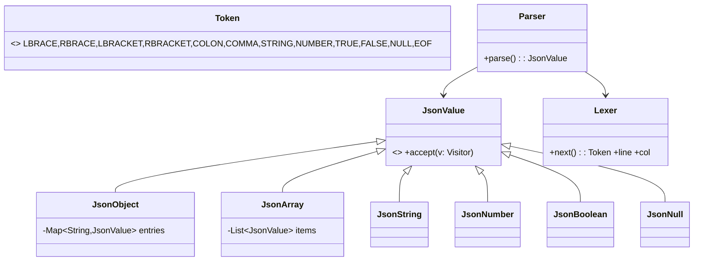

# 🛠️ Design a JSON Parser (LLD)

> **Sources**: [RFC 8259 — The JavaScript Object Notation (JSON) Data Interchange Format](https://www.rfc-editor.org/rfc/rfc8259); [Jackson `JsonParser` API](https://github.com/FasterXML/jackson-core) (streaming + tree pattern); [Gson `JsonElement` hierarchy](https://github.com/google/gson) (tree API); Lemire & Langdale — *simdjson: Parsing Gigabytes of JSON per Second* (VLDB 2019).

## 1. Requirements

### Functional
- `parse(String input) → JsonValue` and `write(JsonValue) → String` (compact + pretty).
- A typed value tree: `JsonObject`, `JsonArray`, `JsonString`, `JsonNumber`, `JsonBoolean`, `JsonNull`.
- Typed accessors: `get("name")`, `getInt("count")`, `getArray("items")`.
- **Preserve insertion order** of object keys (`LinkedHashMap`).
- **Strict** (RFC 8259) and **lenient** (trailing commas, NaN, comments) modes.

### Non-Functional
- **O(n)** parse time.
- **Streaming option** for huge files (don't materialise the whole tree).
- Error messages with **line + column**.

## 2. Core Entities



| Entity | Notes |
|---|---|
| `JsonObject` | Backed by `LinkedHashMap<String, JsonValue>` to preserve insertion order. |
| `JsonNumber` | Store as `long` if integral and fits, else `double`; expose `BigDecimal` for high-precision callers. |
| `JsonNull` | Single shared instance. |
| `Lexer` | Tracks `line`, `col`, and the start position of every token for diagnostics. |
| `Parser` | Recursive-descent; mutually recursive `parseValue / parseObject / parseArray`. |

## 3. Reference Implementation (recursive descent)

```java
class Parser {
  private final Lexer lex;
  Parser(String src) { this.lex = new Lexer(src); }

  JsonValue parse() {
    JsonValue v = parseValue();
    expect(Token.EOF);                 // strict: no trailing junk
    return v;
  }

  private JsonValue parseValue() {
    Token t = lex.peek();
    switch (t) {
      case LBRACE:   return parseObject();
      case LBRACKET: return parseArray();
      case STRING:   return new JsonString(lex.consumeString());
      case NUMBER:   return new JsonNumber(lex.consumeNumber());
      case TRUE:     lex.next(); return JsonBoolean.TRUE;
      case FALSE:    lex.next(); return JsonBoolean.FALSE;
      case NULL:     lex.next(); return JsonNull.INSTANCE;
      default: throw err("Unexpected token");
    }
  }

  private JsonObject parseObject() {
    expect(Token.LBRACE);
    LinkedHashMap<String, JsonValue> m = new LinkedHashMap<>();
    if (lex.peek() != Token.RBRACE) {
      do {
        String key = lex.consumeString();
        expect(Token.COLON);
        m.put(key, parseValue());
      } while (consumeIf(Token.COMMA));
    }
    expect(Token.RBRACE);
    return new JsonObject(m);
  }

  private JsonArray parseArray() { /* analogous */ }

  private ParseException err(String msg) {
    return new ParseException(msg + " at " + lex.line + ":" + lex.col);
  }
}
```

## 4. Parser Approaches

| Approach | API style | Memory | Use case |
|---|---|---|---|
| **Recursive descent (tree)** | `JsonValue v = parse(input)` | O(tree) | Default; small/medium docs; readable |
| **Streaming / SAX** | `onObjectStart()`, `onKey()`, `onValue()` callbacks | O(depth) | Huge files; pipelines |
| **Pull parser** | `nextToken()`, `getCurrentValue()` | O(depth) | Selective extraction; full control |
| **SIMD (simdjson)** | DOM or "On-Demand" API | O(n) but **2.5 GB/s** | Performance-critical batch processing |

Jackson exposes both tree (`JsonNode`) **and** streaming (`JsonParser`) APIs. simdjson uses SIMD instructions to find structural characters in parallel, achieving multi-gigabyte/sec throughput.

## 5. Design Patterns

| Pattern | Where | Why |
|---|---|---|
| **Composite** | `JsonValue` tree (`JsonObject`/`JsonArray` contain `JsonValue`s) | Uniform recursive traversal. |
| **Visitor** | `accept(Visitor)` for `PrettyPrint`, `Schema validate`, `Mutate`, `Equals` | Add operations without modifying the value classes. |
| **Interpreter** | The recursive-descent grammar itself | Each `parseX` interprets one production. |
| **Iterator** | `JsonArray` and `JsonObject.entrySet()` | Standard collection traversal. |
| **Builder** | `JsonObject.builder().put(...).put(...).build()` | Fluent construction in tests/code. |
| **Factory** | `JsonValue.of(Object javaValue)` chooses the right subtype | Simple ergonomics. |

## 6. Edge Cases & Robustness

- **Strings & escapes**: `\"`, `\\`, `\/`, `\b`, `\f`, `\n`, `\r`, `\t`, `\uXXXX`. Validate surrogate pairs for `\u` sequences (RFC 8259 §7).
- **Number precision**: 2⁵³ < `1e308` and many integer IDs (e.g., Twitter snowflake) lose precision in `double`. Default to `long`/`BigDecimal` for integral; `double` for floating point. Document this clearly — JSON's grammar doesn't distinguish.
- **Nesting depth limit**: cap recursion at e.g. 1000 to stop stack-overflow attacks (`[[[[[[…]`).
- **Duplicate keys**: RFC 8259 says behavior is implementation-defined; most parsers keep the last (we follow `LinkedHashMap.put`).
- **Trailing commas / comments**: only allowed in **lenient** mode. Reject by default.
- **UTF-8 BOM**: tolerate (skip) at the very start of input; reject elsewhere per RFC.
- **Pretty-print determinism**: use `LinkedHashMap` to keep output stable for diffs/snapshot tests.

## 7. Sources / Cross-Refs
- LLD-08 Behavioral Patterns (Composite, Visitor, Iterator, Interpreter)
- LLD-06 Creational Patterns (Builder, Factory)
- Solution-Spreadsheet.md (formula AST uses the same Composite + Interpreter recipe)
- Jackson, Gson, simdjson source code
- RFC 8259
