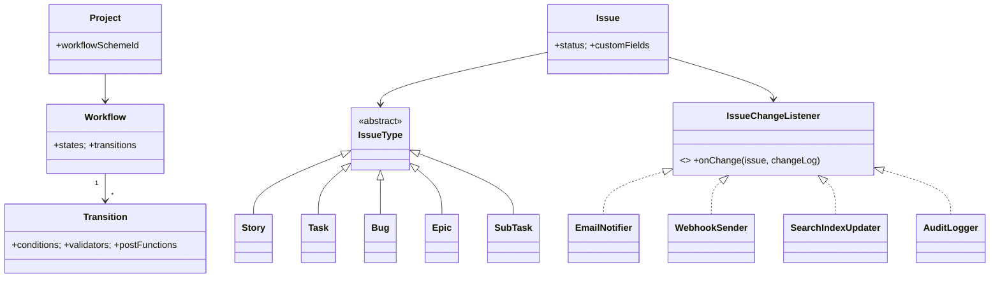

# 🛠️ Design a Jira-style Issue/Project Tracker — LLD

> **Sources**: [Atlassian — Configuring workflows](https://confluence.atlassian.com/jirakb/how-jira-workflow-works-790239589.html) (states, transitions, conditions, validators, post-functions); [Atlassian — Configuring issue-level security](https://confluence.atlassian.com/spaces/AdminJIRACloud/pages/776636711); [Atlassian Developer — Custom workflow elements](https://developer.atlassian.com/server/jira/platform/creating-custom-workflow-elements/); [JQL reference](https://support.atlassian.com/jira-software-cloud/docs/what-is-advanced-search-in-jira-cloud/); [Atlassian Connect framework](https://developer.atlassian.com/cloud/jira/platform/atlassian-connect/).

## 1. Requirements

### Functional
- **Projects** contain **Issues** of types: `Story`, `Task`, `Bug`, `Epic`, `Sub-task`.
- Issue fields: title, description, status, priority, assignee, reporter, labels, components, sprint, epic-link, sub-tasks, comments, attachments, watchers, **custom fields**.
- Status transitions follow a **configurable workflow** (per project/issue-type).
- **JQL** search/filter (`project = PROJ AND assignee = currentUser() AND status != Done`).
- **Boards** (Kanban, Scrum); **Sprints** (`FUTURE → ACTIVE → CLOSED`).
- Reports: burndown, velocity.

### Non-Functional
- **Permissions deeply layered** — global → project → issue-level.
- **Audit trail** of every change — the "History" tab is **append-only**.
- High read traffic on boards (refreshed often).
- Full-text search of issue titles, descriptions, and comments.

## 2. Core Entities

| Entity | Key Fields |
|---|---|
| `Project` | `id`, `key` (e.g. `PROJ`), `lead`, `type: SCRUM/KANBAN`, `workflowSchemeId` |
| `Issue` | `id`, `key` (e.g. `PROJ-123`), `type`, `summary`, `description`, `status`, `priority`, `assignee`, `reporter`, `sprintId?`, `parentEpicId?`, `customFields: Map`, `watchers[]`, `labels[]`, `createdAt`, `updatedAt` |
| `IssueType` | `Story`, `Task`, `Bug`, `Epic`, `SubTask` |
| `Workflow` | `states[]`, `transitions[]` |
| `Transition` | `fromState`, `toState`, `conditions[]`, `validators[]`, `postFunctions[]` |
| `Comment`, `Attachment`, `Watcher` | standard |
| `ChangeLog` *(append-only)* | `(issueId, field, oldValue, newValue, by, at)` |
| `Sprint` | `project`, `name`, `startDate`, `endDate`, `state: FUTURE/ACTIVE/CLOSED`, `issues[]` |
| `Permission` | role → action mapping (3 layers) |

## 3. The Two Decisions That Define Jira

### 3.1 Configurability stored as **data**, not code
Workflows, issue types, and custom fields are **rows in tables**, not classes you compile. The engine reads the workflow row at transition time, evaluates the configured conditions/validators/post-functions, and dispatches **generically**. This is why every team can have its own workflow without forking the codebase.

### 3.2 The transition pipeline (Atlassian's core abstraction)
Each `Transition` has three configurable hook lists, run in this order:
1. **Conditions** — *Is this transition even shown to this user?* (e.g., "only Reviewers can move to Done"). If any condition is false, the transition button is hidden in the UI.
2. **Validators** — *Is the issue's current state acceptable?* (e.g., "must have an assignee", "must have a linked PR"). Failure shows an error.
3. **Post-functions** — *Side effects after the move* (e.g., "auto-assign reviewer", "set resolution = Fixed", "fire a webhook", "append to ChangeLog").

This is a textbook **Chain of Responsibility** for each phase, plus the **Observer** pattern for post-functions.

## 4. Class Diagram



## 5. Key Methods

```java
IssueId createIssue(IssueDraft d);
void    transitionIssue(IssueId i, TransitionId t);  // runs conditions + validators + postFns
void    addComment(IssueId, UserId, String);
void    assignIssue(IssueId, UserId);
SprintId addToSprint(IssueId, SprintId);
void    completeSprint(SprintId s);                   // moves incomplete issues back to backlog
Page<Issue> search(JqlQuery q, Page p);               // JQL → query plan
Board   getBoard(BoardId b);                          // groups issues by status column
```

## 6. Design Patterns

| Pattern | Where | Why |
|---|---|---|
| **State + State Machine** | `Issue.status` driven by `Workflow` | Block illegal transitions; keep all transition logic in one place. |
| **Strategy** | `IssueType` (different required fields, different default workflow) | Same `Issue` shell, type-specific behavior. |
| **Chain of Responsibility** | `Transition.validators` (`HasAssignee → HasPRLink → PermissionCheck`) | Fail-fast with a precise error. |
| **Observer** | `IssueChangeListener`s — `EmailNotifier`, `WebhookSender`, `SearchIndexUpdater`, `AuditLogger` | New listeners added without touching core code. |
| **Composite** | `Epic → Story → SubTask` hierarchy | Recursive traversal (e.g., "rolled-up estimate"). |
| **Visitor** | `ChangeLogVisitor` walking the issue's history | Build the History tab; export to JSON; replay state. |
| **Memento** | Snapshot of issue *before* edit | Stored in `ChangeLog`; powers History + (rare) undo. |
| **Factory** | `IssueFactory.create(type, draft)` | Type-specific defaults. |
| **Specification** | JQL parser produces `Predicate<Issue>` ASTs | Same predicate object can drive a Lucene query and an in-memory filter. |
| **Builder** | `IssueBuilder.summary(...).priority(...).assignee(...).build()` | Fluent construction in scripts/integrations. |

## 7. Permissions — Three Layers

Atlassian implements three nested layers, evaluated in order:

| Layer | Scope | Examples |
|---|---|---|
| **Global** | Whole instance | `JiraSystemAdmin`, `JiraAdmin`, `BrowseUsers` |
| **Project** | Per-project, via Permission Scheme attached to project | `BROWSE_PROJECTS`, `CREATE_ISSUES`, `EDIT_ISSUES`, `ASSIGN_ISSUES`, `TRANSITION_ISSUES`, `RESOLVE_ISSUES` |
| **Issue-level Security** | Per issue, via Issue Security Scheme; sub-tasks inherit parent's level | `Public`, `Internal-Only`, `Reporter-Only` |

Field-level permissions are **not** native — restrict via custom field configurations or app extensions.

## 8. Audit Trail (the History tab)

Every field change appends a `ChangeLog` row inside the **same transaction** as the issue update:

```sql
BEGIN;
UPDATE issues SET status='In Progress', assignee_id=42, version=version+1
  WHERE id=:id AND version=:expectedVersion;       -- optimistic lock
INSERT INTO changelog(issue_id, field, old_value, new_value, by, at)
  VALUES (:id, 'status',   'To Do',  'In Progress', :user, now()),
         (:id, 'assignee', null,     '42',          :user, now());
COMMIT;
```

ChangeLog rows are **never deleted**. The History tab is just `SELECT * FROM changelog WHERE issue_id=? ORDER BY at`.

## 9. JQL — Specification Pattern

A JQL query (`project = PROJ AND assignee = currentUser() AND status != Done`) is parsed into an **AST of `Predicate<Issue>` nodes** (`AndNode`, `OrNode`, `EqualsNode`, `InNode`, …). The same AST can drive:
- A **Lucene/OpenSearch** query for full-text + indexed fields.
- An **in-memory** filter for board updates from cached issues.
- A **SQL `WHERE`** translation for analytics dashboards.

## 10. Concurrency / Read Scaling

- Optimistic concurrency on `Issue` (`version` column); transition retries on conflict.
- Boards refresh frequently — back them with a **secondary index** (Lucene/OpenSearch) updated by the `SearchIndexUpdater` listener; never query the primary issue table for boards.
- Boards are capped (Atlassian uses **5,000 issues**); larger filters require pagination/refinement.

## 11. Sources / Cross-Refs
- LLD-08 Behavioral Patterns (State, Strategy, Chain of Responsibility, Observer, Visitor, Memento)
- LLD-07 Structural Patterns (Composite)
- LLD-06 Creational Patterns (Factory, Builder)
- Solution-Task-Management.md (sister LLD — simpler scope)
- Solution-Concert-Booking.md (configurable lifecycle workflow analogue)
- Atlassian docs (workflows, issue security, JQL)
