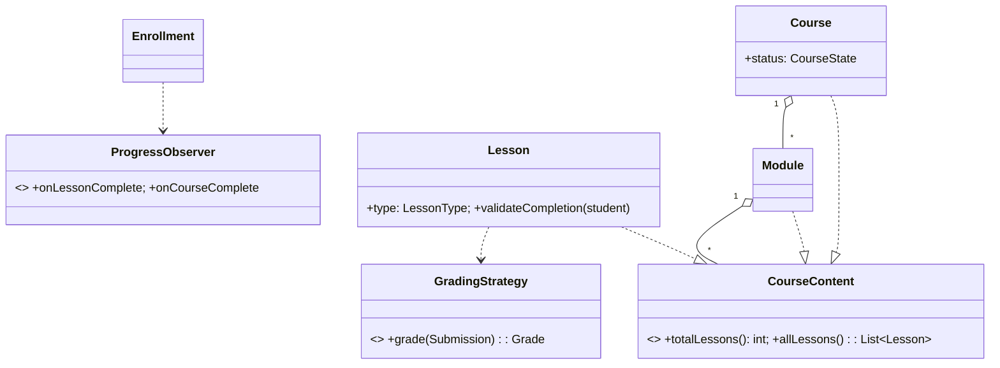

# 🛠️ Design Learning Management System (LMS, e.g., Coursera) — LLD

> **Sources**: Synthesized from Coursera Engineering Blog (course composition + completion semantics), [edX Open edX architecture docs](https://docs.openedx.org/en/latest/) (course tree + grading service), GoF patterns (State, Composite, Strategy, Observer, Template Method, Factory), and PostgreSQL idempotency patterns (`ON CONFLICT DO NOTHING/UPDATE`).

## 1. Requirements

### Functional
- **Authoring**: Instructors create `Course → Module → Lesson` (`VIDEO`/`QUIZ`/`ASSIGNMENT`/`TEXT`).
- **Course lifecycle**: `DRAFT → PUBLISHED → ARCHIVED` (only published courses are enrollable).
- **Enrollment**: Student enrolls (idempotent); progress is tracked per lesson.
- **Quizzes**: Auto-graded MCQ; assignments are peer-reviewed (N reviewers) or instructor-graded.
- **Certificate**: Issued exactly once when the course is complete.
- **Forums**: Discussion threads scoped to course / lesson.

### Non-Functional
- **Thousands of concurrent students** per popular course.
- **Idempotent enrollment** and **idempotent progress markers** (mobile retries are common).
- **Atomic certificate issuance** — exactly one per `(user, course)`.
- **Fair peer-review dispatch** — no reviewer ever sees the same submission twice.

## 2. Core Entities

| Entity | Key Fields |
|---|---|
| `User` | `id`, `email`, `role` (`STUDENT`/`INSTRUCTOR`/`ADMIN`) |
| `Course` | `id`, `title`, `status` (`DRAFT`/`PUBLISHED`/`ARCHIVED`), `modules[]` |
| `Module` | `id`, `title`, `children[]` (modules or lessons) |
| `Lesson` | `id`, `type`, `content`, `requiredForCompletion: bool` |
| `Enrollment` | `id`, `userId`, `courseId`, `status` (`ACTIVE`/`COMPLETED`) |
| `Progress` | `userId`, `lessonId`, `state` (`NOT_STARTED`/`IN_PROGRESS`/`COMPLETED`), `updatedAt` |
| `Quiz` | `id`, `lessonId`, `questions[]`, `passingScore` |
| `Submission` | `id`, `userId`, `assignmentId`, `content`, `status` |
| `Grade` | `id`, `submissionId`, `score`, `gradedBy` |
| `PeerReview` | `id`, `submissionId`, `reviewerId`, `score`, `feedback` |
| `Certificate` | `id`, `userId`, `courseId`, `issuedAt` |

## 3. Class Diagram



## 4. Key Methods

```java
Course        Authoring.createCourse(instructorId, title);
void          Authoring.publishCourse(courseId);     // DRAFT -> PUBLISHED
Enrollment    Enrollment.enroll(userId, courseId);   // idempotent
void          Progress.markLessonComplete(userId, lessonId);  // UPSERT
QuizResult    Quizzes.submit(userId, quizId, answers);        // auto-graded
SubmissionId  Assignments.submit(userId, assignmentId, content);
void          PeerReview.submit(reviewerId, submissionId, score, feedback);
Certificate   Certification.issueIfEligible(userId, courseId);  // atomic, once
```

## 5. Design Patterns

| Pattern | Where | Why |
|---|---|---|
| **State** | `Course.status` (`DRAFT`/`PUBLISHED`/`ARCHIVED`); `Enrollment.status`; `Submission.status` | Encodes legal transitions; e.g., enrollment requires `PUBLISHED`. |
| **Composite** | `Course → Module → Lesson` (recursive tree) | `totalLessons()` aggregates uniformly across leaves and subtrees. |
| **Strategy** | `GradingStrategy` (`AutoMcq`, `PeerReview`, `Instructor`) | Grading mode varies per assignment. |
| **Observer** | `ProgressObserver` reacts to `lessonComplete` → may trigger `courseComplete` → `issueCertificate` | Decouples progress events from side effects. |
| **Factory** | `LessonFactory.create(type, payload)` | Hides constructors for the various lesson types. |
| **Template Method** | `Lesson.markCompleted()` runs `validateCompletion` (subclass) → `recordCompletion` → `notifyObservers` | Common workflow + per-type validation. |
| **Singleton** | `GradingService` coordinator | Centralizes auto-grading and review-dispatch. |

## 6. Concurrency & Edge Cases

### 6.1 Idempotent enrollment
```sql
ALTER TABLE enrollments
  ADD CONSTRAINT uq_user_course UNIQUE (user_id, course_id);

-- Application:
INSERT INTO enrollments (...) VALUES (...)
  ON CONFLICT (user_id, course_id) DO NOTHING;
```

### 6.2 Idempotent progress markers (UPSERT)
```sql
INSERT INTO progress (user_id, lesson_id, state, completed_at)
VALUES (:u, :l, 'COMPLETED', now())
ON CONFLICT (user_id, lesson_id) DO UPDATE
  SET state='COMPLETED',
      completed_at=COALESCE(progress.completed_at, EXCLUDED.completed_at);
```
Multiple identical `markLessonComplete` calls converge to the same row state.

### 6.3 Atomic certificate issuance (exactly once)
```sql
BEGIN;
SELECT 1 FROM certificates
 WHERE user_id=:u AND course_id=:c FOR UPDATE;
-- if exists, COMMIT and return existing cert
INSERT INTO certificates(user_id, course_id, issued_at) VALUES (:u, :c, now());
COMMIT;
```
Or — more cheaply — rely on `UNIQUE(user_id, course_id)` + `ON CONFLICT DO NOTHING`.

### 6.4 Fair peer-review dispatch
- Each submission must reach exactly N reviewers, **no duplicates**.
- Use `UNIQUE(submission_id, reviewer_id)` so a reviewer can never be assigned the same submission twice.
- Atomic dispatch with `SELECT … FOR UPDATE SKIP LOCKED` from a pool of eligible reviewers; commit one row per assignment.

### 6.5 Course-completion check (when does the cert fire?)
After every `markLessonComplete`, check whether all `requiredForCompletion=true` lessons are `COMPLETED` and all required assessments passed. If so, fire `onCourseComplete`; the certificate observer attempts atomic issuance.

### 6.6 Scaling popular courses
- Read-heavy: cache course tree + lesson metadata aggressively (TTL with bust on `publishCourse`).
- Sticky CDN URLs for video segments; HLS adaptive bitrate.
- Quiz auto-grading is stateless and trivially parallel.

## 7. Sources / Cross-Refs
- LLD-08 Behavioral Patterns (State, Strategy, Observer, Template Method, Command)
- LLD-07 Structural Patterns (Composite)
- Solution-Course-Registration.md (idempotent enrollment, capacity locks)
- Solution-Notification.md (downstream notification fanout on grading events)
- Open edX architecture docs: https://docs.openedx.org/en/latest/
