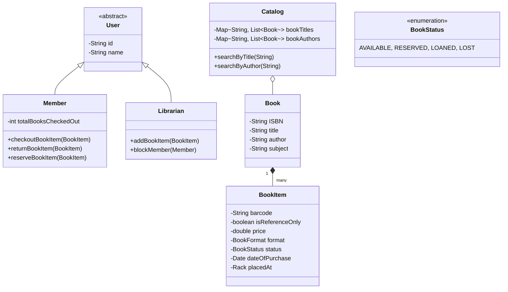

# 🛠️ Design a Library Management System (LLD)

Designing a Library Management System (LMS) is a fundamental Object-Oriented Design problem. It tests your ability to identify the correct actors and use cases, model the relationships between Physical Books vs. Book Titles, and handle states (like borrowing, returning, and reserving).

---

## 1. Requirements

### Functional Requirements
- **Book vs Book Item:** The library has multiple titles (Books). A title can have multiple physical copies (BookItems).
- **Actors:** Members can search, borrow, reserve, and return books. Librarians can add/remove book items and block members.
- **Search:** Users can search the catalog by Title, Author, Subject, or Publication Date.
- **Borrowing Rules:** 
  - A member can borrow a maximum of 5 books.
  - The maximum checkout duration is 10 days.
- **Fines:** If a book is returned late, a fine is calculated and collected.
- **Reservations:** If a book is currently checked out, a member can reserve it.

### Non-Functional Requirements
- **Consistency:** Two members cannot borrow the exact same specific physical `BookItem` at the same time.
- **Extensibility:** The system should easily allow for changes in fine calculations or search indexing algorithms.

---

## 2. Core Entities (Objects)

- `Library` (The central hub containing the catalog)
- `User` (Abstract) -> `Librarian`, `Member`
- `Book` (Metadata of the book)
- `BookItem` (The physical copy on the shelf, identified by a barcode)
- `Account` (Manages member details, borrowed items, and fines)
- `LibraryCard` (Used for scanning/login)
- `BookReservation` / `BookLending`
- `Fine`

---

## 3. Class Diagram / Relationships



---

## 4. Key Algorithms / Design Patterns

### 1. Catalog Search (In-Memory Indexing)
When a user searches for a book by author, we don't want to iterate through a list of 100,000 books. We maintain HashMaps that act as indexes. This is an application of a basic **Inverted Index**.

```java
public interface Search {
    List<Book> searchByTitle(String title);
    List<Book> searchByAuthor(String author);
}

public class Catalog implements Search {
    private Map<String, List<Book>> bookTitles;
    private Map<String, List<Book>> bookAuthors;

    public Catalog() {
        bookTitles = new HashMap<>();
        bookAuthors = new HashMap<>();
    }

    // When a Librarian adds a book, we index it.
    public void indexBook(Book book) {
        bookTitles.computeIfAbsent(book.getTitle(), k -> new ArrayList<>()).add(book);
        bookAuthors.computeIfAbsent(book.getAuthor(), k -> new ArrayList<>()).add(book);
    }

    @Override
    public List<Book> searchByTitle(String title) {
        return bookTitles.getOrDefault(title, new ArrayList<>());
    }

    @Override
    public List<Book> searchByAuthor(String author) {
        return bookAuthors.getOrDefault(author, new ArrayList<>());
    }
}
```

### 2. State Pattern (Book Status)
A `BookItem` has states, and specific actions are only valid in certain states. You cannot checkout a book that is `LOANED`.

```java
public enum BookStatus {
    AVAILABLE, RESERVED, LOANED, LOST
}

public class BookItem extends Book {
    private String barcode;
    private BookStatus status;

    public synchronized boolean checkout(String memberId) {
        if (this.status != BookStatus.AVAILABLE) {
            return false; // Cannot checkout
        }
        
        // Change state
        this.status = BookStatus.LOANED;
        return true;
    }
    
    public void returnItem() {
        this.status = BookStatus.AVAILABLE;
    }
}
```

### 3. Handling Fines (Strategy Pattern)
The library might charge $1/day for the first 10 days, and $2/day after. This rule might change next year. The logic shouldn't be hardcoded into the `returnBookItem` method. We can use the Strategy Pattern.

```java
public interface FineStrategy {
    double calculateFine(int daysLate);
}

public class StandardFineStrategy implements FineStrategy {
    @Override
    public double calculateFine(int daysLate) {
        if (daysLate <= 0) return 0.0;
        if (daysLate <= 10) return daysLate * 1.0;
        return (10 * 1.0) + ((daysLate - 10) * 2.0);
    }
}

public class FineService {
    private FineStrategy strategy;

    public FineService(FineStrategy strategy) {
        this.strategy = strategy;
    }

    public void collectFine(Member member, int daysLate) {
        double amount = strategy.calculateFine(daysLate);
        if (amount > 0) {
            System.out.println("Processing fine of $" + amount + " for member " + member.getId());
            // Call payment gateway...
        }
    }
}
```

### 4. Concurrency Control
Since a library app might be accessed via a web portal and kiosks simultaneously, someone could reserve a book online at the exact moment another person picks it off the physical shelf and scans it at the kiosk.
The `checkout()` method inside `BookItem` must be `synchronized` (in Java) or rely on a database transaction with a row-level lock (`SELECT * FROM book_items WHERE barcode = '123' FOR UPDATE`) in the real world to prevent double checkouts.