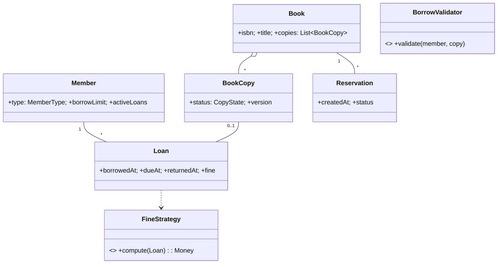

# 🛠️ Design Library Management System (LLD)

> **Sources**: Synthesized from standard library-system OOP designs (Grokking the OO Design Interview, awesome-lld), GoF design patterns (State, Strategy, Observer, Chain of Responsibility, Command, Visitor), and concurrency primitives in [PostgreSQL row-level locks](https://www.postgresql.org/docs/current/explicit-locking.html#LOCKING-ROWS).

## 1. Requirements

### Functional
- **Catalog**: A `Book` (logical work) has many physical `BookCopy` units (each with its own status).
- **Members**: `STUDENT` (5-book limit, 14-day loan) vs `TEACHER` (10-book limit, 30-day loan) — values configurable.
- **Borrow / Return**: A copy is loaned to one member at a time; returns compute fines if overdue.
- **Reservations**: When all copies are out, a member joins a FIFO queue per `Book`; on next return, the queue head is notified and the copy is held.
- **Search** by title / author / ISBN / category.
- **Librarian admin**: add/remove book, register member, write off lost/damaged copies.
- **Notifications**: due-soon, overdue, reservation-ready.

### Non-Functional
- **At most one active loan per copy** (no double-borrow under contention).
- **Borrow-limit enforced** atomically (no member can ever exceed their limit by racing).
- **FIFO fairness** in reservation queues.
- **Audit trail** for every borrow / return / fine event.

## 2. Core Entities

| Entity | Key Fields |
|---|---|
| `Book` | `isbn`, `title`, `author`, `category`, `copies[]` |
| `BookCopy` | `copyId`, `bookIsbn`, `status` (`AVAILABLE`/`BORROWED`/`RESERVED`/`LOST`/`DAMAGED`), `version` |
| `Member` | `id`, `type`, `borrowLimit`, `currentLoanCount` |
| `Loan` | `id`, `memberId`, `copyId`, `borrowedAt`, `dueAt`, `returnedAt?`, `fineAmount` |
| `Reservation` | `id`, `bookIsbn`, `memberId`, `createdAt`, `status` |
| `Fine` | `id`, `loanId`, `amount`, `paidAt?` |

## 3. Class Diagram



## 4. Key Methods

```java
List<Book>  Catalog.search(query);
Loan        LibraryService.borrowBook(memberId, copyId);   // chain-validated, atomic
Receipt     LibraryService.returnBook(loanId);             // computes fine via Strategy; promotes reservation
Reservation LibraryService.reserveBook(memberId, isbn);    // joins FIFO queue
void        LibraryService.payFine(fineId);
void        LibrarianService.addBook(book);
void        LibrarianService.markCopyLost(copyId);
```

## 5. Design Patterns

| Pattern | Where | Why |
|---|---|---|
| **State** | `BookCopy.status`, `Loan` lifecycle (`OPEN`/`OVERDUE`/`CLOSED`) | Constrain transitions; e.g., can't borrow a `LOST` copy. |
| **Strategy** | `FineStrategy` (per-day, capped, member-type discount, holiday-waiver) | Fine policy is the most-changed rule. |
| **Observer** | `Reservation` queue subscribes to `BookCopy.returned` events | When a copy returns, head-of-queue is notified. |
| **Chain of Responsibility** | `BorrowValidator`: `MembershipActive → WithinLimit → NoOverdueFines → CopyAvailable` | Each rule fails fast; easy to add (e.g., `NoBlockedAccount`). |
| **Command** | `BorrowCommand`, `ReturnCommand` | Auditable, retryable, undo-able for librarian corrections. |
| **Singleton** | `Catalog` index | One in-memory inverted index for search. |
| **Visitor** | Reports (top-borrowed books, member activity, overdue list) | Add new reports without changing entities. |

## 6. Concurrency & Edge Cases

### 6.1 Atomic borrow (no double-loan)

```sql
-- Conditional UPDATE on the copy row + INSERT loan in same tx
BEGIN;
UPDATE book_copies SET status='BORROWED', version=version+1
 WHERE copy_id=:copyId AND status='AVAILABLE';
-- 0 rows ⇒ someone beat us; rollback and surface to user

INSERT INTO loans(member_id, copy_id, borrowed_at, due_at) VALUES (...);
COMMIT;
```

### 6.2 Borrow-limit enforcement
Check inside the same tx: `SELECT count(*) FROM loans WHERE member_id=:m AND returned_at IS NULL FOR UPDATE` then assert `< borrowLimit`. Or denormalize `current_loan_count` on `Member` with optimistic version.

### 6.3 Reservation queue (FIFO)
- Queue rows ordered by `(created_at, reservation_id)` — the second component breaks timestamp ties deterministically.
- On return, atomically move the head reservation to `READY`, set the copy to `RESERVED` for that member, send notification with `holdExpiresAt = now() + 48h`.
- If hold expires, demote to `EXPIRED`; promote next.

### 6.4 Overdue fine computation (Strategy example)
```
fine = max(0, daysOverdue * perDayRate)
fine = min(fine, perBookCap)
fine *= (1 - memberType.discount)
```
Fines are attached to the loan on `returnBook`; not retroactively recomputed.

### 6.5 Lost/damaged copies
Librarian command transitions `BookCopy → LOST/DAMAGED`. The copy is excluded from search availability counts but the loan history is preserved.

## 7. Sources / Cross-Refs
- LLD-08 Behavioral Patterns (State, Strategy, Observer, Chain of Responsibility, Command, Visitor)
- Solution-Hotel-Management.md (similar atomic-resource-allocation pattern)
- Solution-Concert-Booking.md (FIFO queue + hold expiry pattern reused here)
- Postgres row-level locking docs: https://www.postgresql.org/docs/current/explicit-locking.html
