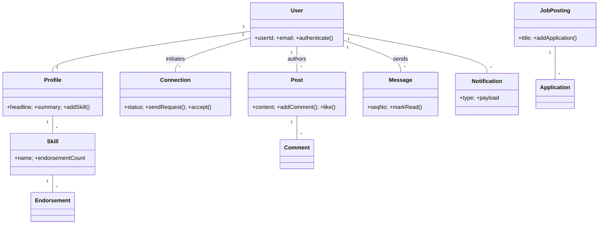

# 🛠️ Design LinkedIn (LLD)

> Object-oriented design for a professional networking platform — profiles, connections, feed, messaging, jobs, and notifications. Focus is OOP class structure; the high-level system design is covered separately in the SD section.

## 📚 Table of Contents

1. [Requirements](#1-requirements)
2. [Core Entities](#2-core-entities-objects)
3. [Class Diagram](#3-class-diagram--relationships)
4. [Key APIs](#4-api--interfaces)
5. [Design Patterns](#5-key-algorithms--design-patterns)
6. [Concurrency](#6-concurrency--edge-cases)
7. [Sources](#7-sources)

---

## 1. Requirements

### Functional
- **Profiles** — create / update profile (name, headline, summary, skills, work history)
- **Connections** — send, accept, reject, withdraw, or block connection requests
- **Feed & Posts** — post updates, comment, like; ranked feed of connections' activity
- **Messaging** — 1:1 direct messages with read receipts and ordering guarantees
- **Job Postings** — recruiters post jobs; candidates search and apply
- **Notifications** — connection requests, message arrivals, endorsements, job matches
- **Endorsements & Skills** — peers endorse skills on a profile

### Non-Functional
- **Read-heavy** — feed reads dominate writes (≈ 100:1)
- **Eventual consistency** — feed ranking can lag a few seconds; profile reads should be near-real-time
- **High availability** — profiles, messaging, search must be available
- **Message ordering** — messages within a conversation must arrive in order

---

## 2. Core Entities (Objects)

| Entity | Key Attributes |
|---|---|
| `User` | userId, email, passwordHash, joinedAt |
| `Profile` | profileId, userId, firstName, lastName, headline, summary, location, photoUrl |
| `Connection` | connectionId, fromUserId, toUserId, status, createdAt, updatedAt |
| `Post` | postId, authorId, content, mediaUrl, createdAt, likeCount |
| `Comment` | commentId, postId, authorId, content, createdAt |
| `Message` | messageId, conversationId, senderId, content, sentAt, seqNo, isRead |
| `Conversation` | conversationId, participantIds[], lastMessageAt |
| `JobPosting` | jobId, recruiterId, companyId, title, description, requirements, postedAt |
| `Application` | applicationId, jobId, applicantId, resumeUrl, status, appliedAt |
| `Skill` | skillId, profileId, name, endorsementCount |
| `Endorsement` | endorsementId, endorserId, skillId, createdAt |
| `Notification` | notificationId, userId, type, payload, createdAt, isRead |

**Connection states (state machine):** `NONE → PENDING → (ACCEPTED | REJECTED | WITHDRAWN | BLOCKED)`

---

## 3. Class Diagram / Relationships



Cardinality:
- `User` 1:1 `Profile`
- `User` M:N `User` via `Connection` (self-referential, with state)
- `User` 1:M `Post`, `Post` 1:M `Comment`
- `Conversation` M:N `User`, `Conversation` 1:M `Message`
- `Profile` 1:M `Skill`, `Skill` 1:M `Endorsement`
- `JobPosting` 1:M `Application`

---

## 4. API / Interfaces

```java
// Connection management
ConnectionResult sendConnectionRequest(long fromUserId, long toUserId);
void acceptConnection(long connectionId);
void rejectConnection(long connectionId);
void blockUser(long userId, long targetUserId);

// Feed / posts
Post createPost(long userId, String content, String mediaUrl);
Comment addComment(long postId, long userId, String content);
void likePost(long postId, long userId);
List<Post> getNewsFeed(long userId, int page, int pageSize);

// Messaging
Message sendMessage(long senderId, long conversationId, String content);
List<Message> getConversation(long conversationId, long beforeSeqNo, int limit);

// Jobs
JobPosting postJob(long recruiterId, JobDetails details);
Application applyToJob(long jobId, long applicantId, String resumeUrl);
List<JobPosting> searchJobs(SearchQuery query);

// Endorsements
void endorseSkill(long endorserId, long skillId);

// Notifications (Observer)
void subscribe(long userId, NotificationObserver observer);
```

---

## 5. Key Algorithms / Design Patterns

| Pattern | Where used | Why |
|---|---|---|
| **Observer** | Notifications | Connection accepted, message received, post liked → notify subscribers without coupling |
| **Strategy** | Feed ranking | Swap chronological / engagement-weighted / connection-strength algorithms |
| **State** | Connection lifecycle | `PENDING → ACCEPTED/REJECTED/BLOCKED` with valid-transition enforcement |
| **Repository** | Data access | `UserRepository`, `PostRepository`, `ConnectionRepository` abstract DB from domain logic |
| **Factory** | Notification creation | One factory per notification type (connection, message, endorsement) |
| **Template Method** | Application pipeline | `validate → checkPreferences → enrich → persist → notify` skeleton; type-specific steps override |
| **Builder** | `JobPosting`, `Profile` | Many optional fields; builder produces immutable instance |

---

## 6. Concurrency & Edge Cases

- **Profile updates** — `ReadWriteLock` per profile: many concurrent readers, exclusive writer. Or use optimistic concurrency with a `version` field for low-contention writes.
- **Connection acceptance race** — two clients click "accept" simultaneously. Use optimistic locking on the `Connection` row (`UPDATE … WHERE status='PENDING'`); whichever update affects 1 row wins; the other returns "already processed".
- **Message ordering** — sequence numbers are issued by the conversation's owning shard (single-writer pattern) so per-conversation order is total. Across conversations, only causal order matters.
- **Endorsement double-counting** — `UNIQUE(endorserId, skillId)` index prevents duplicate endorsements; the increment runs in the same transaction as the insert.
- **Feed write amplification** — for celebrities (millions of followers), use *fanout-on-read* (pull) rather than *fanout-on-write* (push); for normal users, push works fine. (Hybrid; same trade-off discussed in the Twitter Timeline SD doc.)
- **Notification dedup** — idempotency key = `hash(actorId, recipientId, type, entityId, hourBucket)`; second insert is a no-op.

---

## 7. Sources

- LinkedIn Engineering blog — Kafka & feed architecture (publicly documented)
- Workspace cross-references: `Notes/LowLevelDesign/LLD-08-Behavioral-Patterns.md` (Observer, State, Strategy, Template Method)
- Workspace cross-references: `Notes/SystemDesign/Solutions/Solution-Twitter-Timeline.md` (fanout discussion)

📺 **Video walkthrough:** [How I Mastered Low Level Design Interviews](https://www.youtube.com/watch?v=OhCp6ppX6bg)
