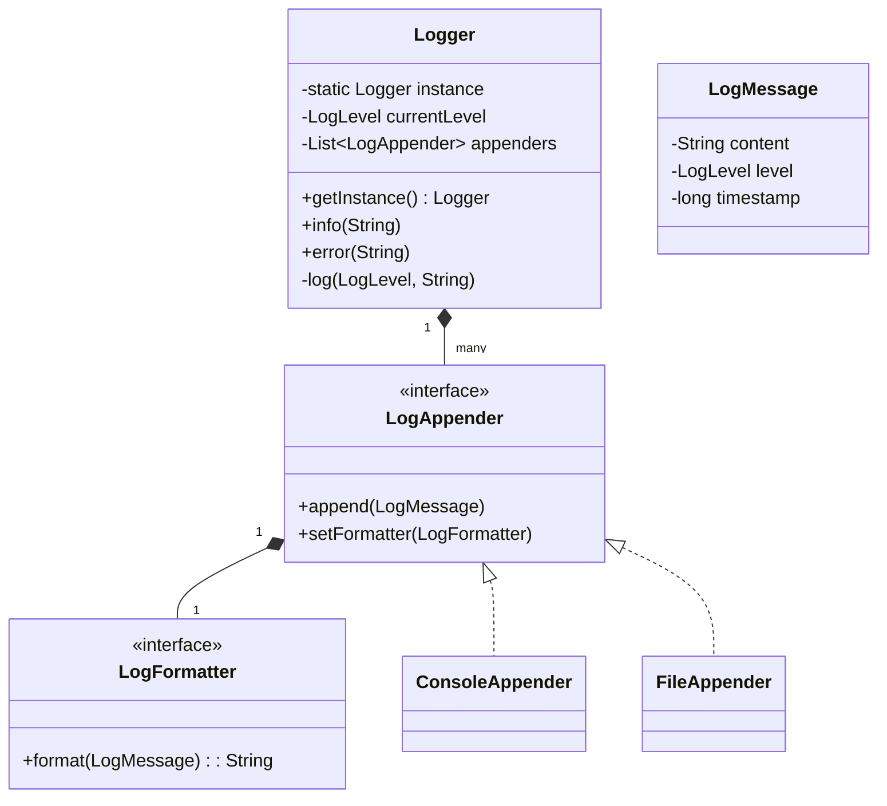

# 🛠️ Design a Logging Framework (LLD)

Designing a logging framework (like Log4j, Logback, or Python's `logging` module) is an excellent problem to demonstrate the **Chain of Responsibility** pattern, the **Singleton** pattern, and asynchronous queue management.

---

## 1. Requirements

### Functional Requirements
- **Log Levels:** Support various log levels (INFO, DEBUG, WARNING, ERROR, FATAL).
- **Multiple Appenders/Sinks:** Ability to log to the Console, a File, or send to an external Database.
- **Filtering:** A logger configured for `WARNING` should ignore `INFO` and `DEBUG` messages.
- **Configurable Formats:** Ability to change how the log looks (e.g., `[JSON]`, `[CSV]`, or `[PlainText]`).

### Non-Functional Requirements
- **Thread-Safety:** Multiple threads writing logs simultaneously must not corrupt the file.
- **Low Latency Constraint (Async Logging):** Writing to a file/DB is slow. The framework should not block the main application thread.

---

## 2. Core Entities (Objects)

- `Logger`: The main Singleton object developers interact with.
- `LogMessage`: DTO holding the content, timestamp, and level.
- `LogLevel`: Enum defining severities.
- `LogAppender`: Interface for destinations (Console, File, DB).
- `LogFormatter`: Interface for formatting the message.

---

## 3. Class Diagram / Relationships



---

## 4. Key Design Patterns & Logic

### 1. Chain of Responsibility Pattern (Optional for Routing)
Often used if you want different appenders to handle different specific chains (e.g., Error goes to DB, Info goes to File). However, a simpler **Observer/PubSub** pattern makes more sense for a basic Logger containing a list of `LogAppender`s.

```java
public enum LogLevel {
    DEBUG(1), INFO(2), WARNING(3), ERROR(4), FATAL(5);
    int weight;
    // ...
}

public class Logger {
    private LogLevel configuredLevel;
    private List<LogAppender> appenders = new ArrayList<>();

    // Singleton Pattern boilerplate omitted...

    public void log(LogLevel level, String message) {
        if (level.weight >= configuredLevel.weight) {
            LogMessage msg = new LogMessage(level, message, System.currentTimeMillis());
            for (LogAppender appender : appenders) {
                appender.append(msg);
            }
        }
    }
    
    public void info(String message) { log(LogLevel.INFO, message); }
    public void error(String message) { log(LogLevel.ERROR, message); }
}
```

### 2. Strategy Pattern (Formatting)
The Appender doesn't care if the text is JSON or Plain Text. It delegates that responsibility to a `LogFormatter` strategy.

```java
public interface LogFormatter {
    String format(LogMessage msg);
}

public class JsonFormatter implements LogFormatter {
    public String format(LogMessage msg) {
        return "{ \"level\": \"" + msg.getLevel() + "\", \"msg\": \"" + msg.getContent() + "\" }";
    }
}

public class FileAppender implements LogAppender {
    private LogFormatter formatter;
    
    public void append(LogMessage msg) {
        String formattedLine = formatter.format(msg);
        // Write formattedLine to file...
    }
}
```

### 3. Thread Safety & Asynchronous Logging (The Hard Part)
If 10 threads call `logger.info("hello")` simultaneously, a synchronous `FileAppender` using a `synchronized` block will severely bottleneck the application.

**The Solution: The Producer-Consumer Pattern (AsyncLogger)**
We decouple the thread calling `logger.info()` from the thread doing the actual writing.

```java
public class AsyncLogger {
    // A Thread-safe queue
    private BlockingQueue<LogMessage> logQueue = new LinkedBlockingQueue<>();
    
    public AsyncLogger() {
        // Start a daemon background thread that constantly writes logs
        Thread backgroundWriter = new Thread(() -> {
            while (true) {
                try {
                    LogMessage msg = logQueue.take(); // Blocks until a msg exists
                    processToAppenders(msg);
                } catch (InterruptedException e) {
                    Thread.currentThread().interrupt();
                }
            }
        });
        backgroundWriter.setDaemon(true);
        backgroundWriter.start();
    }

    // The fast method called by the main application
    public void info(String message) {
        LogMessage msg = new LogMessage(LogLevel.INFO, message);
        logQueue.offer(msg); // O(1) in-memory insert. Does not block!
    }
}
```
This is how modern loggers like Log4j2 achieve massive throughput—by utilizing asynchronous disruptive ring buffers (LMAX Disruptor) or standard BlockingQueues.