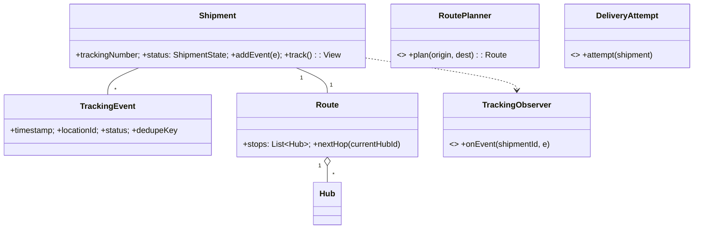

# 🛠️ Design Logistics / Order Tracking System (LLD)

> **Sources**: Synthesized from standard logistics OOP designs, FedEx/UPS public tracking docs, and event-sourcing patterns from [Martin Fowler — Event Sourcing](https://martinfowler.com/eaaDev/EventSourcing.html). The append-only `TrackingEvent` log is the same pattern used by AWS DynamoDB Streams, Stripe events, and Kafka log compaction.

## 1. Requirements

### Functional
- **Create shipment** with `Sender`, `Receiver`, `Package` (weight/dimensions/declared value); auto-issue a `trackingNumber`.
- **Multi-leg routing**: origin hub → regional hub → destination hub → last-mile.
- **State machine**: `CREATED → PICKED_UP → IN_TRANSIT → AT_HUB → OUT_FOR_DELIVERY → DELIVERED`, with branches `FAILED → RETURNED`.
- **Tracking events** emitted on every scan; customer can query by `trackingNumber`.
- **ETA estimation** based on remaining hops + historical hub dwell time.
- **Route optimization** (planner) and **agent assignment** (last-mile).

### Non-Functional
- **Real-time tracking** updates broadcast to many subscribers (web + mobile + email).
- **Scale to billions of packages**; tracking-by-number must be sub-100 ms.
- **No skipped states** in the state machine.
- **Idempotent scans** (a duplicate scan must not create a duplicate event).

## 2. Core Entities

| Entity | Key Fields |
|---|---|
| `Shipment` | `id`, `trackingNumber`, `packageId`, `senderId`, `receiverId`, `status`, `currentLocationId`, `routeId` |
| `Package` | `id`, `weight`, `length×width×height`, `declaredValue` |
| `Address` | `line1`, `city`, `state`, `country`, `postalCode`, `geoPoint` |
| `TrackingEvent` | `id`, `shipmentId`, `timestamp`, `locationId`, `status`, `notes`, `dedupeKey` |
| `Hub` | `id`, `name`, `address`, `capacity` |
| `Vehicle` | `id`, `capacity`, `currentHubId` |
| `DeliveryAgent` | `id`, `name`, `assignedShipments[]` |
| `Route` | `id`, `originHubId`, `destinationHubId`, `stops: List<HubId>` |

## 3. Class Diagram



## 4. Key Methods

```java
String        ShipmentService.createShipment(sender, receiver, package, RoutePlanner planner);
void          ShipmentService.addTrackingEvent(shipmentId, location, status, notes, dedupeKey);
void          ShipmentService.updateLocation(shipmentId, hubId, ts);
ShipmentView  TrackingService.trackByNumber(trackingNumber);
Instant       TrackingService.estimateDelivery(shipmentId);
Route         RoutePlanner.plan(origin, destination);
void          DeliveryService.assignAgent(shipmentId, agentId);
boolean       DeliveryService.markDelivered(shipmentId, signature);
void          DeliveryService.markFailed(shipmentId, reason);   // may trigger return
```

## 5. Design Patterns

| Pattern | Where | Why |
|---|---|---|
| **State** | `Shipment.status` machine | Strict transitions; `CREATED` cannot jump to `DELIVERED`. |
| **Strategy** | `RoutePlanner` (`shortestPath`, `cheapest`, `fastest`) | Routing rules vary by SLA tier. |
| **Observer** | `TrackingObserver` (Email / SMS / Push / WebSocket) | Many notification channels per scan. |
| **Chain of Responsibility** | `DeliveryAttempt` (`deliverToDoor → tryNeighbor → leaveAtHub → reschedule`) | Each handler decides whether to fall through. |
| **Command** | `TrackingEvent` is an immutable command appended to the event log | Audit + replay. |
| **Singleton** | `TrackingService` facade | Single entry point for queries. |
| **Memento** | `ShipmentSnapshot` materialized at milestones | Rebuild current state quickly without replaying every event. |

## 6. Concurrency & Edge Cases

### 6.1 Append-only event log = naturally concurrent-safe
Multiple scanners across hubs can `INSERT` `TrackingEvent` rows in parallel. The `Shipment.currentStatus` is derived (or cached) from the latest applicable event; we never overwrite history.

### 6.2 Idempotent scans (dedupe)
Each handheld scanner sends `dedupeKey = sha1(scannerId + shipmentId + scanType + timestamp_floor_to_second)`. The events table has `UNIQUE(dedupeKey)` so the second insert from a flaky network silently no-ops:
```sql
INSERT INTO tracking_events(...) VALUES (...) ON CONFLICT (dedupe_key) DO NOTHING;
```

### 6.3 State transition guard
```java
void addTrackingEvent(Shipment s, ShipmentState next) {
  if (!s.status.canTransitionTo(next)) {
    throw new InvalidTransitionException(s.status + " -> " + next);
  }
  // append event, then update materialized status
}
```

### 6.4 Out-of-order scans (last-write-wins on **timestamp**, not arrival)
A regional-hub scan may arrive before a delayed origin-hub scan. The current location/status is computed from `MAX(timestamp)` of valid transitions, not from arrival order.

### 6.5 Real-time fanout
`TrackingService` publishes each new event to a Pub/Sub topic (`shipment.{trackingNumber}`); WebSocket gateways and notification workers subscribe. This decouples ingestion throughput from notification throughput.

### 6.6 Failed delivery → return
`markFailed` advances state and triggers the Chain of Responsibility (`tryNeighbor → leaveAtHub → reschedule`). After N attempts, the shipment transitions to `RETURNED` and the route is reversed by the planner.

## 7. Sources / Cross-Refs
- LLD-08 Behavioral Patterns (State, Strategy, Observer, Chain of Responsibility, Command, Memento)
- 19-Event-Driven-Architecture.md (event-sourced log + materialized view)
- Solution-Pub-Sub.md (broadcast fanout)
- Martin Fowler — Event Sourcing: https://martinfowler.com/eaaDev/EventSourcing.html
