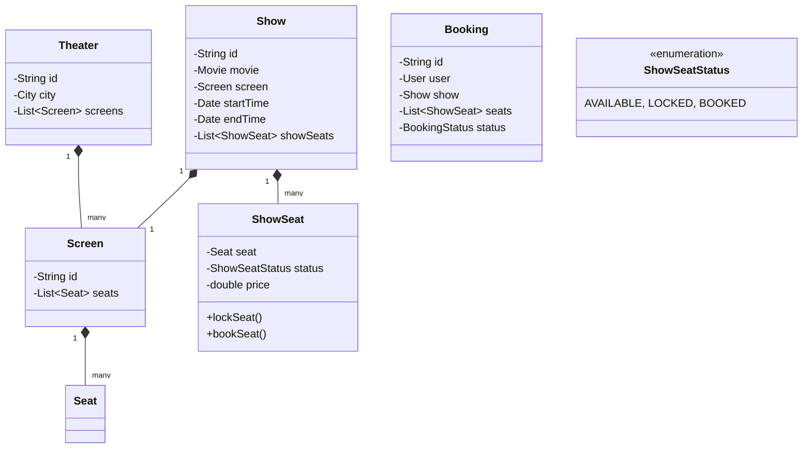

# 🛠️ Design Movie Ticket Booking System (LLD)

Designing a system like BookMyShow or Fandango requires modeling an intricate inventory (Seats in a Show) and solving a very complex concurrency problem: two users trying to book the exact same specific seat at the exact same moment.

---

## 1. Requirements

### Functional Requirements
- **Search:** Users can search for movies by city, theater, and date.
- **Shows:** A theater has multiple screens. A screen plays multiple shows a day.
- **Seat Selection:** Users can view a seating arrangement and select specific seats (VIP, Premium, Standard, which have different prices).
- **Booking & Payment:** Users hold the seat, pay, and confirm the booking.

### Non-Functional Requirements
- **Concurrency (No Double Booking):** If two users click "A15" at the same time, only one gets it.
- **Cart Holds:** Once a user selects a seat, it must be locked for ~5-10 minutes to allow them to pay. If they fail, the seat is released.

---

## 2. Core Entities (Objects)

- `Movie`
- `City`
- `Theater`
- `Screen` (Physical auditorium room)
- `Seat` (Physical chair in a screen)
- `Show` (A specific instance of a Movie playing on a specific Screen at a specific Time)
- `ShowSeat` (The mapping of a physical Seat to a specific Show — holding the dynamic Availability Status)
- `Booking`
- `Payment`

---

## 3. Class Diagram / Relationships



---

## 4. Key Algorithms / Design Patterns

### 1. ShowSeat vs Seat (Crucial Distinction)

A major pitfall candidates make is putting a boolean `isBooked` inside the `Seat` class. A Theatre's "Seat A12" physically exists forever. `Seat A12` isn't booked forever. It is booked *for the 7 PM showing of Inception*.

Thus, when a `Show` is created, we iterate over the physical `Screen.getSeats()` and generate a `ShowSeat` instance for each. Only the `ShowSeat` holds the `status` enum and the dynamic `price`.

### 2. Lock Management (Solving Double Booking)

If User A and User B request to book `ShowSeat A1` at the exact same millisecond, how does the application handle it?

#### Option A: `synchronized` Blocks (Single-Server / Testing)
In a single JVM, we can just lock the specific `ShowSeat` object.
```java
public class ShowSeat {
    private ShowSeatStatus status = ShowSeatStatus.AVAILABLE;

    // Must be synchronized to prevent Race Conditions
    public synchronized boolean lockSeat() {
        if (this.status == ShowSeatStatus.AVAILABLE) {
            this.status = ShowSeatStatus.LOCKED;
            return true;
        }
        return false; // Someone else got it!
    }
}
```

#### Option B: Distributed Locking (Real World)
In a true microservice architecture, we lock via SQL or Redis.
Use a **Redis Distributed Lock (Redlock)** or a SQL `SELECT ... FOR UPDATE`:
```sql
BEGIN TRANSACTION;
SELECT * FROM show_seats WHERE id = 'seat_A1_show_123' FOR UPDATE;
-- If status is AVAILABLE, then:
UPDATE show_seats SET status = 'LOCKED' WHERE id = 'seat_A1_show_123';
COMMIT;
```

### 3. The 10-Minute Cart Hold (State Machine & Timers)

When a user locks a seat, they transition to the Payment page. We cannot keep a critical SQL Mutex/Lock open while waiting for the user to type in their credit card.

We use an expiration pattern:

```java
public class BookingService {
    
    public Booking createBooking(User user, Show show, List<ShowSeat> requestedSeats) {
        // 1. Try to lock ALL requested seats atomically
        for(ShowSeat seat : requestedSeats) {
            if(!seat.lockSeat()) {
                throw new SeatsUnavailableException();
            }
        }
        
        Booking booking = new Booking(user, show, requestedSeats);
        booking.setStatus(BookingStatus.PENDING);
        
        // 2. Start a timer to auto-cancel if unpaid
        scheduleBookingExpiry(booking, 10, TimeUnit.MINUTES);
        
        return booking;
    }

    private void scheduleBookingExpiry(Booking booking, int time, TimeUnit unit) {
        // In reality, this pushes a message to AWS SQS with a 10 min delay,
        // or uses a Redis Key Expiry event.
        Executors.newSingleThreadScheduledExecutor().schedule(() -> {
            if (booking.getStatus() == BookingStatus.PENDING) {
                booking.setStatus(BookingStatus.EXPIRED);
                // Unlock seats
                for (ShowSeat seat : booking.getSeats()) {
                    seat.setStatus(ShowSeatStatus.AVAILABLE);
                }
            }
        }, time, unit);
    }
}
```

### 4. Search and Read-Heavy Operations
99% of requests to BookMyShow are people browsing movies and checking seat maps, not buying.
The `ShowSeat` array/list status for a specific show should ideally be heavily cached in **Redis** or a fast memory grid, updating only when a lock is successfully acquired.