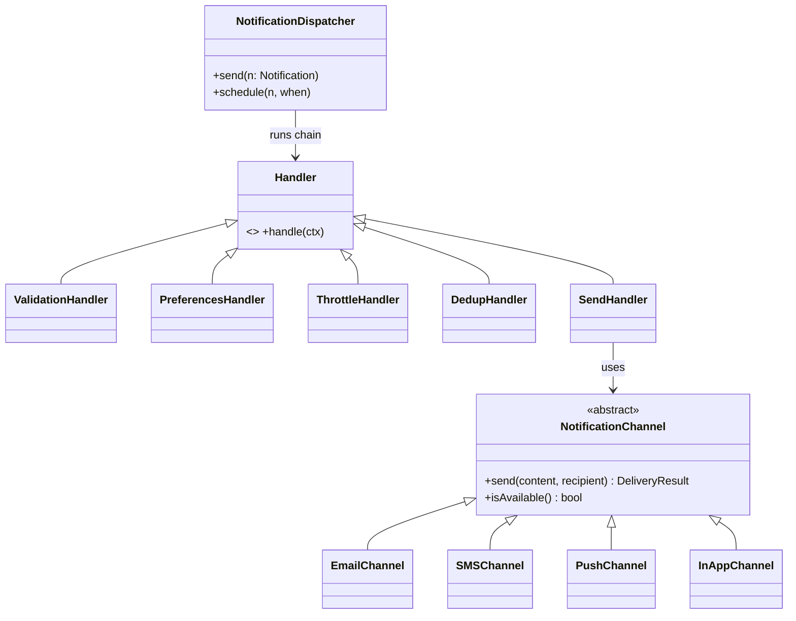

# 🛠️ Design Notification System (LLD)

> Object-oriented design for a multi-channel notification system — Email/SMS/Push/In-App, user preferences, retries, and deduplication. The distributed throughput layer (Kafka, fan-out) lives in `Solution-Notification-Throttler.md`.

## 📚 Table of Contents

1. [Requirements](#1-requirements)
2. [Core Entities](#2-core-entities-objects)
3. [Class Diagram](#3-class-diagram--relationships)
4. [Key APIs](#4-api--interfaces)
5. [Design Patterns](#5-key-algorithms--design-patterns)
6. [Concurrency](#6-concurrency--edge-cases)
7. [Sources](#7-sources)

---

## 1. Requirements

### Functional
- **Multi-channel** — Email, SMS, Push (FCM/APNs), In-App
- **Templates** — reusable bodies with variable substitution (`Hi {{name}}, your order ...`)
- **Per-user preferences** — channel opt-ins, quiet hours, frequency caps, category subscriptions
- **Scheduling** — send now or at a future time
- **Batch delivery** — one campaign → millions of recipients
- **Status tracking** — `PENDING → SENT → DELIVERED → READ` (or `FAILED`)

### Non-Functional
- **Extensible** — adding a new channel (e.g., WhatsApp) should not modify existing channel code (Open/Closed)
- **Async / non-blocking** — sender thread pool decoupled from API ingress
- **Reliable** — retry transient failures with exponential backoff; dead-letter terminal failures
- **Idempotent** — duplicate trigger of the same logical event must not double-deliver

---

## 2. Core Entities (Objects)

| Entity | Key Attributes |
|---|---|
| `Notification` | id, recipientId, content, channels[], priority, status, idempotencyKey, createdAt, scheduledAt |
| `NotificationContent` | subject (optional), body, payload (key-value for templates) |
| `NotificationChannel` (abstract) | `send(content, recipient) → DeliveryResult` |
| `EmailChannel`, `SMSChannel`, `PushChannel`, `InAppChannel` | concrete implementations |
| `NotificationTemplate` | id, channel, subjectTemplate, bodyTemplate, requiredVars[] |
| `UserPreferences` | userId, channelOptIns, quietHoursStart, quietHoursEnd, dailyCap, categoryOptIns |
| `RetryPolicy` | maxAttempts, baseDelayMs, multiplier, retriableExceptions[] |
| `NotificationDispatcher` (singleton) | `send(notification)` orchestrates the pipeline |

**Lifecycle states:** `PENDING → SENT → DELIVERED → READ`, or `PENDING → FAILED → RETRYING → (DELIVERED | DEAD_LETTER)`

---

## 3. Class Diagram / Relationships



---

## 4. API / Interfaces

```java
public interface NotificationChannel {
    DeliveryResult send(NotificationContent content, Recipient r);
    boolean isAvailable();                  // for fallback / health checks
    ChannelType type();
}

public interface NotificationDispatcher {
    Future<DeliveryResult> send(Notification n);
    ScheduledTask schedule(Notification n, Instant when);
    NotificationStatus getStatus(String notificationId);
    void registerObserver(NotificationObserver obs);
}

public interface NotificationObserver {
    void onStatusChange(String notificationId, NotificationStatus newStatus);
}
```

---

## 5. Key Algorithms / Design Patterns

| Pattern | Where used | Why |
|---|---|---|
| **Strategy** | Channel selection per notification type | Critical alert → SMS+Push; promo → Email only |
| **Factory** | `NotificationChannel` instantiation | Wires the right concrete channel from config / channel type |
| **Chain of Responsibility** | Delivery pipeline | `Validation → Preferences → Throttle → Dedup → Send`; each step can short-circuit |
| **Observer** | Status lifecycle | UI, audit log, billing meter all subscribe to `onStatusChange` |
| **Template Method** | `AbstractChannel.send()` | Skeleton: `prepare → preflight → transmit → postProcess`; concrete channels override `transmit` |
| **Singleton** | `NotificationDispatcher` | One coordinator per process owning the queue and observer list |
| **Decorator** | Reliability wrappers | `RetryDecorator(channel)`, `CircuitBreakerDecorator(channel)`, `RateLimitDecorator(channel)` |
| **Command** | Scheduled / batched sends | `SendCommand` queued for later execution; supports cancellation |

**Retry with exponential backoff:** `delay = baseDelayMs * multiplier^attempt + jitter`. Stop after `maxAttempts` and route to dead-letter queue. Common defaults: base = 1 s, multiplier = 3, max = 5 attempts.

---

## 6. Concurrency & Edge Cases

- **Async parallel send** — fixed `ExecutorService` (`size ≈ 2 × CPU cores` for I/O-bound) processes the in-memory queue. UI ingress thread never blocks on channel I/O.
- **At-least-once + idempotency** — message queues (Kafka/SQS) deliver at-least-once. The consumer **must** be idempotent: hash `(actorId, recipientId, type, entityId, hourBucket)`, store with TTL in Redis, skip on hit.
- **Quiet hours** — `PreferencesHandler` checks `now ∈ [user.quietStart, user.quietEnd]`. If yes and notification is non-critical, defer to end of quiet window.
- **Frequency cap** — sliding window counter per user per channel in Redis (`INCR` + `EXPIRE`). If `count ≥ user.dailyCap`, drop or downgrade channel.
- **Channel fallback** — if Push fails (device unregistered), automatically retry on Email channel from the same dispatcher invocation (Strategy + Decorator chain).
- **Provider rate limits** — third-party providers (SendGrid, Twilio, FCM) impose rate caps. Use a token bucket rate limiter per provider; on `429`, requeue with backoff.
- **Race on read receipts** — same notification opened on multiple devices → multiple `READ` events. Use idempotent `UPDATE WHERE status != 'READ'` so only the first call transitions state.

---

## 7. Sources

- Workspace cross-reference: `Notes/LowLevelDesign/LLD-08-Behavioral-Patterns.md` (Strategy, Chain of Responsibility, Observer, Template Method)
- Workspace cross-reference: `Notes/LowLevelDesign/Solutions/Solution-Notification-Throttler.md` (distributed throughput, Kafka)
- Workspace cross-reference: `Notes/LowLevelDesign/LLD-12-Concurrency-Deep-Dive.md` (thread pools, BlockingQueue)
- Industry pattern: at-least-once delivery + idempotent consumers (Stripe Engineering blog on idempotency keys)

📺 **Video walkthrough:** [Notification System – Low Level Design](https://www.youtube.com/watch?v=Ma6zG5C4KNk)
