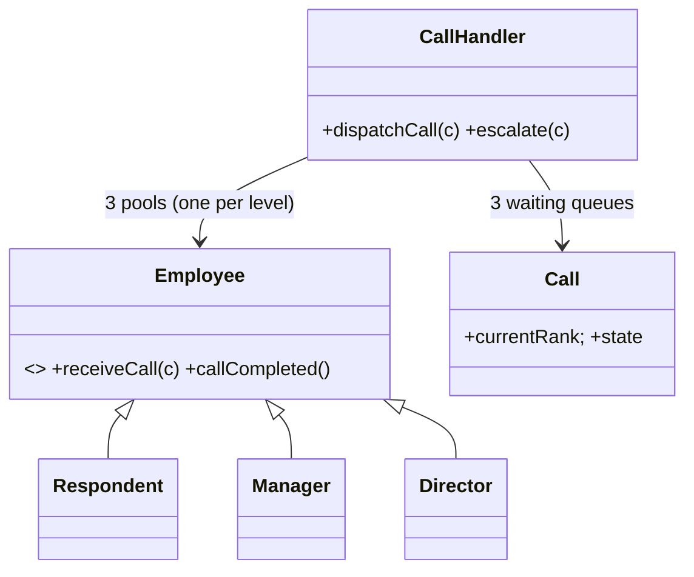

# 🛠️ Design a Call Center (CTCI 7.2 — OOD) — LLD

> **Sources**: Gayle Laakmann McDowell — *Cracking the Coding Interview*, 6th edition, **Q7.2** ("Imagine you have a call center with three levels of employees…"); standard GoF patterns (Chain of Responsibility, Singleton, State); JCIP — concurrency primitives.

## 1. Requirements

### Functional
- Three employee levels: **Respondent** (level 0), **Manager** (level 1), **Director** (level 2).
- An incoming call goes to the **first available Respondent**.
- If all Respondents are busy and a Respondent can't handle the call, **escalate to Manager**.
- If all Managers are busy, **escalate to Director**.
- The **Director never escalates** — they always wait if busy.
- Each call has one caller; each employee handles **at most one call** at a time.
- Calls are dispatched in **FIFO order** when waiting.
- Employees clock in / clock out (toggles `isFree` and removes from / adds to the available pool).

### Non-Functional
- Find the next available employee in **O(1)** if possible.
- **Thread-safe** — many dispatcher threads + many employees.
- **No call is ever lost.**

## 2. Core Entities

| Entity | Key Fields |
|---|---|
| `CallCenter` (Singleton façade) | `callHandler` |
| `Employee` (abstract) | `id`, `name`, `level`, `isFree`, `currentCall?` |
| `Respondent` / `Manager` / `Director` | level 0 / 1 / 2 |
| `Call` | `id`, `caller`, `currentRank` (level currently handling), `state` |
| `CallHandler` | `availablePool[level] : Deque<Employee>` (per level), `waitingCalls[level] : Queue<Call>` (per level) |

## 3. Class Diagram



## 4. Key Methods

```java
class CallHandler {                 // Singleton
  Deque<Employee>[] availablePool = new Deque[3];   // index = level
  Queue<Call>[]     waitingCalls  = new Queue[3];

  // Dispatch newly arrived call: try level 0, escalate up if needed.
  synchronized void dispatchCall(Call c) {
    for (int lvl = c.currentRank; lvl <= 2; lvl++) {
      Employee e = availablePool[lvl].pollFirst();
      if (e != null) { assign(e, c); return; }
    }
    waitingCalls[c.currentRank].offer(c);   // all busy; queue at requested level
  }

  // Employee finished — pick the next call at their level (oldest first).
  synchronized void onCallCompleted(Employee e) {
    Call next = waitingCalls[e.level].poll();
    if (next != null) assign(e, next);
    else              availablePool[e.level].offerLast(e);
  }

  private void assign(Employee e, Call c) {
    e.isFree = false;
    e.currentCall = c;
    c.currentRank = e.level;
    c.state = CallState.IN_PROGRESS;
    e.receiveCall(c);
  }
}

abstract class Employee {
  void escalate() {                // called from receiveCall when out of depth
    Call c = this.currentCall;
    callCompleted();               // free me up first
    c.currentRank = this.level + 1;
    CallHandler.getInstance().dispatchCall(c);
  }
  void callCompleted() {
    this.currentCall = null;
    CallHandler.getInstance().onCallCompleted(this);
  }
}
```

## 5. Design Patterns

| Pattern | Where | Why |
|---|---|---|
| **Chain of Responsibility** | `Respondent → Manager → Director` escalation | Each level decides *handle or pass up*; the chain is implicit in `dispatchCall`'s `for (lvl …)` loop. |
| **Singleton** | `CallHandler` | Single coordinator across all dispatcher threads. |
| **Strategy** | Routing inside a level (round-robin, least-busy, skill-based) | Swap policies without touching escalation logic. |
| **Observer** | `CallStatusListener` (CRM dashboard, supervisor view) | Decouples reporting from call mechanics. |
| **State** | `Call.state` (`RINGING → ASSIGNED → IN_PROGRESS → COMPLETED`) | Block illegal transitions. |
| **Factory** | `EmployeeFactory.create(level)` | Build the right subclass from a config row. |
| **Template Method** | `Employee.receiveCall` calls overridable `canHandle()` | Subclass decides whether to escalate. |

## 6. Concurrency

- All mutating operations on the pools and queues happen inside one `synchronized` block on `CallHandler`. This is the simplest correct design, and the section is short — no I/O. Throughput is fine for realistic call-center scale.
- For higher throughput, use **per-level locks** (one `ReentrantLock` per `(pool, queue)` pair) instead of a single monitor.
- The **find-and-assign** must be atomic: the bug to avoid is two threads each calling `pollFirst()` on the same pool, both seeing the same employee, and assigning two calls. Holding the lock across `pollFirst() + assign()` prevents this.
- A `BlockingQueue` for `waitingCalls` lets dispatcher threads `take()` blocking until a call arrives — handy if you want a separate dispatcher thread per level.

## 7. Edge Cases
- **Director busy + everyone else busy** ⇒ call sits in `waitingCalls[2]` (the highest queue). It will be picked up by the next Director who finishes.
- **Employee clocks out mid-call** ⇒ finish the current call, then remove from the pool on completion (don't drop the caller).
- **Re-entrant escalation** ⇒ we explicitly `callCompleted()` *before* re-dispatching the escalated call so the same employee is added back to the pool.

## 8. Sources / Cross-Refs
- LLD-08 Behavioral Patterns (Chain of Responsibility, State)
- LLD-09 Concurrency.md (`ReentrantLock`, `BlockingQueue`)
- Solution-Notification.md (also uses Chain of Responsibility)
- Solution-OOD-Chat-Server.md (sister CTCI OOD problem)
- *Cracking the Coding Interview*, 6th ed., Q7.2
