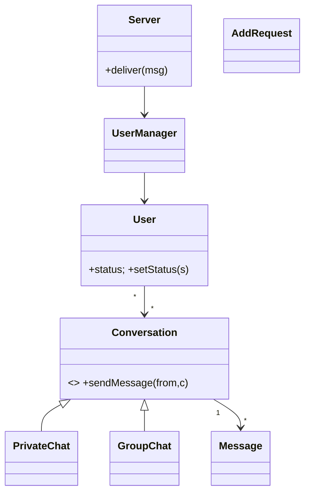

# 🛠️ Design a Chat Server (CTCI 7.7 — OOD) — LLD

> **Sources**: Gayle Laakmann McDowell — *Cracking the Coding Interview*, 6th edition, **Q7.7 — Chat Server** ("How would we design a chat server? Specifically, the back-end components, classes, and methods. What would be the hardest problems to solve?"); standard GoF patterns. **Scope**: in-process server design — the **distributed** chat-system problem (message brokers, sharded inbox stores, presence at scale) is in `SystemDesign/Solutions/Solution-Chat-System.md`.

## 1. Requirements

### Functional
- Sign up / log in / log out. Set status: `ONLINE`, `OFFLINE`, `AWAY`, `DO_NOT_DISTURB`.
- **Add other users as contacts**: send `AddRequest`, recipient accepts/rejects; both directions added on accept.
- See **online status of contacts**.
- Create a **PrivateChat** (exactly 2 participants) **or GroupChat** (≥ 2 participants, has admin).
- **Send / receive text messages** in a conversation.
- View **conversation history**.

### Non-Functional
- Server holds **in-memory user sessions**.
- Message delivery is **best-effort** to currently-connected users; offline messages are stored for later delivery.
- Thread-safe under many concurrent users.

> **CTCI explicitly calls out the hardest problems**: knowing whether a user is *really* online (connections die without notice ⇒ heartbeats), and dealing with state that's split between in-memory caches and the durable store (which one is the source of truth?).

## 2. Core Entities

| Entity | Key Fields |
|---|---|
| `Server` (Singleton) | coordinates everything; holds `UserManager` |
| `UserManager` | registry: `Map<UserId, User>` |
| `User` | `id`, `name`, `status`, `contacts: Set<User>`, `conversations: Set<Conversation>`, `connection?` |
| `Conversation` (abstract) | `id`, `participants[]`, `messages[]` |
| `PrivateChat` extends `Conversation` | exactly 2 participants |
| `GroupChat` extends `Conversation` | ≥ 2 participants, has `admins[]` |
| `Message` | `id`, `sender`, `content`, `timestamp`, `status: SENT/DELIVERED/READ` |
| `AddRequest` | `from`, `to`, `status: PENDING/ACCEPTED/REJECTED` |

### Relationships
- `User` M—M `User` via the contacts set.
- `User` M—M `Conversation`.
- `Conversation` 1—M `Message`.

## 3. Class Diagram



## 4. Key Methods

```java
class User {
  AddRequest requestAddUser(User other);            // creates PENDING
  void       acceptAddRequest(AddRequest r);        // bidirectional contact add
  Conversation startConversationWith(List<User> others); // returns existing or new
  Set<User>  getOnlineFriends();
  void       setStatus(Status s);                   // notifies all contacts (Observer)
}

abstract class Conversation {
  abstract void sendMessage(User from, String content);
  List<Message> history(int limit, MessageId before);
}

class Server {                                      // Mediator
  void deliver(Message m);                          // route to participants of m.conversation
}
```

## 5. Design Patterns

| Pattern | Where | Why |
|---|---|---|
| **Singleton** | `Server`, `UserManager` | Single coordinator for the whole process. |
| **Observer** | Contacts subscribe to a user's status; users subscribe to new messages in conversations they're in | Decoupled fan-out of presence and messages. |
| **State** | `User.status` (`ONLINE`/`OFFLINE`/`AWAY`/`DND`) | DND blocks message-arrival sound; AWAY is a hint, etc. |
| **Strategy** | `Conversation` subtype rules — `PrivateChat` (no admin, no add-member) vs `GroupChat` (admins, add-member, kick) | Same API, different policies. |
| **Factory** | `MessageFactory.create(sender, content)` stamps id + timestamp + initial status | Centralised invariant. |
| **Mediator** | `Server` is the mediator: `User` → `Server.deliver(message)` → `Server` pushes to each participant | Avoids N×N couplings between users. |

## 6. Concurrency

- `UserManager.users` ⇒ `ConcurrentHashMap<UserId, User>` for thread-safe lookup.
- Each `Conversation` owns a lock; `sendMessage` acquires it to: (a) append the message to history, (b) iterate participants and push to those currently online. This guarantees ordering within a conversation (messages appear in send order to all participants).
- `setStatus` mutation + observer fan-out should snapshot the contacts set before iterating to avoid `ConcurrentModificationException`.
- For an open WebSocket, push synchronously; for a missing connection, queue in the user's `pendingInbox` (durable) and deliver on reconnect.

## 7. The Two Hard Problems (CTCI calls these out)

### 7.1 "Are they really online?"
TCP/WebSocket may stay half-open after a phone goes to sleep. Solutions:
- **Heartbeat / ping-pong** every N seconds; mark `OFFLINE` after K missed pings.
- Track **last-seen** timestamp; surface "active 5m ago" if no recent ping.

### 7.2 In-memory cache vs durable store
The presence map and message hot-cache live in RAM; the source of truth is the database. Either can lag the other after a crash. Pragmatic answer:
- The **database is authoritative**; the in-memory cache is a derived view.
- On startup, rebuild presence from `last-seen`; on disconnect, mark `OFFLINE` immediately in both.
- For messages, the order assigned by the database (auto-increment / timestamp) is the canonical order; in-memory ordering must agree.

## 8. Sources / Cross-Refs
- LLD-08 Behavioral Patterns (Observer, State, Mediator, Strategy)
- LLD-06 Creational Patterns (Singleton, Factory)
- Solution-Chat-Messaging.md (LLD chat-app — overlapping problem at slightly larger scope)
- SystemDesign/Solutions/Solution-Chat-System.md (the **distributed** version of this problem)
- *Cracking the Coding Interview*, 6th ed., Q7.7
