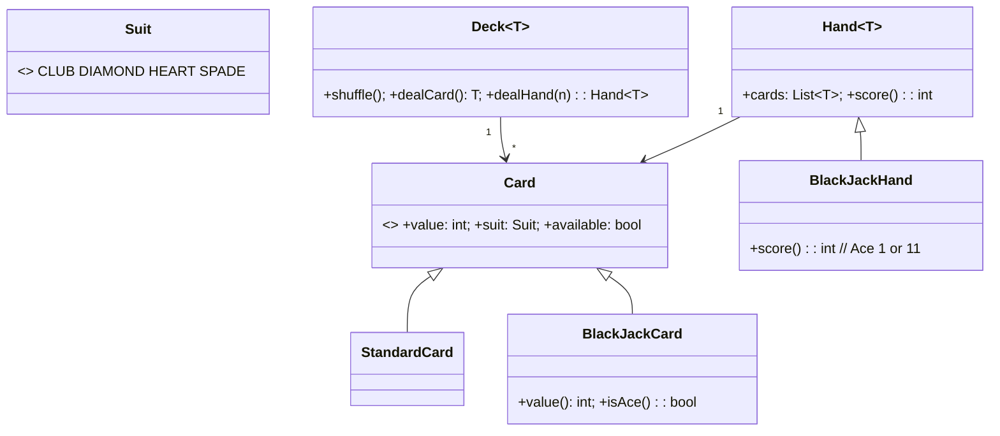

# 🛠️ Design a Deck of Cards (CTCI Q7.5) — LLD

> **Sources**: Gayle Laakmann McDowell — *Cracking the Coding Interview*, 6th edition, **Q7.5** ("Deck of Cards. Design the data structures for a generic deck of cards. Explain how you would subclass the data structures to implement blackjack."); Gamma et al. — *Design Patterns* (1994), §**Strategy** and §**Iterator**; [Fisher–Yates shuffle (Knuth, 1969)](https://en.wikipedia.org/wiki/Fisher%E2%80%93Yates_shuffle).

## 1. Requirements

### Functional
- Represent a **standard 52-card deck** (4 suits × 13 ranks).
- `shuffle()`, `dealCard()`, `dealHand(n)`, `remainingCards()`.
- **Subclass** for Blackjack: 21-target hand scoring with Ace-as-1-or-11 logic.
- The design must extend cleanly to other card games (Poker, Solitaire, Bridge…) without rewriting the deck.

### Non-Functional
- Generic over card type so the same `Deck<T>` can hold standard cards, Uno cards, or custom decks.
- `dealCard()` is O(1).

## 2. The Two Design Insights from CTCI

1. **Generic `Deck<T extends Card>`** — the deck holds an `ArrayList<T>` and doesn't need to know what kind of card `T` is. Game-specific decks (`BlackJackDeck`) are just typed instantiations.
2. **`Hand<T extends Card>`** with a polymorphic `score()` method — a `BlackJackHand` overrides `score()` with the Ace-1/11 rule. The `Deck` doesn't know about scoring.

This is the textbook example of **separating "what is a card" from "what does this game value"**.

## 3. Class Diagram



## 4. Core Classes

```java
enum Suit { CLUB, DIAMOND, HEART, SPADE }

abstract class Card {
  protected final int faceValue;             // 1..13
  protected final Suit suit;
  protected boolean available = true;        // dealt or not
  abstract int value();                      // game-specific
}

class Deck<T extends Card> {
  private final List<T> cards = new ArrayList<>();
  private int dealtIndex = 0;                // pointer into cards[]

  public void shuffle() {                    // Fisher–Yates, O(n)
    Random r = ThreadLocalRandom.current();
    for (int i = cards.size() - 1; i > 0; i--) {
      int j = r.nextInt(i + 1);
      Collections.swap(cards, i, j);
    }
    dealtIndex = 0;
  }

  public T dealCard() {                      // O(1)
    if (dealtIndex >= cards.size()) return null;
    T c = cards.get(dealtIndex++);
    c.available = false;
    return c;
  }

  public Hand<T> dealHand(int n) { ... }
  public int remainingCards() { return cards.size() - dealtIndex; }
}

class Hand<T extends Card> {
  protected final List<T> cards = new ArrayList<>();
  public int score() { return cards.stream().mapToInt(Card::value).sum(); }
  public void addCard(T c) { cards.add(c); }
}
```

## 5. Blackjack Subclassing

```java
class BlackJackCard extends Card {
  int value() {                              // J=Q=K=10; Ace handled by Hand
    if (faceValue >= 11 && faceValue <= 13) return 10;
    if (isAce()) return 1;                   // base value; Hand may upgrade to 11
    return faceValue;
  }
  boolean isAce() { return faceValue == 1; }
}

class BlackJackHand extends Hand<BlackJackCard> {
  /**
   * The Ace-1-or-11 rule: count Aces as 11 by default, then downgrade
   * to 1 (one at a time) while busted.
   */
  @Override public int score() {
    int total = cards.stream().mapToInt(Card::value).sum();
    int aces  = (int) cards.stream().filter(BlackJackCard::isAce).count();
    while (aces > 0 && total + 10 <= 21) {   // upgrade an Ace from 1 → 11
      total += 10;
      aces--;
    }
    return total;
  }
  public boolean busted()    { return score() > 21; }
  public boolean is21()      { return score() == 21; }
  public boolean isBlackJack(){ return cards.size() == 2 && score() == 21; }
}
```

## 6. The Critical Algorithm — Fisher–Yates Shuffle

```text
for i from n-1 down to 1:
    j = random integer in [0, i]    // inclusive
    swap cards[i] and cards[j]
```

- **O(n)** time, **O(1)** extra space.
- **Uniform distribution** over the n! permutations — proven correct (Knuth, *The Art of Computer Programming*, Vol. 2).
- The naive "for each card, swap with a random card in the whole deck" is **biased** — a famous interview pitfall. Use the standard form above.

## 7. Design Patterns

| Pattern | Where | Why |
|---|---|---|
| **Strategy** | `Hand.score()` overridden per game | Same deck, different scoring rules. |
| **Template Method** | `Deck<T>.shuffle()` + `dealCard()` skeleton; subclasses tweak only what's needed | Reuse for every card game. |
| **Iterator** | `Deck` exposes `Iterator<T>` over remaining cards | Standard collection contract. |
| **Factory** | `DeckFactory.standard52()` / `DeckFactory.blackjack()` / `DeckFactory.uno()` | Encapsulate construction. |
| **Generics (`<T extends Card>`)** | The whole point | Compile-time type safety per game. |

## 8. Concurrency / Edge Cases

- **Empty deck** — `dealCard()` returns `null` (or `Optional.empty()`). Don't throw; running out of cards is normal in solitaire.
- **Re-shuffle mid-game** — reset `dealtIndex = 0` and reset every card's `available = true` if you reuse instances. Cleaner: build a fresh `Deck`.
- **Multi-deck shoe** (Blackjack uses 6 or 8 decks) — the same `Deck<BlackJackCard>` with 6×52 = 312 cards; nothing changes.
- **Threading** — for a multi-player server, dealing must be atomic. Easiest: `synchronized` on `Deck.dealCard()`. Per-game contention is trivial.

## 9. Sources / Cross-Refs
- LLD-06 Creational Patterns (Factory)
- LLD-08 Behavioral Patterns (Strategy, Template Method, Iterator)
- Solution-Deck-Of-Cards.md (sibling — same problem, may emphasise different aspects)
- Solution-Card-Game.md (multi-player game flow built atop this deck)
- Solution-Snake-Ladder.md, Solution-Chess.md (other classic OOD board-game LLDs)
- CTCI Q7.5; Knuth Vol. 2 §3.4.2 (Fisher–Yates)
