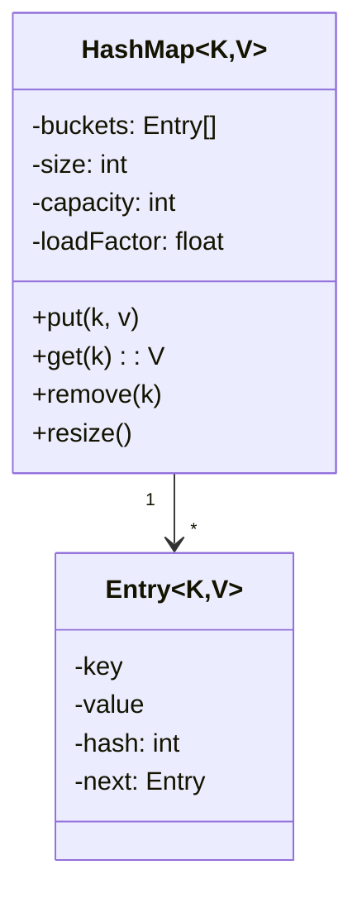

# 🛠️ Design a HashMap (CTCI Q7.10 / LeetCode #706) — LLD

> **Sources**: Gayle Laakmann McDowell — *Cracking the Coding Interview*, 6th edition, **Q7.10** ("Implement a hash table using chaining"); [LeetCode #706 — Design HashMap](https://leetcode.com/problems/design-hashmap/); Java `HashMap` source ([OpenJDK `java.util.HashMap`](https://github.com/openjdk/jdk/blob/master/src/java.base/share/classes/java/util/HashMap.java) — note the **treeify-at-8** optimisation since Java 8); [Robert Sedgewick — *Algorithms*, 4th ed.](https://algs4.cs.princeton.edu/34hash/) §3.4 Hash Tables.

## 1. Requirements

### Functional
- `put(K, V)`, `get(K) → V?`, `remove(K)`, `containsKey(K)`, `size()`, `isEmpty()`.
- **Generic** `HashMap<K, V>` over any key type with a sensible `hashCode` + `equals`.
- Must handle **collisions** correctly.
- Must **resize** as load grows.

### Non-Functional
- **Average O(1)** for `get` / `put` / `remove`; **worst-case O(n)** with chaining (or O(log n) with treeified buckets — Java 8+ trick).
- Predictable behaviour with a poor hash function (no infinite loops, no silent corruption).

## 2. The Two Design Decisions

### 2.1 Collision resolution: **separate chaining** vs **open addressing**

| Approach | Idea | Pros | Cons |
|---|---|---|---|
| **Separate chaining** *(CTCI's choice; Java's `HashMap`)* | Each bucket holds a linked list (or tree) of `Entry` nodes | Simple; tolerates load factor ≥ 1; deletions are easy | Cache-unfriendly (pointer chasing) |
| **Open addressing** (linear / quadratic / double hashing) | On collision, probe to the next slot | Better cache locality; no per-entry pointer | Performance collapses past load factor ~0.7; deletions need tombstones |

**Recommend chaining** — it's what CTCI asks for and what Java does.

### 2.2 The **treeify** optimisation (Java 8+)
When a bucket's chain length reaches **8** *and* the table size is ≥ 64, that bucket is converted from a linked list to a balanced **red-black tree**. This bounds worst-case per-bucket lookup at **O(log n)** even under hash flooding (DoS) attacks. Worth mentioning as the "what would a production map do?" answer.

## 3. Core Entities

| Entity | Role |
|---|---|
| `Entry<K, V>` | `key`, `value`, `hash` (cached), `next` |
| `HashMap<K, V>` | `Entry<K,V>[] buckets`, `size`, `capacity`, `loadFactor` |
| `Iterator<Entry<K, V>>` | Walks every bucket and every node within |

## 4. Class Diagram



## 5. The `put` and `get` Algorithms

```java
public V put(K key, V value) {
  if (key == null) return putForNullKey(value);     // Java allows one null key
  int hash  = spread(key.hashCode());                // mix high+low bits
  int index = indexFor(hash, buckets.length);        // hash & (capacity-1)
  for (Entry<K,V> e = buckets[index]; e != null; e = e.next) {
    if (e.hash == hash && e.key.equals(key)) {       // collision but same key
      V old = e.value;  e.value = value;             // update in place
      return old;
    }
  }
  // truly new key
  buckets[index] = new Entry<>(hash, key, value, buckets[index]); // prepend
  if (++size > capacity * loadFactor) resize();
  return null;
}

public V get(K key) {
  int hash  = spread(key.hashCode());
  int index = indexFor(hash, buckets.length);
  for (Entry<K,V> e = buckets[index]; e != null; e = e.next) {
    if (e.hash == hash && e.key.equals(key)) return e.value;
  }
  return null;
}
```

### Two key tricks
1. **`spread(hash)`** = `hash ^ (hash >>> 16)` — mixes the high bits of the hash into the low bits, because `index = hash & (capacity - 1)` would otherwise ignore them when `capacity` is a power of two. This is the exact Java 8 trick.
2. **`capacity` is always a power of two** — that's what makes `hash & (capacity - 1)` equivalent to `hash % capacity` but vastly faster.

## 6. Resize

```java
private void resize() {
  Entry<K,V>[] old = buckets;
  capacity *= 2;                                   // power-of-two growth
  buckets = (Entry<K,V>[]) new Entry[capacity];
  for (Entry<K,V> head : old) {
    while (head != null) {
      Entry<K,V> next = head.next;
      int newIndex = indexFor(head.hash, capacity); // recomputed via stored hash
      head.next = buckets[newIndex];
      buckets[newIndex] = head;
      head = next;
    }
  }
}
```
- **Storing the hash** in each `Entry` makes resize O(n) instead of O(n × hash_cost).
- With power-of-two capacity, an entry's new index is **either the same as before, or shifted by `oldCapacity`**. Java 8 exploits this for a faster split.

## 7. Design Patterns

| Pattern | Where | Why |
|---|---|---|
| **Iterator** (GoF) | Iteration over entries / keys / values | Standard collection contract. |
| **Strategy** | `loadFactor` and the choice of hash function are pluggable parameters | Tune for memory vs. speed. |
| **Decorator** | `Collections.synchronizedMap(map)`, `Collections.unmodifiableMap(map)` | Add behaviour without subclassing. |
| **Factory** | `Map.of(...)` / `Map.copyOf(...)` | Convenience constructors. |
| ❌ **Observer** | Not in the data structure itself; live-update wrappers (e.g., `MapChangeListener`) layer on top. | |

## 8. Edge Cases

- **`null` key** — Java allows exactly one (`null.hashCode()` undefined → bucket 0 by convention). Decide explicitly; document the choice.
- **Two keys with the same hash but `!equals`** — chaining handles this naturally; we always compare with `equals` after hash matches.
- **Mutable keys** — if a key's `hashCode` changes after insertion, the entry becomes unreachable. Document: **keys must be immutable** (or at least their hash must be stable for the lifetime in the map).
- **Hash flooding (DoS)** — a malicious user crafts inputs that all hash to the same bucket, degrading lookups to O(n). Mitigation: random hash seed (Java does this for `String`), or treeify (above).

## 9. Concurrency

- The plain `HashMap` is **not thread-safe** — concurrent writes can corrupt the chain (Java 7's HashMap had a famous infinite-loop bug during resize under concurrent puts).
- Wrap in `Collections.synchronizedMap(...)` (coarse lock) for simple cases.
- Use **`ConcurrentHashMap`** for real concurrency — it uses **lock striping** (Java 7) or **CAS + per-bin locks** (Java 8+). Worth mentioning as the canonical scalable answer.
- See `Solution-Concurrent-HashMap.md` for the deep dive.

## 10. Sources / Cross-Refs
- LLD-08 Behavioral Patterns (Iterator, Strategy)
- LLD-07 Structural Patterns (Decorator)
- Solution-Hashmap.md (sibling solution from the same family)
- Solution-Concurrent-HashMap.md (the thread-safe big-brother)
- Solution-In-Memory-Cache.md (uses a HashMap as the backing store)
- CTCI Q7.10; LeetCode #706; OpenJDK `HashMap.java`; Sedgewick *Algorithms* 4e §3.4
