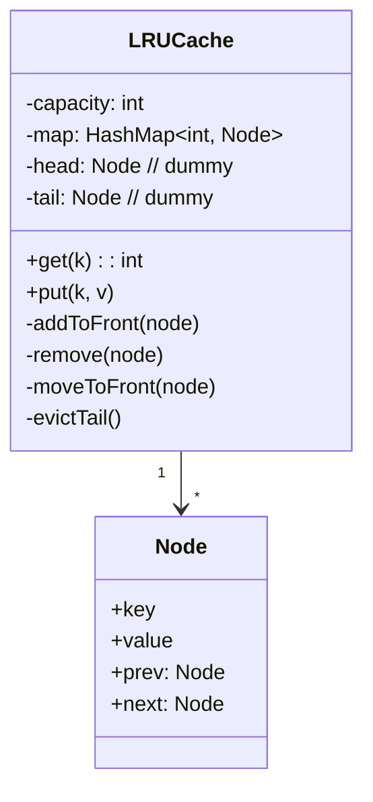

# 🛠️ Design an LRU Cache (LeetCode #146 / CTCI variant) — LLD

> **Sources**: [LeetCode #146 — LRU Cache](https://leetcode.com/problems/lru-cache/) (the canonical interview problem; `get` and `put` must be **O(1)**); Java `LinkedHashMap` ([OpenJDK source](https://github.com/openjdk/jdk/blob/master/src/java.base/share/classes/java/util/LinkedHashMap.java) — has built-in LRU mode via `accessOrder = true` and the `removeEldestEntry` hook); Sedgewick — *Algorithms*, 4e.

## 1. Requirements

### Functional
- `LRUCache(int capacity)` — fixed maximum number of entries.
- `int get(int key)` — returns the value, or `-1` if absent. Marks the entry as **most recently used**.
- `void put(int key, int value)` — inserts or updates. If at capacity, evict the **least recently used** entry first.

### Non-Functional
- **`get` and `put` must run in O(1) average time.** This is what makes it a non-trivial interview question.

## 2. The Solution: HashMap + Doubly Linked List

```text
        ┌──── head (MRU)              tail (LRU) ────┐
        ▼                                            ▼
       DUMMY  ⇄  Node(k1,v1)  ⇄  Node(k2,v2)  ⇄  Node(k3,v3)  ⇄  DUMMY
                      ▲              ▲                 ▲
   HashMap<K, Node>:  k1, k2, k3 each map to their node — O(1) lookup
```

### Why exactly these two structures?
- **HashMap → O(1) lookup** by key.
- **Doubly linked list → O(1) move-to-front** (we have the node reference from the map, so we can splice in O(1) with prev/next pointers).
- A **singly linked list** would force an O(n) walk to find the predecessor when removing — that's why the list must be doubly linked.
- **Dummy head and tail sentinels** eliminate every null check in `addToFront` / `remove` — the standard interview trick.

## 3. Class Diagram



## 4. The Four Helper Methods

```java
class Node { int key, value; Node prev, next; }

class LRUCache {
  private final int capacity;
  private final Map<Integer, Node> map = new HashMap<>();
  private final Node head = new Node();              // dummy MRU sentinel
  private final Node tail = new Node();              // dummy LRU sentinel

  public LRUCache(int capacity) {
    this.capacity = capacity;
    head.next = tail;  tail.prev = head;
  }

  /* ---- list helpers, all O(1) ---- */
  private void addToFront(Node n) {
    n.prev = head;  n.next = head.next;
    head.next.prev = n;  head.next = n;
  }
  private void remove(Node n) {
    n.prev.next = n.next;  n.next.prev = n.prev;
  }
  private void moveToFront(Node n) { remove(n); addToFront(n); }

  /* ---- public API ---- */
  public int get(int key) {
    Node n = map.get(key);
    if (n == null) return -1;
    moveToFront(n);                                  // mark MRU
    return n.value;
  }

  public void put(int key, int value) {
    Node n = map.get(key);
    if (n != null) {                                 // update existing
      n.value = value;
      moveToFront(n);
      return;
    }
    if (map.size() == capacity) {                    // evict LRU
      Node lru = tail.prev;
      remove(lru);
      map.remove(lru.key);                           // <-- crucial: free the map entry too
    }
    Node fresh = new Node();
    fresh.key = key;  fresh.value = value;
    addToFront(fresh);
    map.put(key, fresh);
  }
}
```

## 5. The Three Easy-to-Miss Bugs

1. **Forgetting `map.remove(lru.key)` on eviction** — leaks memory and breaks `get`.
2. **Updating an existing key without moving it to the front** — recently-touched entry incorrectly reported as LRU later.
3. **Singly-linked list** — `remove(node)` becomes O(n). The whole point of the question is the O(1) guarantee, so this loses you the interview.

## 6. The "Cheating" Java Answer

`java.util.LinkedHashMap` already implements all of this:

```java
class LRUCache extends LinkedHashMap<Integer, Integer> {
  private final int capacity;
  public LRUCache(int capacity) {
    super(capacity, 0.75f, /*accessOrder=*/ true);   // <-- LRU mode
    this.capacity = capacity;
  }
  public int get(int key) { return super.getOrDefault(key, -1); }
  public void put(int key, int value) { super.put(key, value); }
  @Override protected boolean removeEldestEntry(Map.Entry<Integer,Integer> e) {
    return size() > capacity;                        // auto-evict LRU
  }
}
```

Mention this **after** the from-scratch version. Showing only the `LinkedHashMap` answer in an interview is usually treated as a dodge of the actual question.

## 7. Design Patterns

| Pattern | Where | Why |
|---|---|---|
| **Composition** | HashMap **+** doubly linked list | Each gives one capability; together they meet the O(1) contract. |
| **Sentinel** | Dummy `head` and `tail` | Eliminate edge cases. |
| **Strategy** | Pluggable eviction policy in the broader cache LLD | See `Solution-In-Memory-Cache.md`. |

## 8. Concurrency

The plain implementation isn't thread-safe; concurrent `put`s race on the linked-list pointers and on `map.size()`. Options, in increasing sophistication:

| Option | Pros / Cons |
|---|---|
| `synchronized` on every public method | Trivial; serialises all access — fine for single-threaded interview answers. |
| `ReentrantLock` | Same correctness, allows `tryLock()` and timed waits. |
| **Lock striping** | Partition keys across N independent caches by hash; near-linear scaling, at the cost of giving up *global* LRU (eviction is per-shard). Caffeine and Guava both do this. |

For an interview, lead with the single-lock answer and mention striping as the production approach.

## 9. Sources / Cross-Refs
- LLD-08 Behavioral Patterns (Strategy)
- Solution-LRU-Cache.md (sibling — same problem, may add features)
- Solution-In-Memory-Cache.md (the generalised pluggable-policy version)
- Solution-OOD-Hashmap.md (the underlying primitive)
- LeetCode #146; OpenJDK `LinkedHashMap.java`; Caffeine project
