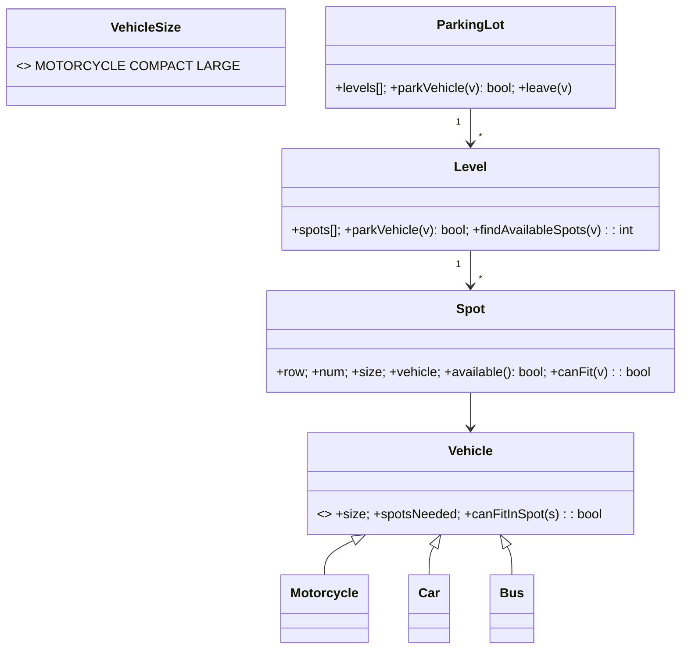

# 🛠️ Design a Parking Lot (CTCI Q7.4) — LLD

> **Sources**: Gayle Laakmann McDowell — *Cracking the Coding Interview*, 6th edition, **Q7.4** ("Parking Lot. Design a parking lot using object-oriented principles."); Gamma et al. — *Design Patterns* (1994), §**Strategy**, §**State**, §**Factory**.

## 1. Requirements

### Functional
- Multi-floor lot; each floor has multiple **spots**.
- Spot sizes: **MOTORCYCLE**, **COMPACT**, **LARGE** (CTCI's three sizes).
- Vehicle types: **Motorcycle**, **Car**, **Bus** (a Bus needs **5 contiguous Large spots on the same floor**).
- Allocation rules:
  - Motorcycle fits in **any** spot.
  - Car fits in **Compact** or **Large**.
  - Bus needs **5 consecutive Large** spots.
- `parkVehicle(v)` returns true on success and assigns the spot(s).
- `leave(v)` releases the spot(s).
- Query: `availableSpots()`, `isFull()`.

### Non-Functional
- O(1) `leave`; O(n) `parkVehicle` worst-case (must scan for a free spot, or a Bus's 5-in-a-row).
- Concurrency-safe — many gates may attempt parking simultaneously.

## 2. The Two Design Decisions

### 2.1 Polymorphic `Vehicle.canFitInSpot(Spot)`
The fitting rules live **on the vehicle**, not in a giant `if/else` inside the lot. Adding a new vehicle type is a one-class change.

### 2.2 Bus needs **contiguous** spots → handled by `Level`, not by `Spot`
A `Spot` doesn't know "contiguous" — only a `Level` (which holds the ordered array of spots) can scan for `numberOfSpots == 5` consecutive Large spots. The lot delegates Bus placement to each level.

## 3. Class Diagram



## 4. Core Classes

```java
enum VehicleSize { MOTORCYCLE, COMPACT, LARGE }

abstract class Vehicle {
  protected final List<Spot> parkedAt = new ArrayList<>();
  protected int spotsNeeded;
  protected VehicleSize size;
  public abstract boolean canFitInSpot(Spot s);
  public void parkInSpot(Spot s)   { parkedAt.add(s); }
  public void clearSpots()         { parkedAt.forEach(Spot::removeVehicle); parkedAt.clear(); }
  public int getSpotsNeeded()      { return spotsNeeded; }
}

class Motorcycle extends Vehicle {
  Motorcycle(){ spotsNeeded = 1; size = VehicleSize.MOTORCYCLE; }
  public boolean canFitInSpot(Spot s){ return true; }                  // any spot
}
class Car extends Vehicle {
  Car(){ spotsNeeded = 1; size = VehicleSize.COMPACT; }
  public boolean canFitInSpot(Spot s){
    return s.getSize() == VehicleSize.COMPACT || s.getSize() == VehicleSize.LARGE;
  }
}
class Bus extends Vehicle {
  Bus(){ spotsNeeded = 5; size = VehicleSize.LARGE; }
  public boolean canFitInSpot(Spot s){ return s.getSize() == VehicleSize.LARGE; }
}

class Spot {
  private Vehicle vehicle;
  private final VehicleSize size;
  private final int row, spotNumber;
  private final Level level;
  public boolean isAvailable(){ return vehicle == null; }
  public boolean canFitVehicle(Vehicle v){ return isAvailable() && v.canFitInSpot(this); }
  public boolean park(Vehicle v){
    if (!canFitVehicle(v)) return false;
    vehicle = v; v.parkInSpot(this); return true;
  }
  public void removeVehicle(){ vehicle = null; level.spotFreed(); }
}
```

## 5. The Bus Placement Algorithm — `Level.findAvailableSpots`

```java
/** Returns the index of the first of N contiguous Large spots, or -1. */
int findAvailableSpots(Vehicle v) {
  int needed = v.getSpotsNeeded();
  int run = 0, lastRow = -1;
  for (int i = 0; i < spots.length; i++) {
    Spot s = spots[i];
    if (s.getRow() != lastRow) { run = 0; lastRow = s.getRow(); }   // a Bus needs SAME row
    if (s.canFitVehicle(v)) {
      run++;
      if (run == needed) return i - needed + 1;
    } else {
      run = 0;
    }
  }
  return -1;
}

boolean parkVehicle(Vehicle v) {
  if (availableSpots < v.getSpotsNeeded()) return false;
  int start = findAvailableSpots(v);
  if (start < 0) return false;
  for (int i = start; i < start + v.getSpotsNeeded(); i++) spots[i].park(v);
  availableSpots -= v.getSpotsNeeded();
  return true;
}
```

The reset of `run` whenever the row changes is the easy-to-miss subtlety — a Bus can't span two rows.

## 6. Design Patterns

| Pattern | Where | Why |
|---|---|---|
| **Strategy** | `Vehicle.canFitInSpot()` | Each vehicle owns its fit rule. New vehicle → new subclass, no edits to `Spot` or `Level`. |
| **Composition** | `ParkingLot → Level → Spot` | Three-level hierarchy mirrors physical reality. |
| **State** | `Spot.vehicle == null` is the binary state; richer LLDs add `RESERVED`, `MAINTENANCE` | Block illegal transitions. |
| **Factory** | `VehicleFactory.from(licensePlate)` reads plate → returns the right subtype | Centralised creation. |
| **Observer** | Display board / mobile app subscribes to `LotEventListener.onSpotChange` | Decoupled UI updates. |
| **Singleton** | `ParkingLot` instance per facility | Single source of truth. |

## 7. Beyond CTCI — Real-World Extensions

Mention these once if asked "how would you extend this?":

- **Pricing** — `PricingStrategy` (hourly / daily / valet / EV-charging surcharge).
- **Reservations** — a separate `Reservation` entity with `(userId, spotId, from, to)`; `parkVehicle` honours active reservations.
- **EV / Handicap spots** — additional `SpotKind` enum; `canFitInSpot` checks both size and kind.
- **Ticketing** — issue a `Ticket(id, vehicleId, spotIds, entryTime)` on entry; `leave(ticket)` computes fee via `PricingStrategy`.
- **Multi-gate concurrency** — see §8.

## 8. Concurrency

Many gates may park simultaneously. The classic race: two cars target the same Large spot at the same instant.

**Recipe**:
- One `ReentrantLock` **per Level** (not per spot — too fine; not per Lot — too coarse).
- `parkVehicle` acquires the level's lock, scans, marks the spot(s), releases.
- For the lot-wide spot counter, use `AtomicInteger`.

This gives near-linear scaling per level while keeping the bus-contiguity scan correct.

## 9. Sources / Cross-Refs
- LLD-08 Behavioral Patterns (Strategy, State, Observer)
- LLD-06 Creational Patterns (Factory, Singleton)
- Solution-Parking-Lot.md (sibling — fuller-featured version with pricing/tickets/reservations)
- Solution-Hotel-Management.md (analogous reservation-and-occupancy domain)
- CTCI Q7.4
