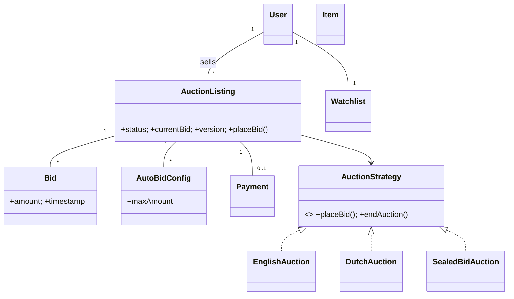

# 🛠️ Design Online Auction System (LLD)

> Object-oriented design for an eBay-style auction platform — listings, bids, real-time updates, proxy bidding, and concurrent-safe bid placement under tight contention.

## 📚 Table of Contents

1. [Requirements](#1-requirements)
2. [Core Entities](#2-core-entities-objects)
3. [Class Diagram](#3-class-diagram--relationships)
4. [Key APIs](#4-api--interfaces)
5. [Design Patterns](#5-key-algorithms--design-patterns)
6. [Concurrency](#6-concurrency--edge-cases)
7. [Sources](#7-sources)

---

## 1. Requirements

### Functional
- Sellers create **auction listings** (item, start price, end time, type)
- Bidders place **bids**; system rejects bids ≤ `currentBid + minIncrement` or after `endTime`
- **Auto-bid (proxy bidding)** — set a max; system bids up incrementally on your behalf
- **Real-time updates** to all watchers when bid changes
- **Auction end** — declare winner, notify, trigger payment
- **Multiple types** — English (ascending), Dutch (descending), Sealed-bid (single hidden bid)
- **Watchlist** for items of interest

### Non-Functional
- Sub-second bid update fan-out
- **Race-condition-free** bid placement under concurrency
- Fair auction-end (all bids placed before `endTime` are honored)
- Audit-able trail of every bid

---

## 2. Core Entities (Objects)

| Entity | Key Attributes |
|---|---|
| `User` | userId, name, email, role (seller/bidder, both possible) |
| `Item` | itemId, name, description, photos[], category |
| `AuctionListing` | listingId, sellerId, itemId, type, startPrice, currentBid, minIncrement, startTime, endTime, status, version |
| `Bid` | bidId, listingId, bidderId, amount, timestamp |
| `AutoBidConfig` | listingId, bidderId, maxAmount, isActive |
| `Watchlist` | userId, listingIds[] |
| `Payment` | paymentId, listingId, winnerId, amount, status |
| `Notification` | notificationId, userId, type, payload |

**Auction state machine:** `SCHEDULED → ACTIVE → ENDED → SETTLED` (or any → `CANCELLED`)

**Auction types:**
- **English** — open ascending; default; familiar eBay model
- **Dutch** — start high, price drops over time; first bid wins
- **Sealed-bid** — bidders submit one hidden bid; highest wins at reveal

---

## 3. Class Diagram / Relationships



---

## 4. API / Interfaces

```java
public interface AuctionStrategy {
    BidResult placeBid(AuctionListing listing, Bid bid);
    Bid endAuction(AuctionListing listing);
}

// Seller
AuctionListing createListing(long sellerId, long itemId, AuctionType type,
                             BigDecimal startPrice, Instant startTime, Instant endTime);
void cancelListing(String listingId);

// Bidder
BidResult placeBid(String listingId, long bidderId, BigDecimal amount);
void placeAutoBid(String listingId, long bidderId, BigDecimal maxAmount);
void addToWatchlist(long userId, String listingId);

// System (scheduled)
void endAuction(String listingId);  // triggered when endTime reached
void notifyWinner(String listingId);
PaymentResult processPayment(String listingId);
```

---

## 5. Key Algorithms / Design Patterns

| Pattern | Where used | Why |
|---|---|---|
| **State** | Auction lifecycle | Only `ACTIVE` accepts bids; `ENDED` accepts only winner-payment; transitions enforced |
| **Strategy** | Auction type | English / Dutch / Sealed-bid encapsulate `placeBid` and `endAuction` differently |
| **Observer** | Bid notifications | Watchlist subscribers + active bidders receive each bid update via WebSocket / push |
| **Factory** | Auction creation | `AuctionFactory.create(type, ...)` returns the right `AuctionStrategy` instance |
| **Command** | Bid actions | `PlaceBidCommand` queued + validated → execute or cancel pre-confirmation |
| **Template Method** | Shared lifecycle | `validate → record → notify → maybeExtend` skeleton; types override specific steps |
| **Event Sourcing** (advanced) | Audit trail | Every bid is an event; current state derived from event log; supports replay |

**Auto-bid algorithm** (English): on each new bid `B` from another bidder, walk active `AutoBidConfig` entries; for each (in order of `maxAmount` desc), if `maxAmount > B.amount`, place a bid for `min(maxAmount, B.amount + minIncrement)`. Repeat until no auto-bidder can outbid the current high bid.

---

## 6. Concurrency & Edge Cases

- **Bid race (CAS)** — two bidders submit `$100` simultaneously when `currentBid = $99`. Use **optimistic update with version**:
  ```sql
  UPDATE listings
  SET current_bid = 100, version = version + 1
  WHERE listing_id = ? AND version = ? AND current_bid < 100;
  ```
  Whichever update affects 1 row wins; the loser retries: re-reads `currentBid`, decides whether to bid higher.
- **Bid sniping → auto-extend** — if a valid bid arrives within last 5 sec, **atomically extend `endTime` by 5 min** as part of the same transaction:
  ```sql
  UPDATE listings
  SET current_bid = ?, version = version + 1,
      end_time = CASE WHEN end_time - now() < interval '5 sec'
                      THEN now() + interval '5 min'
                      ELSE end_time END
  WHERE listing_id = ? AND version = ? AND status = 'ACTIVE';
  ```
  Common policy on real auction sites; prevents last-millisecond manipulation.
- **End-time finalization** — at exactly `endTime`, exactly one process must compute the winner. Use a **distributed lock** (Redlock / ZooKeeper) keyed by `listing:<id>:finalize`. Lock holder runs the transaction `(state ACTIVE → ENDED, set winner, freeze bids)`; everyone else sees `ENDED` on their next read.
- **Late-arriving bid at endTime** — bids arriving after the finalization tx commits are rejected with "auction ended" error; even if the network would have made them in time, the server's clock-of-record decides.
- **Auto-bid loops** — when applying auto-bids cascade, do it inside the same lock to avoid two auto-bidders ping-ponging via separate transactions.
- **Sealed-bid concurrency** — bids are inserted into a `bids` table with no `currentBid` mutation (no contention); winner determined at `endTime` via `SELECT MAX(amount)`.

---

## 7. Sources

- eBay's published bid-extension policy (proxy bidding & auto-extend documentation)
- Industry pattern: optimistic locking with version columns (PostgreSQL / MySQL conventional pattern)
- Workspace cross-reference: `Notes/LowLevelDesign/LLD-08-Behavioral-Patterns.md` (State, Strategy, Observer, Command, Template Method)
- Workspace cross-reference: `Notes/LowLevelDesign/LLD-12-Concurrency-Deep-Dive.md` (CAS, optimistic locking, distributed locks)
- Workspace cross-reference: `Notes/SystemDesign/Topics/30-Distributed-Locking.md` (Redlock, ZooKeeper)

📺 **Video walkthrough:** [Mock System Design Interview – Design Online Auction](https://www.youtube.com/watch?v=o8nSXW-B7Rw)
