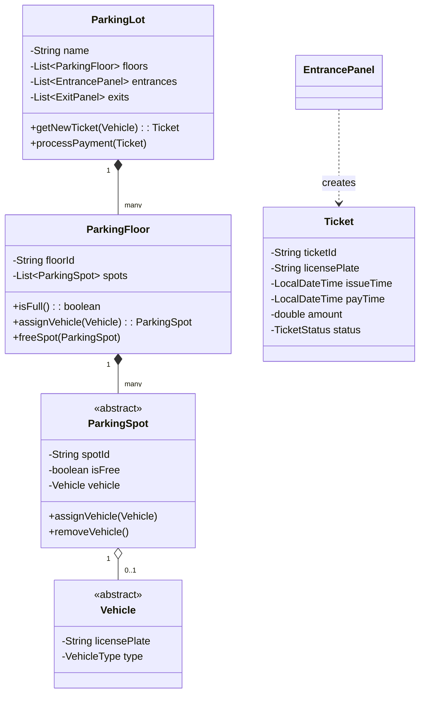

# 🛠️ Design Parking Lot (LLD)

The Parking Lot is one of the most common Low-Level Design / Object-Oriented Design interview questions. It tests your ability to model real-world entities, manage state, and apply design patterns (like Strategy for pricing).

---

## 1. Requirements

### Functional Requirements
- **Multiple Floors/Levels:** The parking lot should have multiple levels.
- **Multiple Spot Types:** Support different types of spots (Compact, Large, Handicapped, Motorcycle).
- **Multiple Vehicle Types:** Support different vehicles (Car, Truck, Van, Motorcycle).
- **Entry & Exit:** Vehicles can enter via an entrance panel (generates a ticket) and exit via an exit panel (calculates fee and accepts payment).
- **Capacity Tracking:** The system should track full/empty spots and display a "Full" sign when a level or the entire lot is full.
- **Pricing Strategy:** Calculate fee based on the time spent (e.g., $4 for the first hour, $2 for subsequent hours).

### Non-Functional Requirements
- **Concurrency:** Multiple cars might try to enter different gates simultaneously. The system must prevent assigning the same parking spot to two different cars.
- **Extensibility:** Easy to add new vehicle types or pricing strategies in the future.

---

## 2. Core Entities (Objects)

Identify the primary objects/models involved.

- `ParkingLot` (Singleton)
- `ParkingFloor`
- `ParkingSpot` (Abstract) -> `CompactSpot`, `LargeSpot`, `MotorcycleSpot`
- `Vehicle` (Abstract) -> `Car`, `Truck`, `Motorcycle`
- `Ticket`
- `EntrancePanel` / `ExitPanel`
- `Payment` / `PricingStrategy`

---

## 3. Class Diagram / Relationships



---

## 4. API / Interfaces

Define the primary interfaces or abstract classes.

### Enums
```java
public enum VehicleType {
    MOTORCYCLE, CAR, TRUCK
}

public enum SpotType {
    COMPACT, LARGE, MOTORCYCLE, HANDICAPPED
}
```

### Strategy Pattern for Pricing
Fees change based on holidays, vehicle type, or duration. The Strategy pattern decouples this logic.

```java
public interface PricingStrategy {
    double calculateFee(Ticket ticket);
}

public class HourlyPricingStrategy implements PricingStrategy {
    @Override
    public double calculateFee(Ticket ticket) {
        long hours = durationInHours(ticket.getIssueTime(), LocalDateTime.now());
        return hours * 5.0; // $5 per hour
    }
}
```

---

## 5. Key Design Patterns & Logic

### 1. Singleton Pattern (`ParkingLot`)
The `ParkingLot` itself is usually a single physical entity. Using a Singleton pattern ensures we have a single central state manager.
```java
public class ParkingLot {
    private static ParkingLot instance = null;
    
    private ParkingLot() { ... }
    
    public static synchronized ParkingLot getInstance() {
        if (instance == null) {
            instance = new ParkingLot();
        }
        return instance;
    }
}
```

### 2. Concurrency (Handling simultaneous entries)
If Car A and Car B enter Gate 1 and Gate 2 at the exact same millisecond, they might both query the DB/State and see Spot #42 is empty, resulting in a **Double Booking**.

To prevent this in a multi-threaded environment (Java):
- **Synchronized Blocks/Locks:** The method that searches for an empty spot and assigns it must be thread-safe.
```java
public synchronized ParkingSpot assignSpot(Vehicle vehicle) {
    // 1. Find nearest available spot
    // 2. spot.assignVehicle(vehicle)
    // 3. Update floor available count
    // 4. Return spot
}
```
*Note: In a distributed real-world system, this would be handled by Row-Level Locking (`SELECT FOR UPDATE`) in a database, or Redis `EVAL` Lua scripts.*

### 3. Finding the "Best" Spot
Often, an entrance panel needs to give the user a ticket printed with a specific spot number.
How do we find an empty spot efficiently without iterating through a list of 10,000 spots every time?
- **Min-Heap (Priority Queue):** Maintain a Min-Heap of available spots for each floor, ordered by distance to the elevator. Finding the 'closest' spot is `O(1)`. Removing it is `O(log N)`. When a car leaves, add the spot back `O(log N)`.

### 4. Vehicle to Spot Matching Logic
- **Motorcycle** can park in -> `MotorcycleSpot`, `CompactSpot`, `LargeSpot`
- **Car** can park in -> `CompactSpot`, `LargeSpot`
- **Truck** can park in -> `LargeSpot` only.

The `ParkingFloor.assignVehicle(Vehicle v)` method iterates through its internal Min-Heaps in the order of the vehicle's permissions, grabbing the most restrictive suitable spot first to save larger spots for larger vehicles.