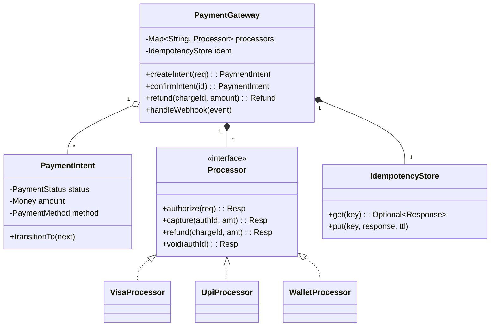

# 🛠️ Design a Payment Gateway (LLD)

> **Sources**: Stripe API reference — [stripe.com/docs/api](https://stripe.com/docs/api) (the canonical model for `PaymentIntent`, idempotency keys, webhooks); PCI-DSS v4.0 — [pcisecuritystandards.org](https://www.pcisecuritystandards.org/document_library/) (cardholder-data scope rules); EMVCo 3-D Secure 2.0 spec — [emvco.com/specifications](https://www.emvco.com/specifications/); ISO 8583 financial-message standard; Pat Helland — *Idempotence Is Not a Medical Condition* (2012). Cross-ref: Solution-Stripe-Payment-Processor.md (deeper Stripe-specific walkthrough).

A payment gateway sits between a merchant and a card network/bank. The product feels like a single API call (`/charge`), but underneath is a multi-step state machine, mandatory idempotency, regulatory encryption boundaries, and asynchronous settlement that lands hours later.

---

## 1. Requirements

### Functional
- **Multiple payment methods**: credit/debit card, UPI, ACH, net-banking, wallets (Apple Pay, Google Pay), BNPL.
- **Authorize / Capture / Void / Refund** lifecycle (separate from a single combined "charge" — many e-commerce flows authorize at checkout and capture at ship).
- **Idempotency**: `Idempotency-Key` header — the same key submitted twice returns the *same* result, never charges twice.
- **Webhooks**: notify the merchant asynchronously on status transitions (`payment.succeeded`, `payment.failed`, `refund.processed`).
- **Refunds**: full or partial; multiple refunds may sum up to the original charge.
- **3-D Secure / strong customer authentication (SCA)** for European cards (PSD2 mandate).
- **Multi-currency**: store amount as the smallest currency unit (cents/paise) to avoid floating-point loss.

### Non-Functional
- **Reliability**: financial state must be exactly-once; partial charges or "lost" refunds are unacceptable.
- **Security**: cardholder data (PAN, CVV) must never leak into logs/databases unencrypted; tokenize and hand off to a PCI-DSS-compliant vault.
- **Throughput**: thousands of concurrent transactions per second (Stripe's quoted scale: 13K+ TPS during Black Friday).
- **Latency**: synchronous authorize response in **< 2 s** (network round-trip to the card network is the floor).

---

## 2. Core Entities

| Entity | Key Fields |
|---|---|
| `PaymentIntent` | `id`, `merchantId`, `amount`, `currency`, `status`, `paymentMethodId`, `idempotencyKey`, `clientSecret`, `createdAt`. |
| `PaymentMethod` (interface) | `Card`, `UPI`, `Wallet`, `ACH` — each holds a *tokenized* reference, never raw PAN. |
| `Transaction` | `id`, `paymentIntentId`, `type` (AUTHORIZE/CAPTURE/REFUND/VOID), `amount`, `gatewayResponseCode`, `processorReference`. |
| `PaymentStatus` (enum) | `REQUIRES_PAYMENT_METHOD → REQUIRES_CONFIRMATION → REQUIRES_ACTION → PROCESSING → SUCCEEDED / FAILED / CANCELED`. |
| `Processor` (Strategy interface) | `VisaProcessor`, `MastercardProcessor`, `UpiProcessor`, `StripeAdapter`, `AdyenAdapter`. |
| `IdempotencyStore` | `Map<idempotencyKey, cachedResponse>` with TTL (typically 24 h). |
| `WebhookEvent` | `id`, `type`, `payload`, `merchantUrl`, `attemptCount`, `nextRetryAt`. |
| `Refund` | `id`, `chargeId`, `amount`, `reason`, `status`. |

---

## 3. Class Diagram



---

## 4. Key Methods

### 4.1 Idempotency-key handling

```java
public PaymentIntent createIntent(CreateRequest req, String idemKey) {
    Optional<PaymentIntent> cached = idem.get(idemKey);
    if (cached.isPresent()) return cached.get();          // replay → same response

    // Acquire a per-key lock so concurrent retries don't both proceed
    try (LockHandle h = idem.acquire(idemKey, Duration.ofSeconds(30))) {
        // double-check after lock
        cached = idem.get(idemKey);
        if (cached.isPresent()) return cached.get();

        PaymentIntent intent = newIntent(req);
        idem.put(idemKey, intent, Duration.ofHours(24));
        return intent;
    }
}
```

> **Why a lock?** Without it, two simultaneous retries can both miss the cache, both create distinct intents, and you end up with a duplicate charge. The lock + double-check = textbook double-checked-locking against the idempotency cache.

### 4.2 Authorize → Capture (two-phase)

```java
public PaymentIntent confirmIntent(String intentId) {
    PaymentIntent i = repo.findById(intentId);
    require(i.getStatus() == REQUIRES_CONFIRMATION);

    Processor p = processors.get(i.getMethod().routingKey());
    AuthResponse auth = p.authorize(i.toAuthRequest());

    if (auth.requires3ds()) {
        i.transitionTo(REQUIRES_ACTION);          // client must complete SCA
        return i;
    }
    if (!auth.isApproved()) {
        i.transitionTo(FAILED, auth.declineCode());
        return i;
    }

    // For "automatic capture" intents, capture immediately
    if (i.captureMode() == AUTOMATIC) {
        CaptureResponse cap = p.capture(auth.authId(), i.amount());
        i.transitionTo(cap.isOk() ? SUCCEEDED : FAILED);
    } else {
        i.transitionTo(REQUIRES_CAPTURE);
    }
    return i;
}
```

### 4.3 Webhook delivery with exponential backoff

```java
public void deliverWebhook(WebhookEvent e) {
    try {
        HttpResponse r = httpClient.post(e.url(), sign(e.payload()));
        if (r.status() / 100 == 2) {
            e.markDelivered();
            return;
        }
        scheduleRetry(e);
    } catch (IOException ex) {
        scheduleRetry(e);
    }
}

private void scheduleRetry(WebhookEvent e) {
    if (e.attemptCount() >= 8) { e.markPermanentlyFailed(); return; }
    // 1m, 5m, 30m, 2h, 6h, 12h, 24h, 48h — Stripe's actual schedule
    Duration delay = BACKOFF_SCHEDULE.get(e.attemptCount());
    e.scheduleAt(now().plus(delay));
}
```

### 4.4 Refund (partial-sum invariant)

```java
public Refund refund(String chargeId, Money amount, String reason) {
    Charge c = repo.findCharge(chargeId);
    Money alreadyRefunded = c.refunds().stream()
        .filter(r -> r.status() == SUCCEEDED)
        .map(Refund::amount)
        .reduce(Money.ZERO, Money::add);

    if (alreadyRefunded.add(amount).gt(c.amount()))
        throw new RefundExceedsChargeException();

    Refund r = new Refund(c.id(), amount, reason);
    Processor p = processors.get(c.method().routingKey());
    var resp = p.refund(c.processorReference(), amount);
    r.transitionTo(resp.isOk() ? SUCCEEDED : FAILED);
    return r;
}
```

---

## 5. Design Patterns

| Pattern | Where Used | Why |
|---|---|---|
| **Strategy** | `Processor` (Visa, UPI, Wallet, Stripe-adapter) | Each processor has its own protocol/SDK; the gateway picks one based on the payment method. |
| **State** | `PaymentStatus` transitions | Forbid illegal moves like `SUCCEEDED → FAILED`; encode the entire flow as a directed graph. |
| **Adapter** | `StripeAdapter`, `AdyenAdapter` | Wrap third-party SDKs with our internal `Processor` interface so the rest of the system is vendor-agnostic. |
| **Chain of Responsibility** | Pre-charge pipeline: `RiskCheck → 3DSCheck → AmlCheck → Authorize` | Any link can short-circuit (e.g. risk score too high → block). |
| **Observer / Pub-Sub** | Webhook delivery to subscribed merchants | Decouple "payment succeeded" from the long-tail of merchant URLs. |
| **Singleton** | `IdempotencyStore`, `PaymentGateway` facade | Single shared in-memory cache. |
| **Memento** | `Transaction` audit log per intent — append-only history of every state change. | Disputes & chargebacks need the full timeline. |

---

## 6. Concurrency & Edge Cases

### 6.1 Idempotency: the canonical mistake
A retry without idempotency = double charge. Every write API must require an `Idempotency-Key` and store the response keyed by it for ≥ 24 h. This is **not optional** in payments.

### 6.2 Authorize succeeds, capture fails
The card network already reserved funds. We must `void` the authorization within the issuer's hold window (typically 7 days) or the customer's available balance stays decremented for nothing — a customer-experience disaster.

### 6.3 Async settlement vs sync API
The synchronous `authorize` returns "approved" — but the actual money movement happens hours later in a batch settlement file from the processor. The gateway must reconcile the morning's settlement file against its own ledger and flag mismatches; never trust that a sync OK means money landed.

### 6.4 Webhook delivery
Merchants' endpoints fail constantly. We need: **at-least-once delivery**, **exponential backoff**, **HMAC signature** so the merchant can verify authenticity, and a **DLQ** after N retries.

### 6.5 PCI-DSS scope minimization
The card PAN must touch the absolute minimum number of components. A typical design routes raw card data **directly from the browser to a tokenization vault** (Stripe.js, Adyen Web Components) — your application servers receive only an opaque token like `tok_xyz`. This shrinks PCI scope from "every server" to "vault only."

### 6.6 Currency arithmetic
Store amounts as integer minor units (`int amountInCents`). Floating point will eventually misbalance the ledger.

### 6.7 Race: concurrent refunds
Two operators simultaneously click "Refund $50" on a $100 charge that already has a $60 refund. Without serialization they could both pass the `alreadyRefunded + amount <= charge` check and overshoot. Serialize per `chargeId` (DB row lock or distributed lock).

### 6.8 Ledger double-entry
Every money movement must be recorded as **two** ledger entries (debit one account, credit another). Validate `sum(debits) == sum(credits)` per transaction. This catches any single missed posting.

### 6.9 3-D Secure flow
For SCA-required cards, the gateway returns `REQUIRES_ACTION` and a redirect URL. The customer authenticates on the issuer's site; the issuer posts back to the gateway, which then re-runs `authorize` with the SCA proof. The intent stays in `REQUIRES_ACTION` for as long as the customer hasn't completed it (with a TTL — typically 15 min — after which it's auto-canceled).

---

## 7. Sources / Cross-Refs
- LLD-08 Behavioral Patterns (State, Strategy, Chain of Responsibility, Observer)
- LLD-07 Structural Patterns (Adapter)
- 18-Distributed-Systems.md (idempotency, exactly-once)
- 19-Event-Driven-Architecture.md (webhook fan-out)
- Solution-Stripe-Payment-Processor.md (deeper Stripe-specific design)
- Solution-Digital-Wallet.md (related: stored-value vs pass-through payments)
- Stripe API: https://stripe.com/docs/api
- PCI-DSS v4.0: https://www.pcisecuritystandards.org/document_library/
- Pat Helland, *Idempotence Is Not a Medical Condition* (2012)
