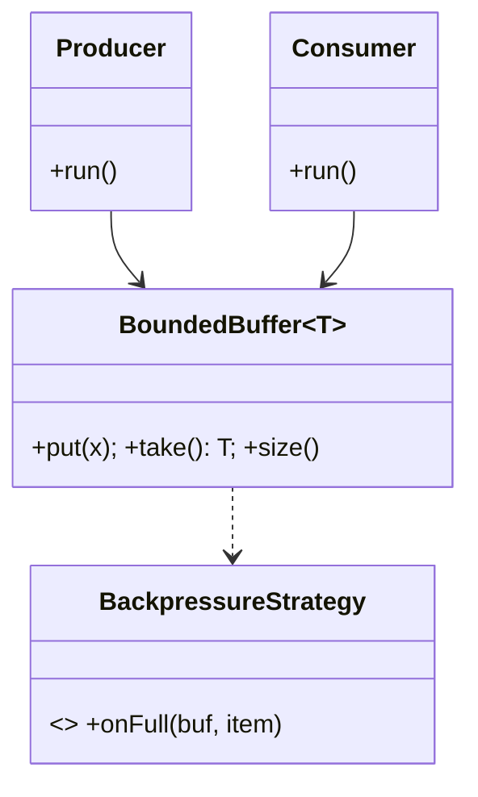

# 🛠️ Design Producer-Consumer / Bounded Buffer (LLD)

> **Sources**: [Brian Goetz et al., *Java Concurrency in Practice*](https://jcip.net/) — Ch. 5 (Building Blocks) & Ch. 14 (Building Custom Synchronizers); JDK source for [`java.util.concurrent.ArrayBlockingQueue`](https://docs.oracle.com/javase/8/docs/api/java/util/concurrent/ArrayBlockingQueue.html); [Doug Lea — Concurrent Programming in Java](https://gee.cs.oswego.edu/dl/cpj/); Hoare/Hansen original monitor papers (1974) for the theory.

## 1. Requirements

### Functional
- **Bounded buffer of capacity N**: `put` blocks when full; `take` blocks when empty.
- **Multiple producers + multiple consumers**.
- **Graceful shutdown** via poison-pill or `Thread.interrupt()`.
- **Optional priority variant** (uses a `PriorityQueue` instead of FIFO).

### Non-Functional
- **Thread-safe** under arbitrary scheduling.
- **No busy-waiting** — block on conditions, not spin.
- **No deadlock** — single lock + correct condition signaling.
- **Fairness** — long-waiting threads are not starved (configurable via fair `ReentrantLock`).

## 2. Core Entities

| Entity | Key Fields |
|---|---|
| `BoundedBuffer<T>` | `items: T[capacity]`, `putIdx`, `takeIdx`, `count`, `lock`, `notFull: Condition`, `notEmpty: Condition` |
| `Producer` | `Runnable` that loops: produce → `buffer.put(x)` |
| `Consumer` | `Runnable` that loops: `x = buffer.take()` → consume |
| `PoisonPill` | sentinel value used to signal "no more items" |

## 3. Class Diagram



## 4. Reference Implementation (Lock + 2 Conditions)

```java
public class BoundedBuffer<T> {
  private final T[] items;
  private int putIdx, takeIdx, count;
  private final ReentrantLock lock = new ReentrantLock(true);  // fair
  private final Condition notFull  = lock.newCondition();
  private final Condition notEmpty = lock.newCondition();

  @SuppressWarnings("unchecked")
  public BoundedBuffer(int capacity) {
    this.items = (T[]) new Object[capacity];
  }

  public void put(T x) throws InterruptedException {
    lock.lockInterruptibly();
    try {
      while (count == items.length) notFull.await();   // guard with `while`, not `if`
      items[putIdx] = x;
      putIdx = (putIdx + 1) % items.length;
      count++;
      notEmpty.signal();
    } finally { lock.unlock(); }
  }

  public T take() throws InterruptedException {
    lock.lockInterruptibly();
    try {
      while (count == 0) notEmpty.await();
      T x = items[takeIdx];
      items[takeIdx] = null;                            // help GC
      takeIdx = (takeIdx + 1) % items.length;
      count--;
      notFull.signal();
      return x;
    } finally { lock.unlock(); }
  }
}
```

This is, to a first approximation, exactly how `ArrayBlockingQueue` is implemented in the JDK.

## 5. Design Patterns

| Pattern | Where | Why |
|---|---|---|
| **Producer-Consumer** | The whole pattern | The canonical decoupling pattern. |
| **Monitor** | `lock` + two `Condition`s = a monitor with two wait sets | Per Hoare/Hansen: an object whose methods are mutually exclusive. |
| **Strategy** | `BackpressureStrategy` (`BLOCK`, `DROP_OLDEST`, `DROP_LATEST`, `THROW`) | Plug-in policy when full. |
| **Template Method** | `Producer.run()` / `Consumer.run()` define loop; subclasses implement `produce()` / `consume()` | Reuse + variability. |
| **Decorator** | `InstrumentedBoundedBuffer` adds metrics around `put`/`take` | Add observability without changing core. |
| **Singleton** | A shared global queue between long-lived workers | Single coordination point. |

## 6. Concurrency & Edge Cases

### 6.1 Two `Condition`s, not one — and why
With a single condition (or `synchronized`/`wait`/`notifyAll`), waking up "anyone waiting" needlessly contends a producer with another producer (they'd both check `notFull`). With two conditions you `signal()` exactly the side that can make progress, reducing wakeups and preventing the [thundering herd](https://en.wikipedia.org/wiki/Thundering_herd_problem).

### 6.2 Always wait in a `while` loop (spurious wakeups)
`Condition.await()` may return without any signal. Re-check the predicate every time you wake — this is "Mesa-style monitors" (the discipline `wait`/`await` enforces; Hoare-style is rare in practice).

### 6.3 `lockInterruptibly()` for shutdown
Producers/consumers in `await()` can be interrupted to exit cleanly. Alternative: a **poison pill** sentinel value pushed by the producer to signal end-of-stream; each consumer that takes a poison pill puts another back so all consumers eventually exit.

### 6.4 Fairness
`new ReentrantLock(true)` grants the lock to the longest-waiting thread, preventing starvation under contention. Comes at a throughput cost; default is non-fair.

### 6.5 Why prefer `Condition` over `wait/notify`
- Multiple distinct wait queues (`notFull`, `notEmpty`) per lock.
- Optional fair scheduling.
- `awaitNanos`, `awaitUntil` for timed waits.
- Composes cleanly with `try/finally` lock release.

### 6.6 When to skip all this and just use the JDK
For most apps, **don't write your own**. Use `ArrayBlockingQueue` (bounded, single lock — same design as above), `LinkedBlockingQueue` (bounded or unbounded; *two* locks, one for head and one for tail, doubling throughput at the cost of a slightly larger footprint), or `LinkedBlockingDeque`. The interview value of writing your own is showing you understand the underlying mechanics.

### 6.7 Backpressure strategies (Strategy)
| Strategy | Behavior |
|---|---|
| `BLOCK` | `put` blocks until space; safest, default. |
| `DROP_OLDEST` | Discard `items[takeIdx]`, advance, then enqueue. Ring-buffer semantics. |
| `DROP_LATEST` | Discard the incoming item; cheapest. |
| `THROW` | `IllegalStateException` (matches `Queue.add()` semantics). |

## 7. Sources / Cross-Refs
- LLD-12 Concurrency Deep Dive (locks, conditions, blocking queues)
- LLD-09 Concurrency.md (producer/consumer fundamentals)
- Solution-Blocking-Queue.md (the building block)
- Solution-Pub-Sub.md (uses this exact pattern per subscriber)
- Goetz et al., *Java Concurrency in Practice*, Ch. 5 & 14
